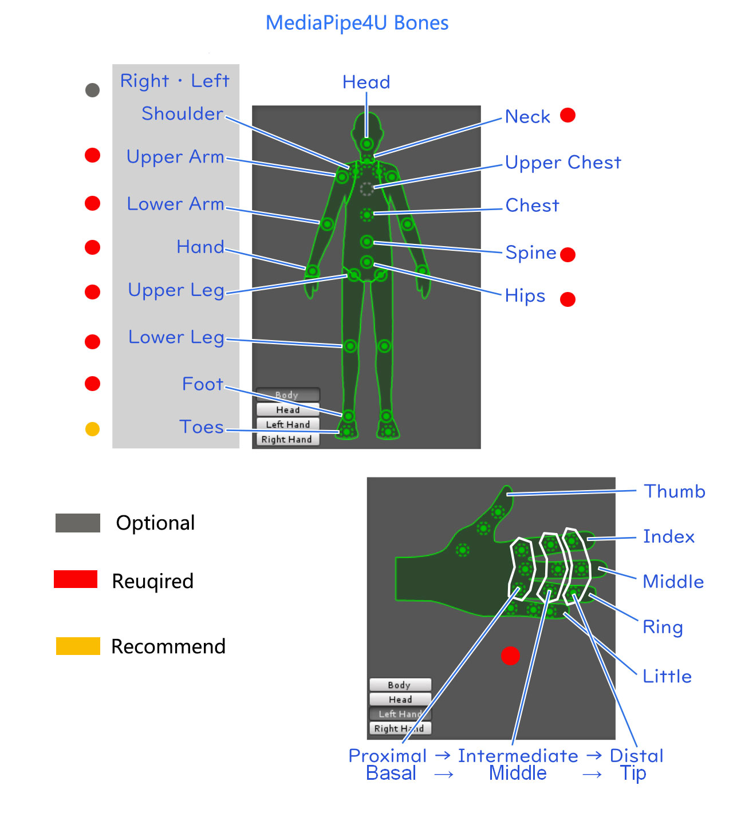
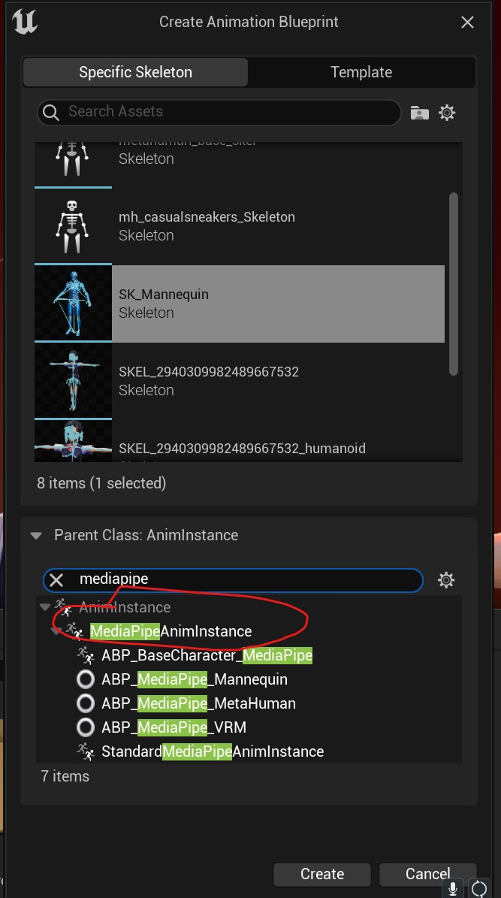
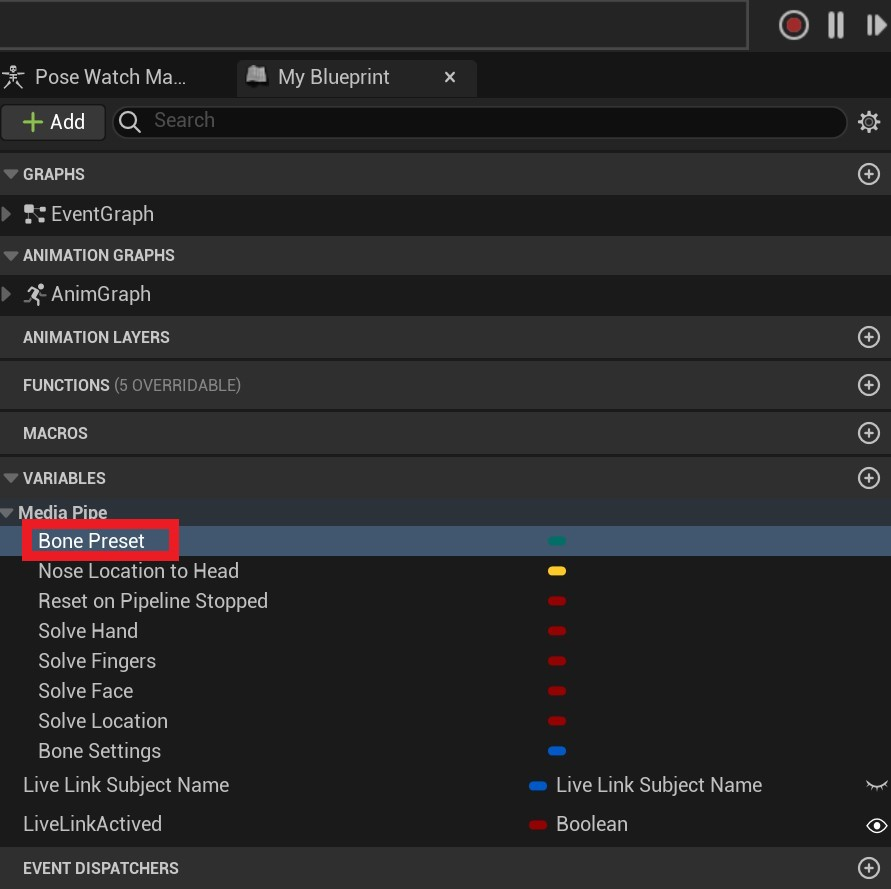
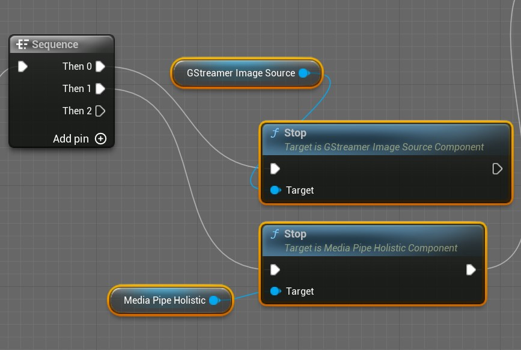

# Mediapipe4U 插件

基于 MediaPipe 的 UnrealEngine 动作捕捉插件。   

目录：

- [系统要求与限制](#p1)    

- [使用方法](#p2)    
  - [准备动补角色（Character）](#p21)
  - [准备 MediaPipe 运行时组件（Component）](#p22)
  - [开始 MediaPipe 动补](#p23)
    - [摄像头动补](#p231)
    - [图片动补](#p232)
    - [视频动补](#p233)
  - [停止 MediaPipe 动补](#p24)   
- [高级功能](#p3)
  - [运行时动画重定向（C++, 实验性)](#p31)
  - [运行时骨骼配置（C++）](#p32)   

----

# <a id="p1">系统要求与限制</a>

## 系统要求：

1. UnrealEngine 5.0 +
2. Windows 10 x64 及以上操作系统（ Windows 7 未经测试）

> 注意：手机端和 Mac 端未支持！！

---
## 性能表现：

由于 MediaPipe Windows 版本不支持 GPU 推理，Windows 依靠 CPU 完成人形姿态预测（具体信息参考 MediaPipe）：

**测试环境**

CPU： AMD 3600 CPU   
内存: 32GB   
显卡: 1660s（此型号显卡无光追）   


**表现：** 

帧率(fps)： 18-24  

CPU 占用率：20% (测试 DEMO 仅包含 MetahumanLight 场景和 VRM 模型)  

---

## 支持的功能：

1. C++ 开发支持
2. 蓝图开发支持
3. 运行时动画重定向（实验性）
4. 表情捕捉（实验性）


> Mediapipe4U 全部使用 C++ 开发，因此完美支持 C++ 开发的。同时，尽可能做到了让所有功能暴露于蓝图中，你可以在蓝图开发环境下获得一致的开发体验。


## 模型要求：

### 骨骼

模型需要满足最小人形骨骼定义，定义如下：

[](images/avatar_bones.jpg)


图片中骨骼颜色标记说明：

- 红色: 必须提供，否则无法正常工作
- 黄色: 建议提供，否则影响部分功能
- 灰色：可以不提供，后续版本可能会使用
- 未标记：可以不提供（长期不会使用）


骨骼结构注意事项：

1. 除脊柱（Spine）和盆骨（Hips）外，骨骼必须具有正确的父子关系（父骨骼旋转能供移动子骨骼)，例如：LeftHand 必须是 LeftLowerArm 的直接子骨骼。 
2. 手掌部分骨骼必须全部提供，每根手指需要三根骨骼
3. 其他多余的骨骼不影响功能
4. 脊柱（Spine）可以是任意数量，但是盆骨（Hips）必须是他的祖先，脊柱(Spine)和盆骨（Hips）不要求直接父子关系，你可以使用任意一根脊柱骨骼来控制腰身的旋转

### Pose 要求

MediaPipe4U 适应任意的角色模型的初始 POSE （例如可以是 T-POSE，也可以是 A-POSE）, 但是角色必须面朝向 **Y** 轴正方向。

**但是**，如果你使用运行时重定向功能，原始骨骼和目标骨骼必须具有相同的骨骼结构（包括层级关系和各个骨骼的转轴朝向），也要求必须使用相同的 POSE 类型。


### 面部驱动（不保证效果，要求苛刻，不建议使用）

面部驱动兼容苹果 Arkit 表情，你的 MorphTarget 名称必须满足苹果命名规范，当然你可以通过 RetargetAsset 来适应任意的名称。

### 必要条件

使用动补功能，你的动画蓝图必须使用插件中的 MediaPipeAnimInstance 作为基类。

---

# <a id="p2">使用方法</a>

## <a id="p21">准备动补角色（Character）</a>

1. 创建一个动画蓝图，基类选择 MediaPipeAnimInstance ：   


[](images/create_anim_blueprint.jpg)


> 必须使用这个基类，否则无法正常使用使用动补功能   

2. 在动画蓝图左侧选择打开显示继承的变量，确保你可以看到 mediapipe 变量   

[](images/configure_anim_blueprint.jpg)

3. 依次放入三个节点: MediaPipePoseSolver, MediaPipeHandSolver, MediaPipeLocationSolver   

[](images/anim_nodes.jpg)   

### 核心节点详细说明   

**MediaPipePoseSolver**: 身体动补算解节点，负责计算身体骨骼旋转，参数如下：

|参数|类型|说明|
|---|----|-----|
Alpha     | float (0-1.0)      | 和普通动画蓝图节点的 Alpha 参数相同，请参考 UE 文档
Smooth     | float (0-1.0)     | 动作平滑度，该参数影响阻尼滤波算法，平滑度越大抖动越少，但是动作"灵敏度"越低，简单来说，如果图像源是快速动作（例如街舞）请使用较小的平滑值，如果图像源速度较慢，可以增加平滑值以消除抖动噪声
|LockShoudlers| bool | 是否锁定整个肩膀(Shoudler, 目前 Shoudler 其实并未参与计算，未来可能会引入肩膀 IK 功能)到手腕 (hand) 的骨骼，值为 **true** 时该链上的骨骼不参与动补，否则参与动补，“锁定”含义下面均相同，不再重复说明 |
|LockLegs| bool | 是否锁定整个大腿( Leg )到脚踝 (Foot) 的骨骼 |
|LockHips| bool | 是否锁定盆骨，模型通常通常以盆骨作为根骨，锁定盆骨后人物将不会整体旋转 |
|LockSpine| bool | 是否锁定脊柱，锁定后角色上半身将不能旋转 |
|LockHead| bool | 是否锁定头部，锁定后角色头部不能旋转 |
|LockHand| bool | 是否锁定手部，锁定后角色手腕、手指将不能旋转，**注意**： LockShoudlers 被设为锁定时，手部也会强制锁定 |
|LockFoot| bool | 是否锁定脚踝，锁定后角色脚部不能旋转，**注意**： LockLegs 被设为锁定时，脚踝也会强制锁定 |
|UseLegIK| bool | 使用使用腿部 IK，使用脚部 IK 可以纠正膝关节扭曲，一般情况下开启，副作用是动作可能不如关闭 IK 到位 |
|UseArmIK| bool | 使用使用手臂 IK，使用手部 IK 可以纠正肘关节扭曲，一般情况下开启，副作用是动作可能不如关闭 IK 到位 |
|KalmanQ| float | 卡尔曼滤波 Q 参数，除非你对 Kalman 滤波非常熟悉，否则不建议更改 |
|KalmanR| float | 卡尔曼滤波 R 参数，除非你对 Kalman 滤波非常熟悉，否则不建议更改 |

> 说明：KalmanQ\KalmanR 参数默认因为不常用，默认显示不是 pin，所以节点上可能不能看到， 但是你可以在右侧细节面板中看见

**MediaPipeHandSolver**: 手指动补算解节点，负责计算手指骨骼旋转，参数同 **MediaPipePoseSolver**。

**MediaPipeLocationSolver**: 动补位移算解节点，负责计算角色位移（相同参数不再介绍）：   

|参数|类型|说明|
|---|----|-----|
|LockHozantalMove| bool | 是否锁定横向位移（角色左右运动） |
|LockVerticalMove| bool | 是否锁定垂直位移（角色下蹲、跳跃） |
|LockForwardMove| bool | 是否锁定前后位移（角色靠近、走远） |
|CalibrateCountDownSeconds| float | 自动标定角色位置的延迟时间（秒），将在开始动补 XX 秒之后标定，标定前角色不会产生位移 |
|Speed | float | 角色移动速度, 位移计算类似于“惯性动补原理”，并非定位空间位置，而是预估角色移动速度，图像源动作的快慢可能会有不同的位移效果，通过该参数调节预估算法以匹配正确的位移速度 |
|MovementScale | FVector | 角色三个朝向（X,Y,Z）运动的效果缩放，同 speed 参数类似，但是可以精确控制各个轴向的移动效果 |
   

1. 动画蓝图参数：

### 骨骼

MediaPipe4U 理论上支持所有的人形骨骼，并不要求你的骨骼名称和必须遵循某一规范，同时，提供了两种预设以减少配置骨骼的枯燥工作。

你可以在动画蓝图上左侧 tab 页找到 MediaPipeAnimInstance 的参数（MediaPipe 类别下）

[](images/anim_vars.jpg)   


**BonePreset**    
使用骨骼预设：
- VRM: Vroid 骨骼, 支持通过 Vroid Studio 创建的角色
- UE5：UE5曼尼（mannequin 小金人）的骨骼，该骨骼其实也兼容 UE4 的曼尼（小白人）、
- Custom: 自定义骨骼（使用 **BoneSettings** 中配置的骨骼）


**BoneSettings**    
人形骨骼配置信息
> BoneSettings 仅当 BonePreset 设置为 Custom 时才可编辑

根据“模型要求”一节提到的信息配置模型骨骼

### 其他


**ResetOnPiplineStop**     

是否在 MediaPipe 停止时（停止动补时）将角色骨骼旋转回复到最初状态。

**SolveHand**

是否算解手掌（包括手指）动作

**SolveFingers**

是否算解手指动作， 注意，当 SolveHand 为 false 时，即使 SolveFingers 为 true 也不会算解手指，当 SolveFinger 开启时手腕旋转使用 MediaPipe 手部地标计算（更加精确），当 SolveFinger 关闭后使用 MediaPipe POSE 地标计算手腕


**SolveFace**

是否算解面部表情（仅在使用了 MediaPipe LiveLink 时有效）

**SolveLocation**   

是否算接位移   

---

## <a id="p22">准备 MediaPipe 运行时组件（Component）</a>

MediaPipe 运行时需要一些组件，下面分别介绍：

**UMediaPipeImageSource** （仅当使用视频动补或图片动补时需要）

这是一个接口，并且可以通过蓝图或者 C++ 实现，为 MediaPipe 计算提供图像，你可以自己实现这个接口提供图像以进行 mediapipe 计算。   
> 注意：该接口实现需要自行保证多线程性能，例如图像缓冲队列，否则可能造成整个算解器性能低下，因此建议你使用 C++ 高效的实现该接口，例如可以从 UE4 内置的媒体播放器获得图像放入 mediapipe 中进行计算，或者从在线的视频流获得图像等。
---
### 内置 **UMediaPipeImageSource** 实现（组件）   

**StaticImageSouceComponent**   

静态图片图像源，该组件通过输入单张的图片到 MediaPipe 完成算解过程。
> 注意，单张图片会自动启用 mediapipe static 模式，算解过程将得到优化，所以请勿自己实现单张图片的动补，使用该组件即可

**GStreamerImageSourceComponent**  

GStramer 图像源，该组件实现了从 GStramer 获取视频流作为图像源。   
可以把 GStreamerImageSourceComponent 视为一个视频播放器，他提供了播放、暂停、跳转到时间点等能力。

> GStreamer 是知名的第三方媒体库，可以实现采集，编码，解码，渲染，如果你对 Gstreamer 感兴趣，可以看这里 https://gstreamer.freedesktop.org/。使用 Gstreamer 是为了完美兼容 mp4，当然，如果你对 Gstreamer 熟悉，你甚至可以用他解码在线流媒体然后输出给 mediapipe 进行动补

<small>GStreamer 的源代码遵循 LGPL 开源协议，MediaPipe4U 插件并未对 GStreamer 进行任何更改，所以你可以放心的商用和分发而不必担心版权问题，如果你自行修改了 GStreamer 实现了高级功能，请务必遵循 LGPL 协议，尊重知识产权也避免你的商业软件产生知识产权纠纷。</small>


**MediaPipeHolisticComponent**   

对 MediaPipe Holistic 计算器（Calculator）封装的组件，关于 MediaPipe Holistic 参考下面链接：

https://google.github.io/mediapipe/solutions/holistic.html

**MediaPipeLiveLinkComponent**   

该组件提供将 MediaPipe 作为 LiveLink 源的能力，这样你可以像使用 Arkit 一样通过在动画蓝图中添加 LiveLinkPose 节点使用 MediaPipe4U 的面补功能，更多 LiveLink 详细信息请参阅 Unreal 官方文档。

### 创建 Actor 以包含 MediaPipe 所需组件：

创建一个 Actor，并添加上述组件，添加后你的 Actor 看起来应该如下图：


[](images/mediapipe_runtime_actor.jpg)   


至此，你已经完成了所有运行 MediaPipe 动补的准备工作！！！   


---   


## <a id="p23">开始 MediaPipe 动补</a>

### <a id="p231">摄像头动补：</a>

你可以通过调用 **MediaPipeHolisticComponent** 的 **StartCamera** 函数来开始一个摄像头动补，如果你使用蓝图调用，看起来差不多是这样：

[](images/start_camera.jpg)   

StartCamera 参数说明

|参数|说明|
|-------------|----------------|
|DeviceId|摄像头编号，一般 0 表示 PC 中的第一个摄像头|
|ResolutionX |摄像头水平分辨率|
|ResolutionY |摄像头垂直分辨率|

> 注意：一般摄像头都支持很多分辨率，图像不是越大越好，过大的图像反而影响计算效率，推荐 1280*720 即可


### <a id="p232">图片动补：</a>

通过调用 **MediaPipeHolisticComponent** 的 **在StartImageSource** 函数， 在StartImageSource 中传入 StaticImageSouceComponent 即可，由于方法很简单，不再文字描述，参考下面蓝图节点：


[](images/start_static_image.jpg)   


### <a id="p233">视频动补：</a>

通过调用 **MediaPipeHolisticComponent** 的 **在StartImageSource** 函数，StartImageSource 中传入 GStreamerImageSourceComponent 即可：   

> 开始 mediapipe 后也应该调用 **GStreamerImageSource** 的 **Start** 函数让 GStreamerImageSource 开始播放视频。

[](images/start_vedio.jpg)   


## <a id="p24">停止 MediaPipe 动补</a>

通过调用 **MediaPipeHolisticComponent** 的 **Stop** 函数，StartImageSource 中传入 GStreamerImageSourceComponent 即可:   
> 停止 Mediapipe 后也应该停止 GStreamerImageSource 的播放（调用 **GStreamerImageSource** 的 **Stop** 函数）。


[](images/stop_mediapipe.jpg)   

# <a id="p3">高级功能</a>

## <a id="p31">运行时动画重定向 （C++） </a>

运行时动画重定向允许同一类型的模型（相同骨骼但蒙皮的同的角色模型，例如两个 VRM 模型，两个 metahuman 模型）之间传递骨骼动画和表情。

> 这是一个实验性功能，不保证任意情况下可靠性，该功能只支持 C++。
## 解决的问题

在运行时提供 UE 的骨骼重定向（IK Retargeter）类似的能力。通常用于满足运行时加载用户模型的需求。

例如运行时动态加载 VRM 模型的功能，VRM 模型的骨架都是相同的结构 ，由于 IK Retargeter 是骨架绑定的，只能支持在 Editor 中制作重定向资产（IKRig 和 IKRetargeter），这个场景可以借助 MediaPipe4U 的重定向功能完成。

## 限制
运行时重定向需要保证源（MediaPipeAnimInstance 的角色）和目标（要复制动画的目标）具有完全相同的人形骨骼层级和保证两个骨架（skeleton）对应的每个骨骼朝向一致，但是并不要求每个骨骼的名称相同。

## 使用方法

通过在 **USkeletalMeshComponent** 设置动画类为 **URuntimeRetargetAnimInstance** 类型并配置重定向参数，不完全代码参考如下：

```cpp
//其中 mesh 为 USkeletalMeshComponent* 类型变量
mesh->SetAnimInstanceClass(URuntimeRetargetAnimInstance::StaticClass());
auto* animInstance = mesh->GetAnimInstance();
if(auto* vrmRetargetAnimInstance = Cast<URuntimeRetargetAnimInstance>(animInstance))
{
    /*
    配置重定向源骨架
    SourceSkeletalMesh 源骨骼网格体组
    SourceBones: 源骨骼设置
    TargetBones目标骨骼设置
    */
    vrmRetargetAnimInstance->ConfigureRetarget(SourceSkeletalMesh, SourceBones, TargetBones)
}
```

## <a id="p32">运行时骨骼配置 （C++） </a>

满足在运行时才能确定人形骨骼配置的场景。MediaPipe4U 提供了运行时骨骼配置能力。   

我们可以通过 MediaPipeAnimInstance 动画蓝图的 BoneSettings 属性（变量）完成人形骨骼映射，但是有时候，这种编辑器中配置映射的功能无法满足一些特定需求，例如：
例如，我们支持了用户加载 VRM 文件读取模型信息，但是骨骼名称需要从 VRM 文件提供的元数据中获取，并不能提前知道，此时，使用运行时骨骼配置就能解决这个问题。

通过实现 MediaPipe4U 插件中的 **IBoneSettingsProvider** 结构创建一个骨骼提供程序，该接口定义如下：

```cpp
class MEDIAPIPE_API IBoneSettingsProvider
{
    public:
        virtual ~IBoneSettingsProvider() = default;
        virtual  void ApplyBoneSettings(const FBoneContainer& BoneContainer, FHumanoidBoneSettings& BoneSettings) = 0;
        
        static void LoadBoneSetting(const FBoneContainer& BoneContainer, FBoneReference& BoneReference, const FName& BoneName);
};

```

然后调用 **UMediaPipeAnimInstance::PrepareSolvers** 函数，不完全代码如下：

```cpp

if(auto* mediapipeAnimInstance = Cast<UMediaPipeAnimInstance>( animInstance))
{
    //FVrmBoneSettingsProvider 是一个 IBoneSettingsProvider 实现
    FVrmBoneSettingsProvider provider(VrmAssetList); 

    mediapipeAnimInstance->PrepareSolvers(&provider);
    
}
```

如何实现 IBoneSettingsProvider 接口，可以参考内置的 **UE5BoneSettingsProvider** 实现 实现

```cpp
void UE5BoneSettingsProvider::ApplyBoneSettings(const FBoneContainer& BoneContainer,
	FHumanoidBoneSettings& BoneSettings)
{
	LoadBoneSetting(BoneContainer, BoneSettings.Root, FName(TEXT("root")));
	LoadBoneSetting(BoneContainer, BoneSettings.Hips, FName(TEXT("pelvis")));
	
	LoadBoneSetting(BoneContainer, BoneSettings.LeftUpperLeg, FName(TEXT("thigh_l")));
	LoadBoneSetting(BoneContainer, BoneSettings.RightUpperLeg, FName(TEXT("thigh_r")));
	
	LoadBoneSetting(BoneContainer, BoneSettings.LeftLowerLeg, FName(TEXT("calf_l")));
	LoadBoneSetting(BoneContainer, BoneSettings.RightLowerLeg, FName(TEXT("calf_r")));

	LoadBoneSetting(BoneContainer, BoneSettings.LeftFoot, FName(TEXT("foot_l")));
	LoadBoneSetting(BoneContainer, BoneSettings.RightFoot, FName(TEXT("foot_r")));
	LoadBoneSetting(BoneContainer, BoneSettings.LeftToe, FName(TEXT("ball_l")));
	LoadBoneSetting(BoneContainer, BoneSettings.RightToe, FName(TEXT("ball_r")));

	LoadBoneSetting(BoneContainer, BoneSettings.Spine, FName(TEXT("spine_01")));

	LoadBoneSetting(BoneContainer, BoneSettings.Neck, FName(TEXT("neck_01")));

	LoadBoneSetting(BoneContainer, BoneSettings.Head, FName(TEXT("head")));

	LoadBoneSetting(BoneContainer, BoneSettings.LeftShoulder, FName(TEXT("clavicle_l")));
	LoadBoneSetting(BoneContainer, BoneSettings.RightShoulder, FName(TEXT("clavicle_r")));

	LoadBoneSetting(BoneContainer, BoneSettings.LeftUpperArm, FName(TEXT("upperarm_l")));
	LoadBoneSetting(BoneContainer, BoneSettings.RightUpperArm, FName(TEXT("upperarm_r")));

	LoadBoneSetting(BoneContainer, BoneSettings.LeftLowerArm, FName(TEXT("lowerarm_l")));
	LoadBoneSetting(BoneContainer, BoneSettings.RightLowerArm, FName(TEXT("lowerarm_r")));

	LoadBoneSetting(BoneContainer, BoneSettings.LeftHand, FName(TEXT("hand_l")));
	LoadBoneSetting(BoneContainer, BoneSettings.RightHand, FName(TEXT("hand_r")));

	LoadBoneSetting(BoneContainer, BoneSettings.LeftThumbProximal, FName(TEXT("thumb_01_l")));
	LoadBoneSetting(BoneContainer, BoneSettings.LeftThumbIntermediate, FName(TEXT("thumb_02_l")));
	LoadBoneSetting(BoneContainer, BoneSettings.LeftThumbDistal, FName(TEXT("thumb_03_l")));
	LoadBoneSetting(BoneContainer, BoneSettings.RightThumbProximal, FName(TEXT("thumb_01_r")));
	LoadBoneSetting(BoneContainer, BoneSettings.RightThumbIntermediate, FName(TEXT("thumb_02_r")));
	LoadBoneSetting(BoneContainer, BoneSettings.RightThumbDistal, FName(TEXT("thumb_03_r")));

	LoadBoneSetting(BoneContainer, BoneSettings.LeftIndexProximal, FName(TEXT("index_01_l")));
	LoadBoneSetting(BoneContainer, BoneSettings.LeftIndexIntermediate, FName(TEXT("index_02_l")));
	LoadBoneSetting(BoneContainer, BoneSettings.LeftIndexDistal, FName(TEXT("index_03_l")));
	LoadBoneSetting(BoneContainer, BoneSettings.RightIndexProximal, FName(TEXT("index_01_r")));
	LoadBoneSetting(BoneContainer, BoneSettings.RightIndexIntermediate, FName(TEXT("index_02_r")));
	LoadBoneSetting(BoneContainer, BoneSettings.RightIndexDistal, FName(TEXT("index_03_r")));

	LoadBoneSetting(BoneContainer, BoneSettings.LeftMiddleProximal, FName(TEXT("middle_01_l")));
	LoadBoneSetting(BoneContainer, BoneSettings.LeftMiddleIntermediate, FName(TEXT("middle_02_l")));
	LoadBoneSetting(BoneContainer, BoneSettings.LeftMiddleDistal, FName(TEXT("middle_03_l")));
	LoadBoneSetting(BoneContainer, BoneSettings.RightMiddleProximal, FName(TEXT("middle_01_r")));
	LoadBoneSetting(BoneContainer, BoneSettings.RightMiddleIntermediate, FName(TEXT("middle_02_r")));
	LoadBoneSetting(BoneContainer, BoneSettings.RightMiddleDistal, FName(TEXT("middle_03_r")));

	LoadBoneSetting(BoneContainer, BoneSettings.LeftRingProximal, FName(TEXT("ring_01_l")));
	LoadBoneSetting(BoneContainer, BoneSettings.LeftRingIntermediate, FName(TEXT("ring_02_l")));
	LoadBoneSetting(BoneContainer, BoneSettings.LeftRingDistal, FName(TEXT("ring_03_l")));
	LoadBoneSetting(BoneContainer, BoneSettings.RightRingProximal, FName(TEXT("ring_01_r")));
	LoadBoneSetting(BoneContainer, BoneSettings.RightRingIntermediate, FName(TEXT("ring_02_r")));
	LoadBoneSetting(BoneContainer, BoneSettings.RightRingDistal, FName(TEXT("ring_03_r")));

	LoadBoneSetting(BoneContainer, BoneSettings.LeftLittleProximal, FName(TEXT("pinky_01_l")));
	LoadBoneSetting(BoneContainer, BoneSettings.LeftLittleIntermediate, FName(TEXT("pinky_02_l")));
	LoadBoneSetting(BoneContainer, BoneSettings.LeftLittleDistal, FName(TEXT("pinky_03_l")));
	LoadBoneSetting(BoneContainer, BoneSettings.RightLittleProximal, FName(TEXT("pinky_01_r")));
	LoadBoneSetting(BoneContainer, BoneSettings.RightLittleIntermediate, FName(TEXT("pinky_02_r")));
	LoadBoneSetting(BoneContainer, BoneSettings.RightLittleDistal, FName(TEXT("pinky_03_r")));
}
```


