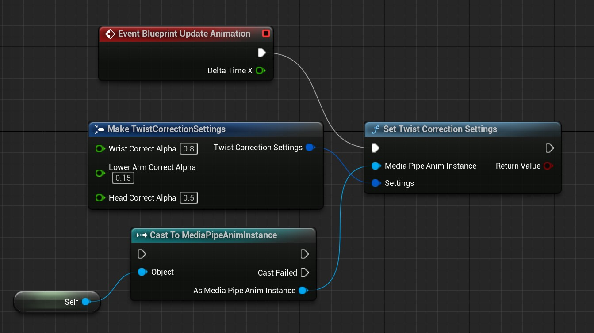
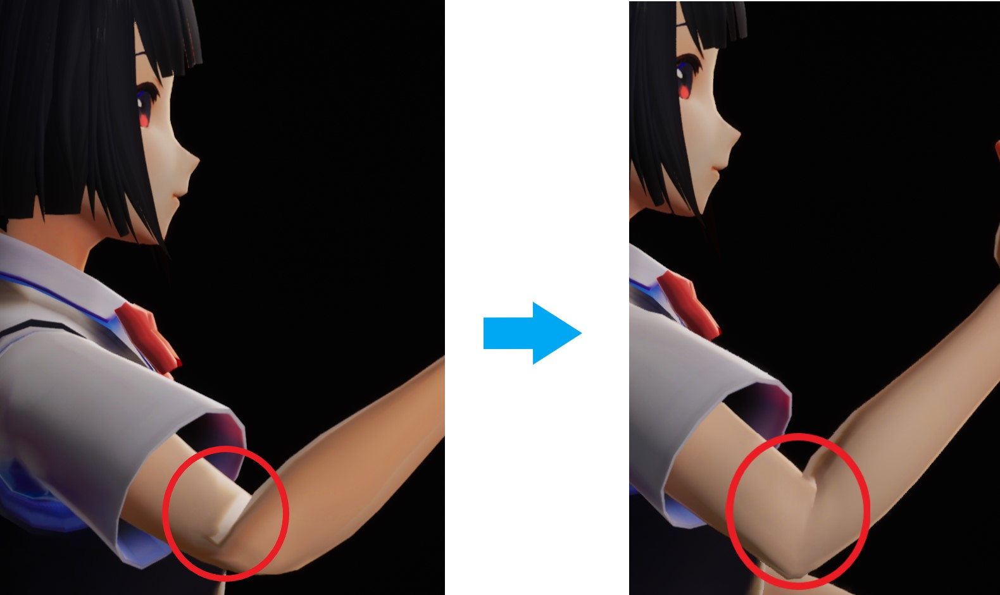

# 关节扭曲校正

“扭曲校正”将骨骼旋转的百分比重新分配到父骨骼，以校正在某一旋转轴上关节的旋转扭曲变形，在没有专用的矫正骨骼或者 BlendShape 的时候插件的矫正算法可以缓解扭曲现象，但是这可能会造成
更上层关节的扭曲，实际上，这只是把扭曲分摊到关节链上以缓解末端关节的过度扭曲。    
> 如果有专用的矫正骨骼，建议关闭（将 **TwistCorrectionSettings** 中的 **Enabled** 属性设未 false）插件中的矫正算法，使用后期动画蓝图处理关节扭曲。

**MediaPipe4U**中的扭曲校正包含了手腕，肘关节和头部:   

[](images/twist_correction.gif)

- Wrist Correct：手腕 (Hand) 使用前臂 (LowerArm) 来进行校正。
- Lower Arm Correct：前臂 (Lower Arm) 使用上臂 (UpperArm) 来进行校正。
- Head Correct：头部 (Head) 使用头部父骨骼，通常是颈骨 (Neck) 来进行校正。    


> 同时支持蓝图和 C++ 获取校正参数（权重），并且可以在运行过程中动态调整。

## 启用扭曲矫正

默认情况，扭曲矫正是关闭的，你可以通过将 **MediaPipeAnimInstance**的 **TwistCorrectionEnabled** 属性设置为 **true** 开启扭曲矫正。


## 在蓝图中设置校正权重  

[](images/update_twist_correction_settings.jpg)

## C++ 设置校正权重

```cpp
FTwistCorrectionSettings settings;
settings.HeadCorrectAlpha = 0.5f;
settings.WristCorrectAlpha = 0.85f;
settings.LowerArmCorrectAlpha = 0.15f;
UMediaPipeUtils::SetTwistCorrectionSettings(animInstance, settings);

```

## 校正属性

|属性|默认值|说明|
|-----|----|------|
|HeadCorrectAlpha|0.5| 0-1 的值，表示头部校正骨骼在轴线上的旋转权重，用来校正头部旋转，仅校正 Roll 方向的旋转 |
|WristCorrectAlpha|0.85| 0-1 的值，表示手腕校正骨骼(默认为 Lower Arm)在轴线上的旋转权重 |
|LowerArmCorrectAlpha|0.15| 0-1 的值，表示肘关节校正骨骼(Upper Arm)在轴线上的旋转权重 |

> 虽然可以通过父骨骼来矫正扭曲，但是可能使得更上层的骨骼产生扭曲，因此，矫正数值应该尽可能的小。

**手腕校正效果**

[](images/wirst_correction.jpg)

**肘关节校正效果**

[](images/lower_arm_correction.jpg)

**头部校正效果**

[](images/head_correction.jpg)