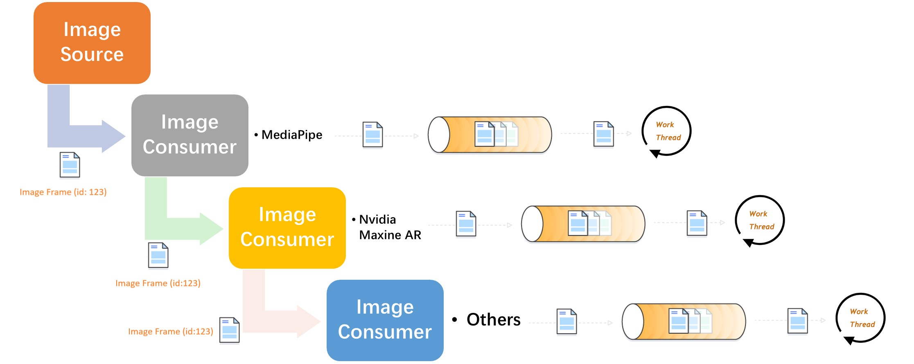

# ImageConsumer

## 程序结构

**MediaPipe4U** 的数据源来自图像帧，图像帧请阅读 **ImageSource** 部分。**MediaPipe4U** 融合各种不同的 AI、AR 技术，
这些技术大都通过消费图像帧来完成计算,例如 Google MediaPipe, Nvidia NvAR。**MediaPipe4U** 内部使用发布订阅（PUB/SUB）模式
来向各种不同的技术实现投递图像。

一个简单的工作流可以表达为如下图

[](./nvar/Image_work_flow.jpg)

从图中可以看出，所有的 **ImageConsumer** 都消费同一张图片，并且，他们是串行运行的（顺序执行），这是为了让上层线程管理变得简单，同时可以减少内存复制。
由于这样的设计，在实现 **ImageConsumer** 时就要求 **ImageConsumer** 不能同步消费图片，同步消费将堵塞下一个 Consumer 接收图片。

>**ImageConsumer** 的一个简单的设计：你可以自己缓冲一个队列，当帧到来时只是简单的将其入队 (Enqueue)，然后通过开启后台线程 Loop 消费队列，或者在 Tick
时消费缓冲区队列中的图像帧。

---  

## ImageFrame 生命周期

从上面的程序结构可以看出，所以的消费者消费同一帧图像减少了内存的复制，程序会更高效，但是引入了一个问题，就是什么时候释放这个帧。    
 

**池化（Pooling）**   

实时上，**ImageSource** 内部维护着一个帧对象池, 当所有的消费者消费完成时，这一帧数据将重新回到池中，它可以反复重新使用而不必开辟内存。
也不用担心因为某个 **ImageSource** 消费过慢而影响其他 **ImageSource**。

> 如果一个 **ImageConsumer** 拿到图像帧长期不消费，那么帧缓冲池会被填满，导致 ImageSource 不会再分发图像帧。

**释放**

要让一个图像帧可以重新回到缓冲池，只需要在 **ImageConsumer** 完成它的工作后调用帧对象 （IMediaPipeTexture）的 **Release** 函数即可。
> 背后原理：**ImageSource** 对每一个图像帧都维护着一个引用计数，它非常像 C++ 的 shared ptr 设计，但是这是 MediaPipe4U 自己实现的，并不使用 C++ 智能指针。
   

---


## C++ 实现 IImageConsumer

**MediaPipe4U** 为上述的 ImageSource 抽象了接口，这是一个 C++ 接口(只有虚函数的抽象类)，只需要实现它，你就可以将基于图像的功能集成到 **MediaPipe4U** 中。

```cpp

class IImageConsumer
{
public:
	virtual ~IImageConsumer() = default;
	virtual  bool CanConsume() = 0;
	virtual bool Consume(const FImageSourceInfo& SourceInfo, IMediaPipeTexture* Texture) = 0;
};


```
**IImageConsumer** 函数列表

|函数|说明|
|----|----|
| CanConsume | 返回一个值，当为 **true** 时，表示可以消费图像帧，ImageSource 将会回调 Consume 函数，如果为 **false** 表示这个 Comsumer 不接受图像帧，ImageSource 将不会再调用 Consume 函数。 |
| Consume | ImageSource 获取到图像帧以后会回调这个函数，用来消费图像帧。参数说明: **SourceInfo** 图像的高、宽、格式等信息, **Texture**：图像帧的指针，包含图像数据（字节数组）。 |

> 注意：**SourceInfo** 和 **Texture** 都是只读的，你只能读取，不可以修改。

**SourceInfo** 结构

```cpp

struct FImageSourceInfo
{
	int Width = 0;
	int Height = 0;
	int WidthStep = 0;
	MediaPipeImageFormat Format = MediaPipeImageFormat::UNKNOWN;
	bool bIsStatic = false;
	int CvMatType = 0;
	int NumOfChannels = 0;
	int ByteDepth = 0;
};
```

|属性|说明 |
|----|----|
| Width | 图像帧大小 |
| Height | 图像帧高度 |
| WidthStep | 行数据跨度，（可以不考虑字节对齐，**MediaPipe4U** 中的所有 ImageSource 都没有字节对齐）你可以简单认为 WidthStep = Wdith * NumOfChannels |
| Format | 格式，因为要兼容 UE，目前 **MediaPipe4U** 只有 RBGA 和 BGRA 两种格式，但是枚举中定义了 mediapipe 支持的所有格式。 | 
| IsStatic | 是否是静态图片。 | 
| CvMatType | 这在和 OpenCV 交互的场景中很有用，目前，只有 **CV_8U** |
| NumOfChannels | 图片的通道数 |
| ByteDepth | 位深度 |   


> 之所以提供这么多信息,是为了在和其他技术栈的图片结构（例如 cv::Mat, NvImage 等）交互数据时候可以直接使用这些信息而不用再计算


**IMediaPipeTexture 接口**

```cpp

class IMediaPipeTexture
{
public:
    virtual ~IMediaPipeTexture() = default;
    virtual long GetImageId() const = 0;
    //get uint8*
    virtual void* GetData() const = 0; // 目前只有 uint8 数组
    virtual void Release() = 0;
    virtual long DataSize() const = 0;
};

```

|函数|说明|
|----|----|
| GetImageId | 帧 id， **MediaPipe4U** 内部使用，你需要知道，这个 id 由于帧被池化是会重复的，你不能用来标识一个数据帧。 |
| GetData | 包含图片数据的数字，目前只有 uint8 数组。 |
| DataSize | ImageSource 获取到图像帧以后会回调这个函数，用来消费图像帧。参数说明: **SourceInfo** 图像的高、宽、格式等信息, **Texture**：图像帧的指针，包含图像数据（字节数组）。 |
| Release | 当一个 **IImageConsumer** 完成了帧的处理后**必须**调用此方法，让帧能够重新返回帧对象池。 |

简单的图片数据接口，需要注意的是 DataSize 是指字 GetData 返回的字节大小，即: num * sizeof(uint8)

