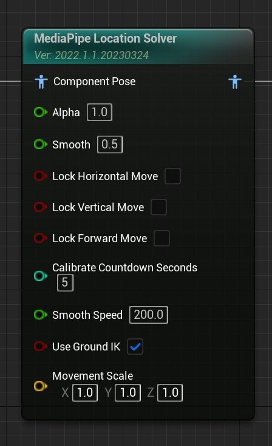
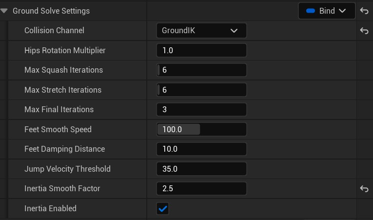
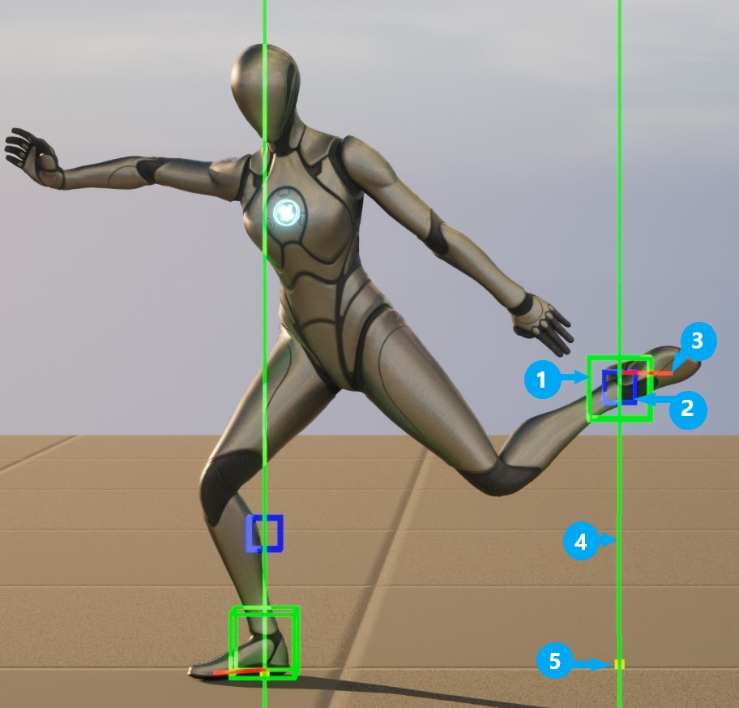

# 位置节点

MediaPipe4U 使用一个专门的动画蓝图节点，从动补数据中计算角色的位移。

## 安装位置节点

1. 在动画蓝图中放入 MediaPipe Location Solver 节点。
2. 在节点上设置主要的行为。
3. 选中节点，在细节面板中对节点进行详细的配置。

此时，MediaPipe4U 将从动补数据中算解出人物的位移数据，并且驱动 3D 角色在 X,Y, Z 轴向上移动。   
   

下面的设置能够调整位置节点的行为，对于位移的算解，我们主要关心移动轴的控制，位移的速度以及地标贴合。其他的很多属性与其他 MediaPipe4U 节点相同（因为所有的节点都从同一个基类继承）。

## 基本参数   

节点上包含的最常用的属性，仅调节这些属性就可以适应绝大多数的场景。

|属性| 默认值 | 说明 |
|--------------------| ------ | -- |
| Smooth | 0.3 | 对动补数据应用平滑，数值在 0~1 之间，数值越大越平滑。 |
|LockHorizontalMove  | false | 当为 **true** 时，将阻止角色进行水平（左，右）方向的位移。 |
|LockVerticalMove    | false | 当为 **true** 时，将阻止角色进行垂直（上，下）方向的位移。 |
|LockForwardMove     | false | 当为 **true** 时，将阻止角色进行前后位移。 |
|CalibrateCountdownSeconds | 5（秒） | 将在开始动补后 X 秒内进行位置校准。 |
|UseGroundIK | true | 是否使用地表 IK，关于地表 IK，下面的小节将详细介绍。 |
|DepthInterpSpeed | 0.5 | 预估的视频中人物和相机之间的距离（相机焦点）变化的速度，这将影响人物深度的计算，通常情况下，你不需要调整此参数。 |
|MovementScale | Vector(1,1,1) | 用于放大（缩小）三个轴向上的位移效果。通常，角色朝向 Y 轴时，X 表示水平方向，Y 表示前后方向，Z 表示垂直方向。 |

## 位置校准 (Calibration)

如果使用了位置节点，当动补开始以后，**MediaPipe4U** 将自动开始进行位置校准，校准就是通过视频流中的一帧图像作为人物位置参考数据，通过 CalibrateCountdownSeconds 来设置何时抓取这张图片。 

> 例如 CalibrateCountdownSeconds 设置为 5， 表示大致从第 5 秒的视频中抓取图片作为位置参考。对于摄像头动补而言，CalibrateCountdownSeconds 的含义是，人物站在摄像头图像的正中间，5 秒钟之内保持不动，等待校准完成。

---   

## Ground IK

单目摄像头由于无法准确获取图像深度信息，因此可能在算解过程中造成人物位置发生偏移。
垂直方向的偏移可能造成角色“悬空”或脚部陷入地面，为此，位置节点中内置了地表 IK ，用来将角色的脚与地面贴合。 

想快速开始使用 GroundIK，最简单的方法就是观看视频教程：   
- [中文视频（bilibili）](https://www.bilibili.com/video/BV1eY4y1Q7AD)
- [English Video Tutorial（youtube）](https://youtu.be/cop7_kCaDn4)
   

> Ground IK 工作原理：
> - Ground IK 通过向地面发出射线 (Ray Trace)
> - 从脚的骨骼射线计算脚离地面的距离
> - 推动角色的盆骨（Hips）消除距离
> - 调整腿的骨骼链来让姿态自然

{: .warning }
由于 Ground IK 通过射线检测（Ray Trace）地面，需要确保从腿部发出的射线除了地面外不会产生任何碰撞。可以通过单独建立碰撞通道（Collision Channel）来忽略除了地板外的所有碰撞体。
因特别注意，Character 的胶囊碰撞体也应该被忽略。   
关于如何使用碰撞通道，请参考 UnrealEngine 官方文档。

通过单击位置节点，在细节面板中可以调整 Ground IK 的行为。

Ground IK 会受到很多参数影响，大多数参数使用默认值是合理的，你只需要调整三个参数就可以明显感受到效果的变化：
- FeetDampingDistance
- JumpVelocityThreshold
- FeetSmoothSpeed

**CollisionChannel**     
射线检测的碰撞通道，确保从脚发出的射线只与地面碰撞   

**HipsRotationMultiplier**  
推动盆骨过程中如果法线偏移，轻微的旋转盆骨，该属性控制旋转的倍数

**MaxSquashIterations**  
推动盆骨造成腿部收缩时，腿部 IK 算解的迭代次数。

**MaxStretchIterations**  
推动盆骨造成腿部舒展时，腿部 IK 算解的迭代次数。

**FeetSmoothSpeed**  
当需要移动脚（Foot）的骨骼靠近地面时，通常是脚是增量，非线性的移动，该属性控制 (厘米/秒) 增量的移动速度, 如果你发现抬脚或落脚太快，尝试减小该值。

**FeetSmoothAngularSpeed**  
当需要转动脚（Foot）的骨骼贴合地面时，通常是脚是增量，非线性的旋转，该属性控制 (角度/秒) 增量的角速度。

**FeetDampingDistance**  
抬脚的阻尼高度（厘米），在此高度以下时脚将吸附到地面，只有超过这个值才会抬起腿部，数值约小，对抬腿越敏感。如果你发现无法抬起脚可以尝试减少该值，如果你认为不应该抬脚
时候脚被抬起可以增大该值，直到你认为灵敏度合适为止。

**JumpVelocityThreshold**  
跳跃速度（厘米/秒）阈值，只有角色位移速度超过这个阈值，才认为角色正在跳跃，此时会缓慢降低脚步阻尼以完成起跳，如果视频种的人物需要小的跳跃，可以降低该值，数值约小，对跳跃越敏感。
如果你发现角色经常离开地面，可以尝试增加该值以"增加地面吸附力", 如果你发现人物无法跳起，可以增加该值以"减少地面吸附力"。

**InertiaSmoothFactor**  
惯性平滑因子，当脚移动时，需要消除位移的摇摆，移动过程必须具有增量非线性的阻尼效果，通过这个参数控制这种“移动速度”的平滑，数值越大，平滑度越高。

**FeetVerticalOffset**
脚垂直方向的偏移量（以厘米为单位），如果模型 IK 计算后脚一直陷入地面或浮空（这或许是建模时脚就和根骨骼不在同一平面），你可以通过这个静态的偏移量修正它，正数表示上推（脚默认陷入地面的情况），负数表示下推（脚浮空的情况）。

## 调试绘制

位置节点的 Ground IK 使用过程中，由于射线碰撞或脚步位置问题可能造成 IK 失败，可以通过打开 "DebugDraw" 来绘制出 GroundIK 求解的关键点来定位问题。

要打开调试绘制，请按以下步骤设置：

1. 动画蓝图中选中位置节点
2. 细节面板中勾选 **DebugDraw** 属性
3. 运行程序并开始动作捕捉

{: .warning}
> 如果动画蓝图（MediaPipeAnimationInstance）类上的 **DebugDraw** 为 false, 即使节点上的 **DebugDraw** 属性为 true, 也不会进行调试绘制。

当动补开始后效果如下：

图中标注的含义：

1. 绿色盒子：表示 Ground IK 求解后 Foot 骨骼当前位置。
2. 蓝色盒子：表示 Ground IK 求解前 Foot 骨骼当前位置。
3. 红色短线条：表示脚掌平面的水平线，该线条因该平行于地面
4. 从 Foot 发出的射线： **绿色**表示射线发生了碰撞，**红色**表示没有发生碰撞。
5. 射线检测的碰撞点：正常情况下这个点应该的地面上。