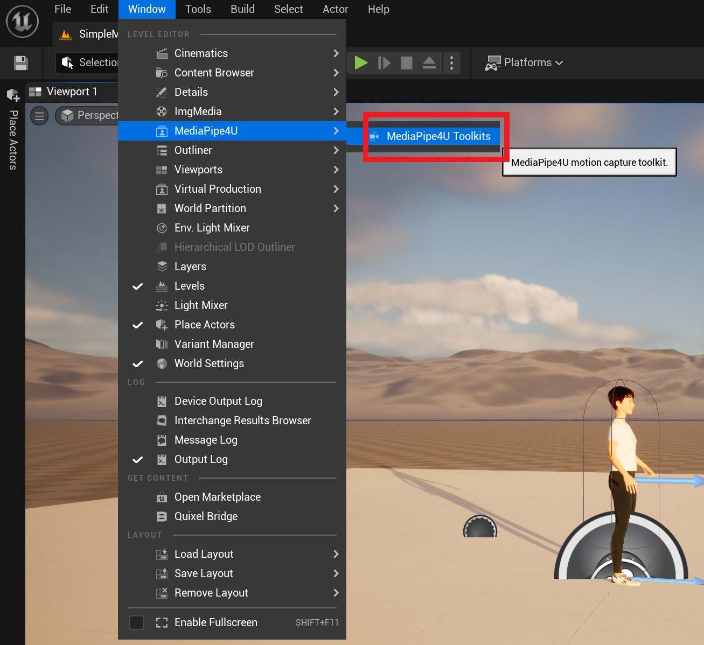
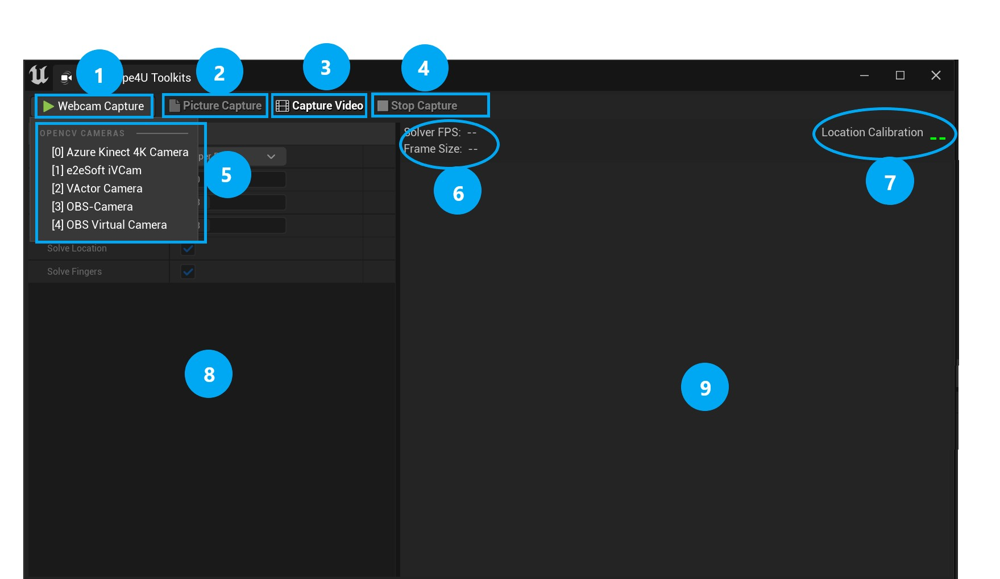
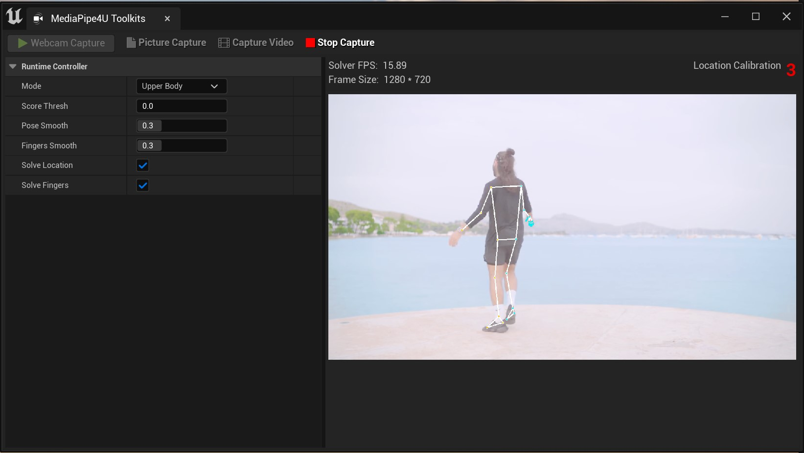

# UE Editor 工具箱

MediaPipe4U 提供了和 Unreal Engine Editor 配套使用的工具，方便你快速预览动补效果，运行时调教参数。

## 使用工具箱

在 UE Editor 中窗口菜单 -> MediaPipe4U -> MediaPipe Toolkits 菜单，点击它即可打开工具箱。

{: .waning}
> UE Editor 工具箱只有当编辑器运行游戏时才会被激活，如果你没有运行游戏，工具箱窗口的内容将是禁用的。

当工具箱打开时，你会看到 MediaPipe4U Tookits 窗口：

工具箱各区域说明：

- **1**: 启动摄像头动作捕捉
- **2**: 启动图片动作捕捉 (**注意**: 只有当场景中包含 **StaticImageSourceComponent** 时按钮才可用) 
- **3**: 启动视频动作捕捉 (**注意**: 只有当使用了 MediaPipe GStreamer 插时按钮才可见；当场景中包含 **GStreamerImageSourceComponent** 时按钮才可用)
- **4**: 停止动作捕捉
- **5**: 摄像头列表, 列表项**中括号**（[]）中的内容为摄像头索引，这个索引用于 MediaPipeHolisticComponent 的 StartCamera 函数
- **6**: 运行时状态
- **7**: 位移算解器标定的倒计时
- **8**：运行时控制面板
- **9**：动作捕捉的图像帧显示区域

你可以很方便的从工具箱启动动作捕捉，它和你当前场景实际运行效果一致，并且可以看到图像回显，同时还能够方便的调整参数观察 MediaPipe4U 动作捕捉的行为。

{: .note}
> 当你从运行时控制面板中调整参数时，你所作的调整并不会被保存到你的任何资产，它仅改变了运行时实例的参数，而你设置的默认值并不会变化，你可以放心的调整各种参数。

