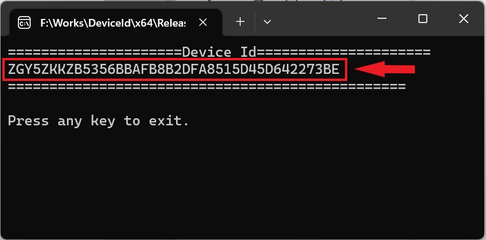

# Hardware Machine ID

If you purchase a device license for MediaPipe4U, you will need to provide the hardware machine ID[^1].

[^1]: `Hardware Machine ID`: This refers to a unique code generated based on the hardware information of the PC, used to identify a machine. Any hardware changes (such as replacing the motherboard, hard drive, CPU, etc.) will cause the result to change. Therefore, if you change hardware, you must request a new authorization for the new hardware device.

!!! warning "Note"

    Typically, your development PC and the actual deployment PC might not be the same device. You must provide the machine ID of the actual deployment device so that I can generate the correct license for you.  
    It is recommended to use the [`Device ID Viewer`](#Device-ID-Viewer-获取机器码) to obtain the machine ID of the actual deployment device.

You can obtain the machine ID using the following methods:   

- Retrieve the machine ID in UE Editor
- Use the Device ID Viewer (Machine ID Viewer) to obtain the machine ID
- Retrieve the machine ID from the logs
- Use blueprint functions to retrieve the machine ID

## Retrieving the Machine ID in UE Editor

1. Open UE Editor, and click on the "Edit >> Project Settings" menu to open the Project Settings page.
2. In the Project Settings page, click on the "Plugins >> MediaPipe4U" menu item on the left to open the MediaPipe4U plugin settings page.
3. In the MediaPipe4U plugin settings page, locate the **Device Id**, which is the machine ID of the current device.

  

## Retrieving the Machine ID Using Device ID Viewer

1. Download the Device ID Viewer.
2. Run the Device ID Viewer on the target machine.
3. Copy the machine ID from the displayed console interface.

Device ID Viewer download link:

[https://github.com/endink/Mediapipe4u-plugin/releases/download/device_id_viewer/DeviceId.exe](https://github.com/endink/Mediapipe4u-plugin/releases/download/device_id_viewer/DeviceId.exe)

!!! warning "Special Note"

    Based on user feedback, some antivirus software may falsely flag **Device ID Viewer** as a virus.  
    **Device ID Viewer** accesses Windows low-level APIs to read hardware information but does not perform any write operations or require an internet connection, so it is safe to use.  
    You may disable antivirus software to download the viewer program, obtain the machine ID, delete the program, and then re-enable your antivirus software.

  

## Retrieving the Machine ID from the Startup Logs

When MediaPipe4U starts, it prints a log table that includes the machine ID.

  

!!! tip "Tip"

    When you need to obtain the machine ID from other machines, it is recommended to use the [`Device ID Viewer`](#Device-ID-Viewer-获取机器码) to read the machine ID from other devices.  
    Alternatively, you can package a program, deploy it on the target device, run the program, and then find the log file in the Saved folder. You can then extract the machine ID from the log file.

## Retrieving the Machine ID in Blueprint

You can retrieve the machine ID using the **GetMediaPipeDeviceId** function.

  

!!! tip "Tip"

    C++ users can access these blueprint functions through the **UM4ULicenseBlueprintLibrary** class.
