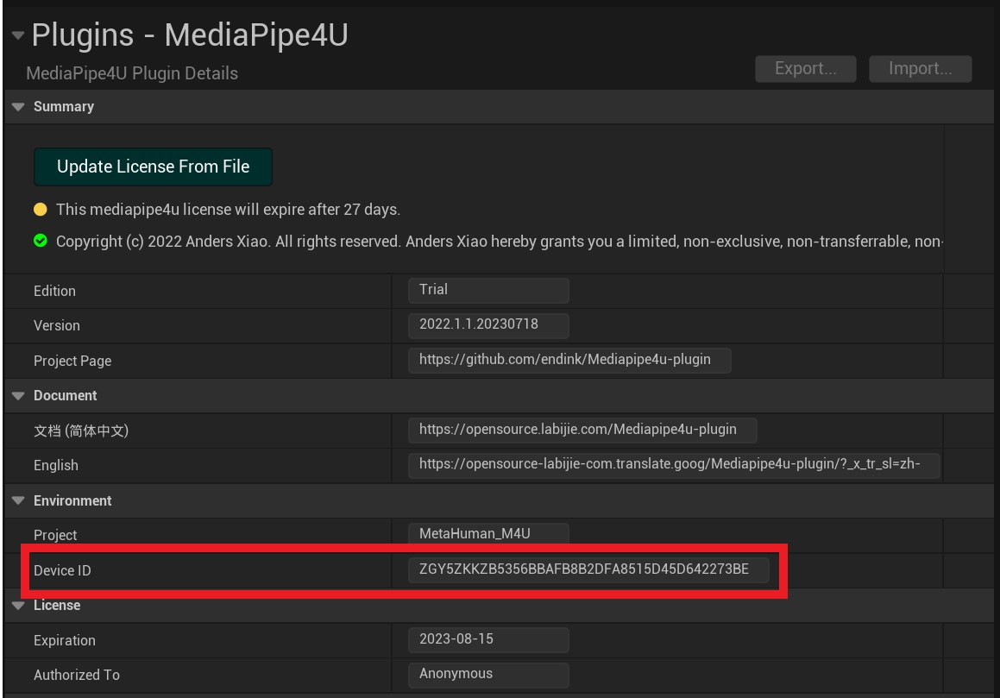

# 设备机器码

如果你购买 MediaPipe4U 的设备授权许可，需要提供设备机器码。

{: .warning}
> 通常你的开发 PC 和实际部署的 PC 可能不是同一个设备，你必须提供实际要部署的设备的机器码，这样我才能为你制作正确的许可证。       
> 推荐使用[`Device ID Viewer`](#Device-ID-Viewer-获取机器码)获取实际要部署的设备的机器码。

获取机器码有以下方式：
- 在 UE 编辑器中获取机器码
- 使用 Device ID Viewer （机器码查看器）获取机器码
- 查看日志获取机器码
- 使用蓝图函数获取机器码

## 在 UE 编辑器中获取机器码

1. 打开 UE Editor，点击"编辑 >> 项目设置" （ Editor >> Project Settings）菜单打开项目设置页。
2. 在项目设置页左侧点击 "插件(Plugins) >> MediaPipe4U" 菜单项打开 MediaPipe4U 插件设置页。
3. 在MediaPipe4U 插件设置页中找到 Device Id ，这就是当前设备的机器码。

   

## Device ID Viewer 获取机器码

1. 下载 Device ID Viewer。
2. 在目标机器上运行 Device ID Viewer。
3. 从显示的控制台界面中复制机器码。
   

Device ID Viewer 下载地址：   

[https://github.com/endink/Mediapipe4u-plugin/releases/download/device_id_viewer/DeviceId.exe](https://github.com/endink/Mediapipe4u-plugin/releases/download/device_id_viewer/DeviceId.exe)

{: .warning}
> 经用户反馈，部分杀毒软件会将**Device ID Viewer**误报为病毒。    
> **Device ID Viewer**会访问 Windows 底层 API 读取硬件信息，但并不会进行任何写操作，也不需要联网，请放心使用。   
> 你可以关闭杀毒软件后下载查看器程序，获得机器码后将程序删除，然后重新打开杀毒软件。

   

## 从启动日志中获取机器码

在 MediaPipe4U 启动时，会打印一个表格日志，其中包含了机器码。

   

{: .important}
> 当你要获取其他机器的机器码时，推荐使用[`Device ID Viewer`](#Device-ID-Viewer-获取机器码)读取其他设备的机器码。   
> 你也可以打包一个程序，放在实际要部署的设备上，启动程序后，在 Saved 文件夹中找到日志文件，从日志文件中找到机器码。

## 在蓝图中获取机器码

你可以通过 **GetMediaPipeDeviceId** 函数来获取机器码。  

   

{: .highlight}
> C++ 用户可以通过 **UM4ULicenseBlueprintLibrary** 类访问到这两个蓝图函数。
