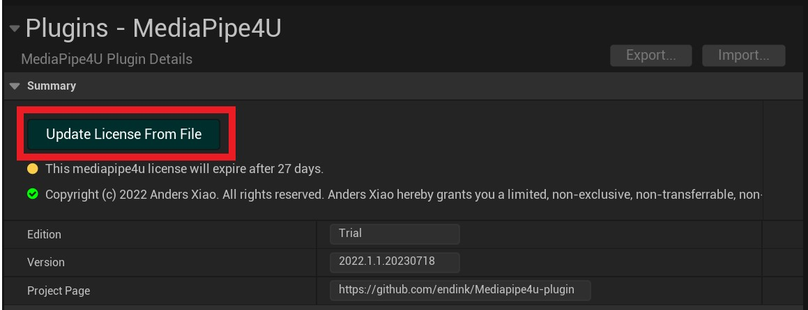

# 如何更新许可证

许可证过期后，你可以通过下面的几种方式更新许可证：

- 在 UE 编辑器中更新许可证，这通常适用于于开发过程。
- 使用蓝图函数来更新许可证，这可以用来开发自动更新许可证的程序。
- 手动更新，这是最原始的更新方式。

!!! tip "提示"
    UE 编辑器更新和蓝图更新需要插件版本不低于 2022.1.1.20230718 。

下面分别介绍这些方法。

## 在 Unreal Editor 中更新许可证

1. 打开 UE Editor，点击`编辑 >> 项目设置` （`Editor >> Project Settings`）菜单打开项目设置页。
2. 在项目设置页左侧点击`插件(Plugins) >> MediaPipe4U`菜单项打开 MediaPipe4U 插件设置页。
3. 在MediaPipe4U 插件设置页中点击`Update License From File`按钮, 选择新的许可证文件来更新现有许可证。

   

## 使用蓝图更新许可证

你可以通过`Update License By File`函数或者`Update License By Content`函数来更新许可证。   
   

这两个函数的区别正如它们的函数名一样：

**Update License By File**   
通过传入一个本地磁盘上的文件（完整路径）来更新许可证。

**Update License By File**   
通过传入许可证文件的内容来更新许可证。   
这非常适用于 HTTP 请求中返回许可证内容的场景。

!!! tip "提示"
    C++ 用户可以通过 **UM4ULicenseBlueprintLibrary** 类访问到这两个蓝图函数。   

## 手动更新许可证

打开目录 Plugins\MediaPipe4U\Source\MediaPipe\license 替换其中的 **mediapipe4u.license** 文件。

   

