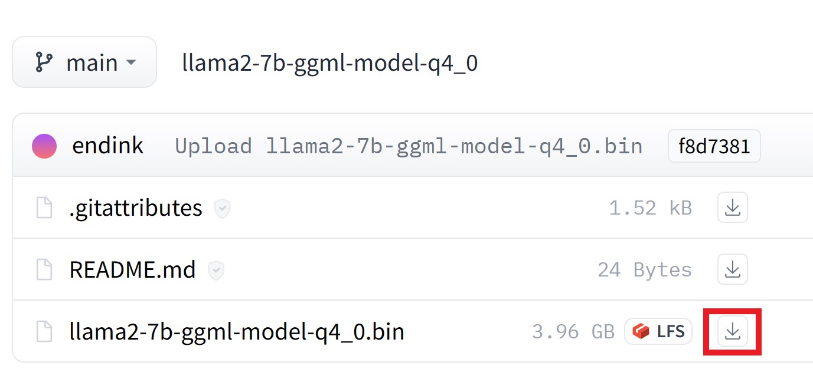
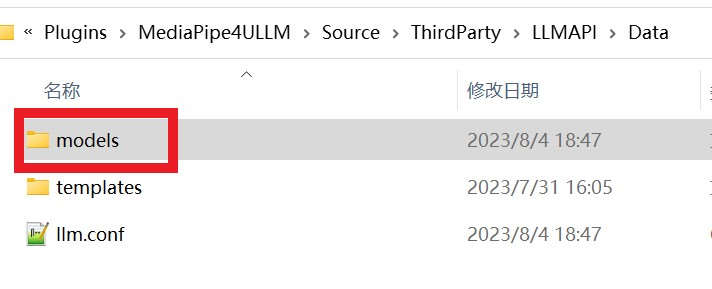
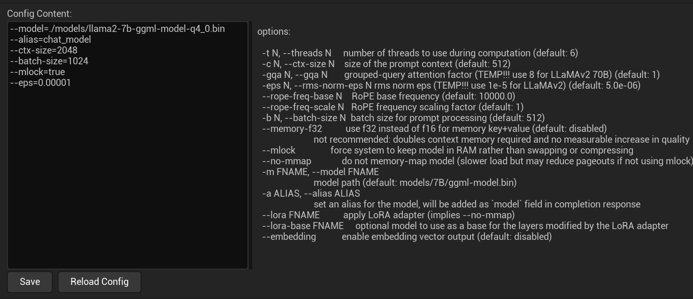
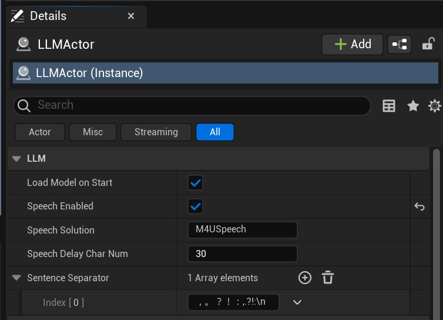

# 使用 LLM

使用 LLM 功能需要以下几个步骤：   

1. 安装和配置模型
2. 添加 LLMActor 组件
3. 绑定回调事件
4. 开始推理

{: .note}
> 大语言模型是一项复杂的技术，你应该充分阅读本文档，你可以需要了解大预言模型的几个核心概念：
>
> Prompt: 提示词   
> Context: 上下文   
> Token: 生成令牌   
>   
> 还有更多的概念你需要自行学习。

---   

## 安装和配置模型

配置 LLM 包含如下内容：   
- 安装模型
- 模型配置
- 系统提示词（System Prompt）配置
- 日志设置

### a. 安装模型

在开始使用语音套件之前，你必须先下载 LLM 模型文件。目前支持 [llama.cpp](https://github.com/ggerganov/llama.cpp) 量化后的模型。

你可以从我的[HuggingFace仓库](https://huggingface.co/endink/)下载我已经量化好的中文模型：

[https://huggingface.co/endink/llama2-7b-ggml-model-q4_0/tree/main](https://huggingface.co/endink/llama2-7b-ggml-model-q4_0/tree/main)

[](./images/llm_hf_download.jpg)


### b. 配置模型

下载模型文件（这里以模型文件名为 **llama2-7b-ggml-model-q4_0.bin** 为例，实际以你下载模型文件名为准）后，将模型放在插件的正确位置，**MediaPipe4ULLM** 提供了一个配置界面方便的完成这些操作：

依次在 Unreal Engine Editor 打开插件配置:
> 打开插件配置可以使用以下步骤：
> 1. 可以点击 `编辑（Edit）`>>`项目设置（Project Settings）`。
> 2. 在`项目（Project Settings）设置`页面左侧找到`插件(Plugins)`>>`MediaPipe4U LLM` 并点击。 
> 3. 将 **llama2-7b-ggml-model-q4_0.bin** 文件复制到 MediaPipe4ULLM 数据目录的`models`子目录中。

[](./images/llm_open_data_folder.jpg)

在 MediaPipe4ULLM 插件设置界面中提供了 `Open LLM Data Folder` 按钮，你将打开一个 MediaPipe4ULLM 插件的数据目录。   

{: .important}
> 如果点击`Open LLM Data Folder`后没有自动打开目录，你可以手动找到它：   
> 目录路径是 `[Plugins]\MediaPipe4ULLM\Source\ThirdParty\LLMAPI\Data` 
>
> `[Plugins]`: 你的 Unreal 项目插件目录。

[](./images/llm_models_folder.jpg)

将 llama2-7b-ggml-model-q4_0.bin 文件拷贝到 `models` 目录后，你还需要完成模型配置，模型配置文件是 MediaPipe4ULLM 数据目录下的 **llm.conf** 文件。   

用任意的文本编辑器（例如 Windows 记事本）打开它，进行编辑:

```shell
--model=./models/llama2-7b-ggml-model-q4_0.bin
--alias=chat_model
--ctx-size=2048
--batch-size=1024
--mlock=true
--eps=0.00001
```

你也可以在插件配置界面中编辑它，但是要记得编辑后点击 `Save` 按钮以保存编辑后的配置。   
[](./images/llm_edit_config.jpg)

{: .important}
> 配置参数的格式为：      
> --`[参数名]`=`[参数值]`
>
> 每行一个参数, 前缀 `--` 不可省略

界面中还提供了参数说明，下面是常用的参数简单说明：

**model**   
模型文件路径， 路径以配置文件所在路径所在目录的相对路径，也可以是绝对路径，相对路径以 `./` 开头。

**ctx**   
模型上下文长度，必须根据模型设置，LLaMA 模型最大长度为 2048 个字符, LLaMA 2 代模型最大长度为 4096，越长的上下文，对于多轮聊天的理解能力越强，但是推理速度会变慢，我认为 2048 已经可以满足普通场景。

**mlock**   
是否锁定内存防止和虚拟内存发生交换，这样可以提高性能（这个参数目前可能不起作用）。

> 其他参数并不常用，请自行查看插件设置界面中的说明。

### c. 配置系统提示词

通过插件设置界面来配置模型的系统提示词：

[](./images/llm_system_prompt_settings.jpg)

系统提示词（System Promt）在多轮会话推理时会固定到上下文中，作为默认 Prompt，因此我们可以用它让模型扮演一个角色，或者用来设置一个规则，下面是一个提示词例子：

```
你是一个化学天才，你的名字叫王小二，你是一个16岁的男生，你应该尽量用中文回答问题，你应该尽可能的给出答案，你的回答应该是积极乐观的。
```
{: .note}
> 虽然你可以用提示词赋予模型一些人设，但是受限于模型尺寸和模型理解能力， 模型可能并不能严格的按照你的设定拟人化，它只是尽可能的理解的 Prompt，提示词要尽可能简答，避免包含逻辑。
>
> 提示词会占据上下文空间（上下文空间指`ctx`配置的最大字符长度），因此不宜设置得过于冗长

 ### d. 设置日志输出

**Log Verbose**   
表示输出详细的日志。开启后，日志会非常冗长，正常情况下你不应该启用详细日志，详细日志通常用来进行开发调试或者你想了解模型的推理过程。

> 至此模型的安装和配置已经完成，请继续阅读后去章节学习如何使用 MediaPipe4ULLM 功能。

---   

## 用 LLM 生成内容

LLM 是复杂的生成式模型可以用来生成复杂结果（例如，写诗、写代码、逻辑计算，讲故事，写文章等）。   
模型尺寸越大，生成结果越准确，但是推理的速度也越慢。

{: .highlight}
> 目前 MediaPipe4U LLM 仅支持 LLaMA 系列模型（LLaMA/LLaMA2），当前实现由于是 CPU 推理，推荐你使用 7B 规格的模型。


可以通过以下步骤在 在 Unreal Engine 中使用 LLM：

1. 添加 **LLMActor** 到场景中
2. 在细节面板中设置 **LLMActor**
3. 在蓝图中添加事件（委托）回调，在回调中处理生成结果
4. 调用 Chat 函数开始推理

[](./images/llm_actor_details.jpg)

{: .highlight}
> MediaPipe4ULLM 的核心使用方式:   
> 
> 使用 `Chat` 函数发送聊天内容给 LLM。   
> 在`OnLLMTokenGenerated`事件中接收 LLM 生成结果。 

### LLMActor 属性   

LLM Actor 只需要较少的属性即可工作良好。

**LoadModelOnStart**   
控制是否在游戏启动时自动加载模型。   
默认值:**true**


{: .important}
> LLM 模型加载过程缓慢，为了避免阻塞游戏线程, 加载过程是异步执行的。   
> 
> 你可以通过 `GetModelState` 函数获取模型状态判断模型是否加载成功。   
> 你还可以通过`OnModelsLoadCompleted`事件来获得模型加载完成的通知。

**SentenceSeparator**   
对返回结果分句处理时用于分句的标点符号，分句可以以句子形式处理生成结果（例如：用于非流式 TTS 接入）。

**SpeechEnabled**   
是否启用语音朗读模型生成内容。   
这个功能依赖 LLM 扩展插件 **MediaPipe4ULLMSpeech**，关于如何与语音（TTS）集成，有专门文档说明。   
默认值: **false**   

**SpeechSolution**   
要使用的语音方案（适用于开发自定义 TTS 实现），关于自定义语音方案， 有专门文档说明。      
   

**SpeechDelayCharNum**   
当使用语音方案时，语言开始朗读延迟的字符数。

{: .highlight}
> 可能语音朗读速度和 LLM 生成内容的速度不一致（CPU 推理时，模型生成较慢）。
> 
> 如果直接朗读，会造成语音中间有大量停顿。   
> 
> 使用`SpeechDelayCharNum`属性设置延迟朗读的字符数，只有积累的文本字符数大于`SpeechDelayCharNum`设置的字符数量时才开始朗读，这样可以对齐语音朗读和 LLM 生成的速度。 
>
> 开始朗读字符数可能不是`SpeechDelayCharNum`设置的值（通常大于`SpeechDelayCharNum`）, 因为延迟的文本是以句子为单位积累，并不是以字符形式积累。


### LLMActor 事件   

**OnModelsLoadCompleted**   
模型加载完成后触发，模型加载是否成功，通过事件参数 `ModelState` 获取。

**OnLLMTokenGenerated**   
当 LLM 生成字符时触发。这个事件通常用将文本上屏，以得到打字效果。

{: .important}
> 这里`OnLLMTokenGenerated`事件名中的 "Token" 并不是 LLM 中 "token" 的概念。   
> `OnLLMTokenGenerated`是以字符（一个英文字符/中文字符/标点符号）为单位触发。
> 
> MediaPipe4ULLM 为了方便使用，在底层进行了封装，只有多个 token 被合得到一个字符时，才触发`OnLLMTokenGenerated`事件。

**OnSentenceGenerated**   
当 LLM 生成句子时触发。      
句子通过 `SentenceSeparator` 配置的分句符号来进行拆分

**OnCompletionFinished**   
当 LLM 完整的生成了结果时触发。   
触发`OnCompletionFinished`事件时，表示 LLM 的一轮对话完成。   


### LLMActor 蓝图函数   

**LoadModelAsync**   
开始异步加载模型，当 `LoadModelOnStart` 被设置为 **false** 时，你可以通过该函数手动加载模型。


**ResetChat**   
重置一个聊天会话，用来清空聊天上下文，开始一个新的聊天会话。    
其中 Options 参数用来设置模型会话参数，关于会话参数，本文档后面内容详细介绍。   


**Chat**   
与 LLM 进行对话，即向 LLM 模型发送聊天指令。   
如果当前不存在聊天会话，将使用模型参数创建一个会话 。      
如果已经存在聊天会话，将持续继续使用当前的上下文（Context）发送聊天指令。   

**HasChatSession**   
返回一个布尔值，指示当前是否存在聊天会话（上下文）。   
如果为 **true**, 表示当前有聊天会话（聊天已经开始），否则为 **false**。      

**CancelCompletion**   
停止 LLM 生成内容，可以理解为取消一轮聊天。
{: .important}
> 执行 `CancelCompletion` 后，这一轮聊天的用户输入和 LLM 输出都不会保存到上下文中，因为取消会中断 LLM 生成内容，不完整的内容不适合放入上下文。   

**IsCompleting**   
返回一个布尔值，指示 LLM 是否正在生成内容。   
如果为 **true**, 表示正在生成内容，反之，LLM 正在等待用户输入。   

---   

## 语音集成    

**MediaPipe4ULLM** 实现了和 **MediaPipe4USpeech** 集成的功能，可以很方便的让你使用本地 TTS 朗读 LLM 生成的内容。    
### 开启语音集成：
1. 向场景中添加`MediaPipeSpeechActor`。
2. 配置好 MediaPipe4USpeech。
3. 设置`LLMActor`的 `SpeechEnabled` 属性为 **true**（默认是 false）。   


{: .highlight}
> 关于如何使用 `MediaPipeSpeechActor` 和如何正确的配置离线 TTS （MediaPipe4USpeech）, 请阅下面的文档：
>
> [Speech 快速入门](../speech/quick_start.md)


