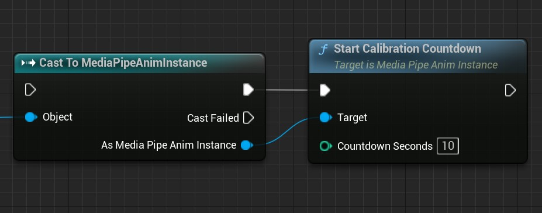
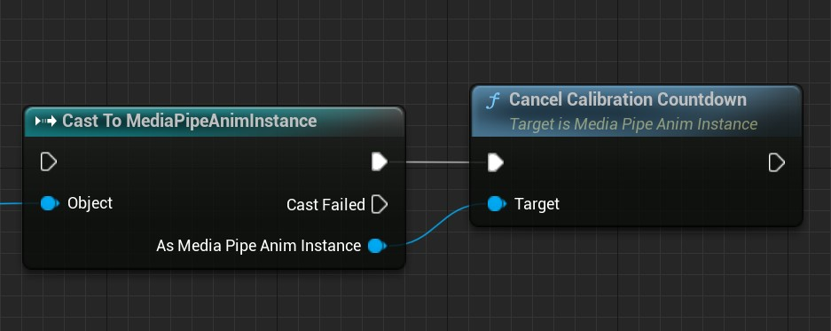
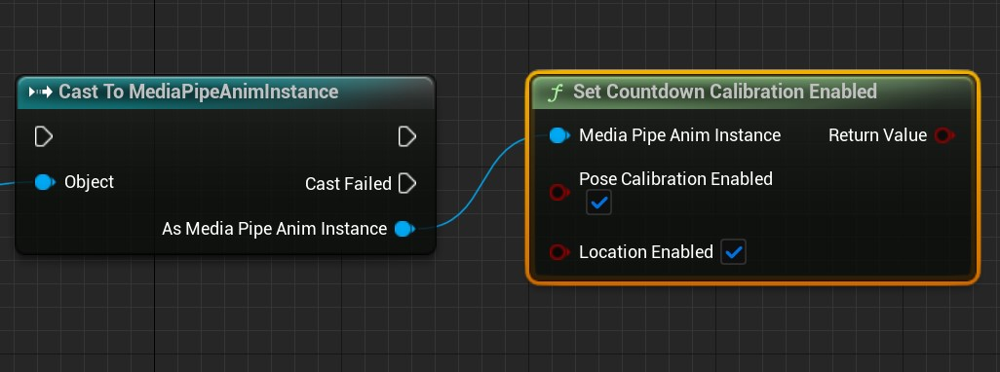
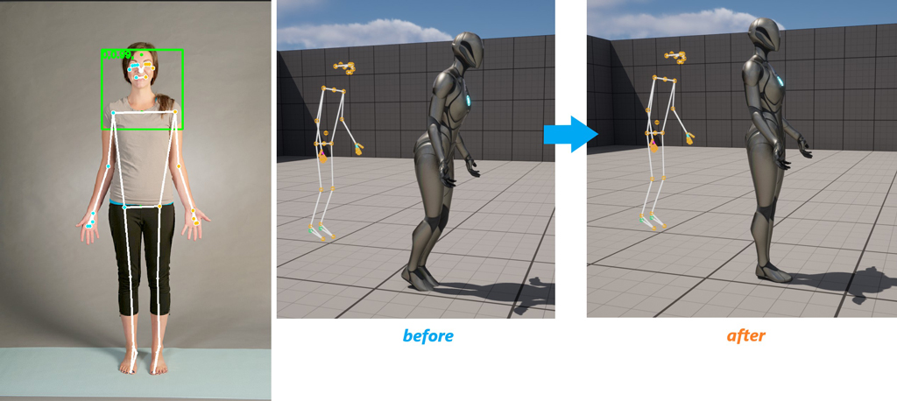
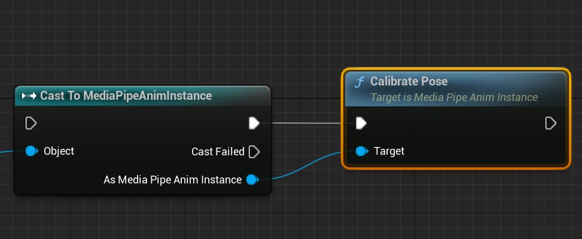
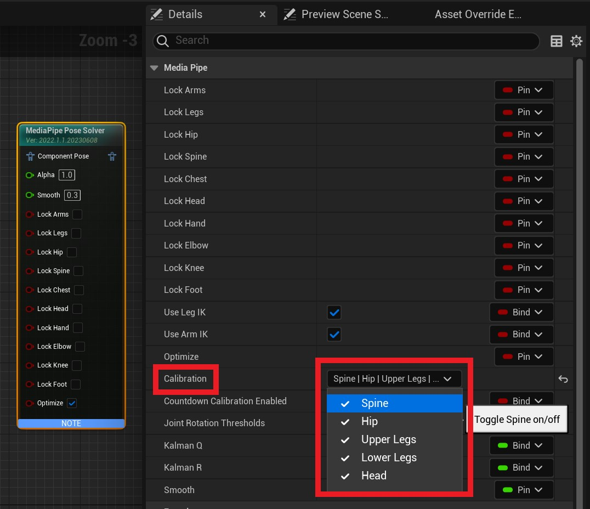
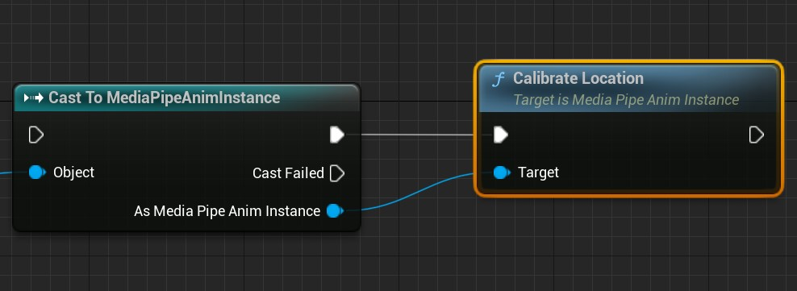

# 校准

由于 MediaPipe4U 采用相机免标定设计，从而没无法获得物理相机的参数。因此，在动补开始前对角色进行校准可以纠正动补过程中人物位置不准、人物倾斜等问题。

动补校准分为两个部分：
- 姿势校准： 纠正角色倾斜，腿部无法伸直的问题。
- 位置校准： 纠正角色初始位置错误的问题。
     
---   
## 校准概述

默认情况下, MediaPipe4U 在每次动补开始前会开始一个倒计时，在倒计时结束时进行姿势校准和位置校准。   
你可以通过动画蓝图（ MediaPipeAnimInstance ）上的 **CalibrationCountdownSeconds** 和 **CalibrationPolicy** 属性来控制这个校准行为。   

下面是这两个属性的介绍：

| 属性 | 说明 |
|-----|------|
|CalibrationCountdownSeconds|通过这个属性设置倒计时校准的秒数。|
|CalibrationPolicy|校准策略， 动补开始时的倒计时校准行为。|

{: .important}
> CalibrationPolicy 说明：   
>
> **CountdownOnStart** :倒计时校准，表示每次开始都倒计时。   
> **Manual**: 手动校准，开始动补时不进行倒计时。
>

### 运行时倒计时校准

当你把 CalibrationPolicy 属性设置为 **Manual** 时, MediaPipe4U 将不会开始进行倒计时，但是，你可以调用 MediaPipeAnimInstance 上的 **StartCalibrationCountdown** 函数来开始一个校准倒计时。     
 
   
   
   
你也可以通过调用 MediaPipeAnimInstance 上的 **CancelCalibrationCountdown** 函数来取消一个校准倒计时。   
   

 **控制姿势和位置校准行为**

某些情况下，你可能希望运行时控制倒计时校准的行为，例如：倒计时结束时不进行姿势校准，你可以通过 MediaPipe4U 提供的蓝图函数库来进行这些操作。   
通过蓝图函数库中的 **SetCountdownCalibrationEnabled** 函数控制倒计时结束时的校准行为。

> **SetCountdownCalibrationEnabled** 函数返回一个值，指示设置校准的操作是否成功，通常不需要关心这个返回值。

   

{: .warning}
> 由于姿势校准要求镜头中的人物以标准姿势站立，因此，通常它不适用于视频动补（视频中前几秒人物以标准姿势站立的视频除外）。    
> 在视频动补前，你可以通过蓝图中调用 **SetCountdownCalibrationEnabled** 函数来禁用姿势的倒计时校准。

> C++ 可通过访问 **UMediaPipeUtils** 蓝图函数类的静态函数执行相同的操作。

### 校准类型
MediaPipe4U 包含位置校准和姿势校准。默认情况下，校准倒计时结束时，会分别进行姿势校准、位置校准，但是你可以在动画蓝图节点上控制这个行为。   

- MediaPipe Pose Solver 节点上的 **CountdownCalibrationEnabled** 可以控制是否在倒计时结束时进行姿势校准。   
- MediaPipe Location Solver 节点上的 **CountdownCalibrationEnabled** 可以控制是否在倒计时结束时进行位置校准。

{: .warning}
> 位置校准：当位置校准没有被执行时，角色不能进行位移，如果你禁用了到倒计时位置校准，你应该进行手动校准位置的流程。 
>
> 姿势校准：当你运行过程中动态调整设置时，姿势校准数据会被重置，你需要重新校准姿势：   
>    
> - 脊柱俯仰禁用/启用 (SpinePitchEnable)   
> - 脊柱俯仰跨度（SetHipPitchSpan）   
>    
> -关于脊柱俯仰，请阅读[姿势算解节点](../features/pose_solver.md)部分文档
  
---     

### 手动校准
除了倒计时校准外， 你可以通过蓝图或者 C++ 代码立即对姿势、位置进行校准，下面的内容将详细介绍手动校准的方法。
 
## 姿势校准

姿势校准的原理是记录一些角色当前关节的角度作为修正角度，在动补的每一帧中应用这些修正角度来修复骨骼旋转偏移。   

 

姿势校准被作用于 MediaPipe Pose Solver 动画蓝图节点。

- 通过 MediaPipeAnimInstance 上的 **CalibratePose** 函数进行姿势校准。      
- 通过 MediaPipeAnimInstance 上的 **UnCalibratePose** 函数清除姿势校准数据。   

姿势校准可以通过 **Calibration** 属性控制要校准的关节。

可以通过蓝图函数库中的 **SetPoseCalibrationFlags** 在运行时动态的改变要校准的关节。

> **SetPoseCalibrationFlags** 函数返回一个值，指示操作是否成功，通常不需要关心这个返回值。

---

## 位置校准

位置校准是通过抓取一张图片，然后模拟相机 FOV 等参数来计算相机坐标到 3D 坐标之间的关系。

- 通过 MediaPipeAnimInstance 上的 **CalibrateLocation** 函数进行位置校准。      
- 通过 MediaPipeAnimInstance 上的 **UnCalibrateLocation** 函数清除位置校准数据。   

 