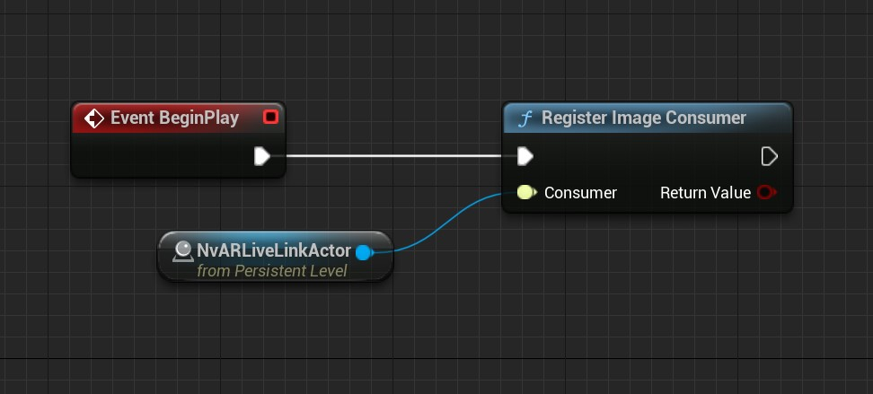

# ImageConsumer

## 程序结构

**MediaPipe4U** 的本质是不停的处理来自图像源的帧（以下简称图像帧）。**MediaPipe4U** 融合各种不同的 AI、AR 技术，
这些技术大都通过消费图像帧来完成计算,例如 Google MediaPipe, Nvidia NvAR。**MediaPipe4U** 使用发布订阅（PUB/SUB）模式向各种不同的技术投递图像，以此融合各种视觉处理技术。
> 图像源请阅读 **ImageSource** 部分。
一个简单的工作流可以表达为如下图

[](./nvar/Image_work_flow.jpg)

从图中可以看出，所有的 **ImageConsumer** 都消费**同一帧**图像，并且，他们是**串行**运行的（顺序执行），这是为了让底层的线程管理变得简单，同时可以减少内存复制。
由于这样的设计，在实现 **ImageConsumer** 时就要求 **ImageConsumer** :heavy_exclamation_mark:不能同步消费图片，同步消费将堵塞下一个 Consumer 接收帧。

{: .highlight }
>推荐的 **ImageConsumer** 的简单实现模式：缓冲一个队列，当帧到来时只是简单的将其入队 (Enqueue)，然后通过开启后台线程循环消费队列（Dequeue），或者在UE组件的 Tick
事件中消费缓冲队列中的帧。

---  

## ImageFrame 生命周期

从上面的程序结构可以看出，所有消费者（ImageConsumer）都消费同一帧图像，这减少了内存的复制，程序会更高效，但是引入了一个问题，就是什么时候释放这个帧。    
 
**池化（Pooling）**   

实时上，**ImageSource** 内部维护着一个帧对象池，这实际是一个内存池, 当所有的消费者消费完成时，这一帧数据将重新回到池中，帧的内存可以被反复使用从而降低频繁分配和释放内存的开销。
池中还有其他的空闲帧内存时，就不用担心因为某个 **ImageSource** 消费过慢而影响其他 **ImageConsumer**，**ImageConsumer** 之间可以并行处理互不干扰。

{: .warning }
> 如果一个 **ImageConsumer** 拿到图像帧长期不消费（没有 Release），**ImageSource** 帧对象池就会被填满，导致 **ImageSource** 无空闲内存可用，从而不再分发图像帧。

**释放**

要让一个图像帧可以重新回到对象池（内存池），只需要在 **ImageConsumer** 完成它的工作后调用帧对象 （IMediaPipeTexture）的 **Release** 函数即可。   

> 背后原理：**ImageSource** 对每一个图像帧都维护着一个引用计数，它非常像 C++ 的 shared ptr 设计，但是这是 MediaPipe4U 自己实现的，并不使用 C++ 智能指针。
   

---


## C++ 实现 IImageConsumer

**MediaPipe4U** 为上述的 **ImageConsumer** 抽象了接口，这是一个 C++ 接口(不是 UnrealEngine 接口，不能在蓝图中使用)，只需要实现它，你就可以将基于图像处理的功能集成到 **MediaPipe4U** 中。

```cpp

class IImageConsumer
{
public:
	virtual ~IImageConsumer() = default;
	virtual  bool CanConsume() = 0;
	virtual bool Consume(const FImageSourceInfo& SourceInfo, IMediaPipeTexture* Texture) = 0;
};


```
**IImageConsumer** 函数列表

|函数|说明|注意事项|
|----|----|----|
| CanConsume | 返回一个值，当为 **true** 时，表示可以消费图像帧，ImageSource 将会回调 Consume 函数，如果为 **false** 表示这个 Comsumer 不接受图像帧，ImageSource 将不会再调用 Consume 函数。 | 不再需要消费图像时，可以返回 **false**，达到 "关闭"的功能。|
| Consume | 用来消费图像帧。参数说明: **SourceInfo** 图像的高、宽、格式等信息, **Texture**：图像帧的指针，包含图像数据（字节数组）。 |:bangbang:**注意**: <br/>实现 **Consume** 函数不能使用同步模式，堵塞当前线程将导致其他 Consumer 得不到图像帧。<br/>当 **Consume** 返回 **false** 时不能释放 （Release）图像帧，返回 **false** 表示一个 **Consumer** 没有对这一帧图形进行消费。|

> **SourceInfo** 和 **Texture** 都是只读的，你只能读取，不可以修改。   
> **SourceInfo** 存储帧信息，**Texture** 存储帧数据。

**SourceInfo** 结构

```cpp

struct FImageSourceInfo
{
	int Width = 0;
	int Height = 0;
	int WidthStep = 0;
	MediaPipeImageFormat Format = MediaPipeImageFormat::UNKNOWN;
	bool bIsStatic = false;
	int CvMatType = 0;
	int NumOfChannels = 0;
	int ByteDepth = 0;
};
```

|属性|说明 |
|----|----|
| Width | 图像宽度 (像素) |
| Height | 图像高度 (像素) |
| WidthStep | 行数据跨度，（可以不考虑字节对齐，**MediaPipe4U** 中的所有 ImageSource 都没有字节对齐）你可以简单认为 WidthStep = Wdith * NumOfChannels |
| Format | 格式，因为要兼容 UE，目前 **MediaPipe4U** 只有 RBGA 和 BGRA 两种格式，但是枚举中定义了 mediapipe 支持的所有格式。 | 
| IsStatic | 是否是静态图像（静态表示从图片获得的图像帧，非静态表示视频流里的图像帧）。 | 
| CvMatType | 这在和 OpenCV 交互的场景中很有用，目前，只有 **CV_8U** |
| NumOfChannels | 图片的通道数 |
| ByteDepth | 位深度 |   


> 之所以提供这么多信息,是为了在和其他技术栈的图片结构（例如 cv::Mat, NvImage 等）交互数据时候可以直接使用这些信息填充数据，而不用为了获得这些属性复制内存。


**IMediaPipeTexture 接口**

**IMediaPipeTexture** 是一个简单的图片数据接口，兼容绝大多数流行的图片处理库（内部已经集成了 GStreamer, OpenCV, NvImage），方便转换到各种第三方库的图片数据结构。

```cpp

class IMediaPipeTexture
{
public:
    virtual ~IMediaPipeTexture() = default;
    virtual long GetImageId() const = 0;
    //get uint8*
    virtual void* GetData() const = 0; // 目前只有 uint8 数组
    virtual void Release() = 0;
    virtual long DataSize() const = 0;
};

```

|函数|说明|
|----|----|
| GetImageId | 帧 id， **MediaPipe4U** 内部使用，你需要知道，由于帧是池化的，这个 id 是会重复的，你不能用它作为图像的唯一标识。 |
| GetData | 包含图片数据的数组，目前只有 **uint8** 数组。 |
| DataSize | 图像数据的字节大小，num * sizeof(uint8)，由于只有 **uint8** 数据，所以他也等于 GetData.Num()。 |
| Release | :bangbang:当一个 **IImageConsumer** 完成了帧的处理后**必须**调用此方法，让帧能够重新返回帧对象池。 |


## 注册和注销

当你实现了 **IImageConsumer** 以后，还需要注册你的实现到 **MediaPipe4U** 的图片工作流中，通过调用 **FImageWorkflow::RegisterConsumer** 函数完成注册。

> **FImageWorkflow** 是单例模式，通过静态函数 **Get** 获取唯一实例。

```cpp
TSharedPtr<IImageConsumer> yourInstance = MakeSharedable<IImageConsumer>(new YourImageConsumerClass());
FImageWorkflow::Get().RegisterConsumer(yourInstance);
```

当你不再需要这个ImageConsumer 的时候，你还可以注销它：

```cpp
FImageWorkflow::Get().UnregisterConsumer(yourInstance);
```

> 你也可以让这个实例的 **CanConsume** 返回 **false**, 来达到让它"停止工作"的目的。   

{: .warning }
> 如果一个 Consumer 不需要消费图像帧时候，强烈建议建议注销或者让它“停止工作”，这样可以提高程序的性能。

## 与 UObject 集成

由于 UnrealEngine 的接口（**UInterface**）存在 GC，为了保持底层稳定性，IImageConsumer 并不是一个 UE 接口，但是 **MediaPipe4U** 提供了一个 UnrealEngine 接口来包装它, 方便你把它集成到 Component 或 Actor：

```cpp
UINTERFACE()
class UImageConsumerProvider : public UInterface
{
	GENERATED_BODY()
};

/**
 * 
 */
class MEDIAPIPE_API IImageConsumerProvider
{
	GENERATED_BODY()
public:
	virtual IImageConsumer* GetImageConsumer() = 0;
};

```

它只有一个 C++ 纯虚函数，返回一个你实现的 **IImageConsumer**。这意味着这个包装你也必须用 C++ 实现，因为图像处理影响整个 **MediaPipe4U** 的稳定性和性能，不支持使用蓝图实现。
> 可以让组件（Component）同时实现 **IImageConsumer** 和 **IImageConsumerProvider** 接口，在 **GetImageConsumer** 中返回 **this** 来包装一个 UE 组件。   

可以参考的一个例子是NvAR 的实现：   

```cpp
//.h
UCLASS(BlueprintType)
class MEDIAPIPENVAR_API ANvARLiveLinkActor : public AActor, public IImageConsumer, public IImageConsumerProvider

//.cpp
IImageConsumer* ANvARLiveLinkActor::GetImageConsumer()
{
	return this;
}
```

**FImageWorkflow** 的 **RegisterConsumer** 和 **UnregisterConsumer** 也接受一个 **IImageConsumerProvider** 进行注册/注销。   

{: .warning }
> 当你使用 IImageConsumerProvider 时你必须非常小心 UE 的 GC，如果你的实现是一个 UComponent，建议你调用 **AddToRoot** 来防止 GC 清理它。

由于 **IImageConsumerProvider** 是 UnrealEngine 接口，不但可以通过 C++ 代码注册，也支持在蓝图中使用 **MediaPipe4U** 提供的蓝图函数库来注册。

蓝图函数名称：

- RegisterImageConsumer
- UnregisterImageConsumer


[](./images/image_consumer_blueprint_register.jpg)

