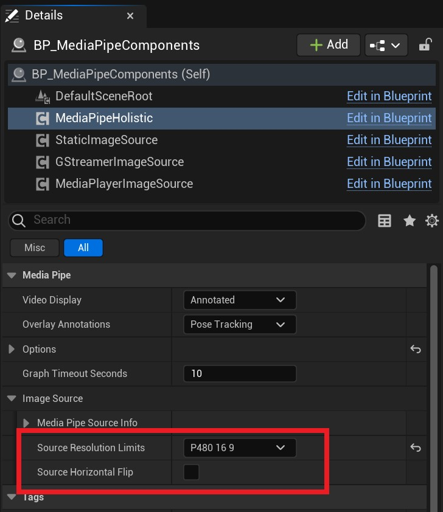
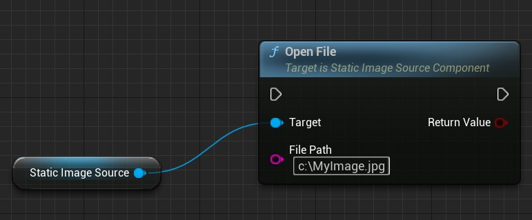
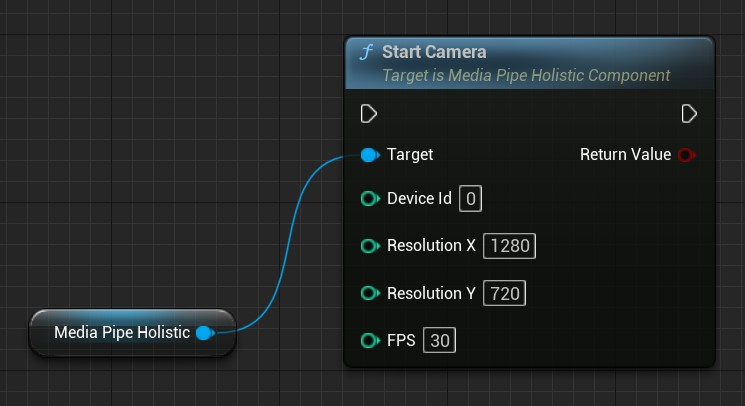
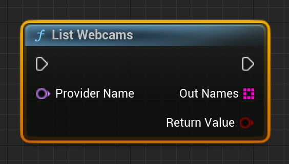
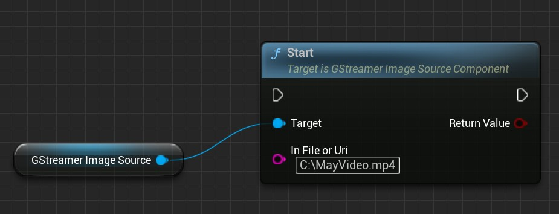
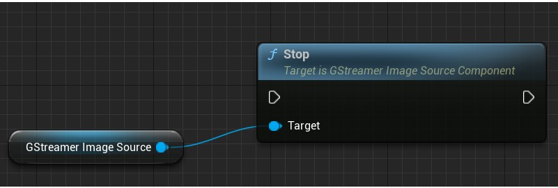
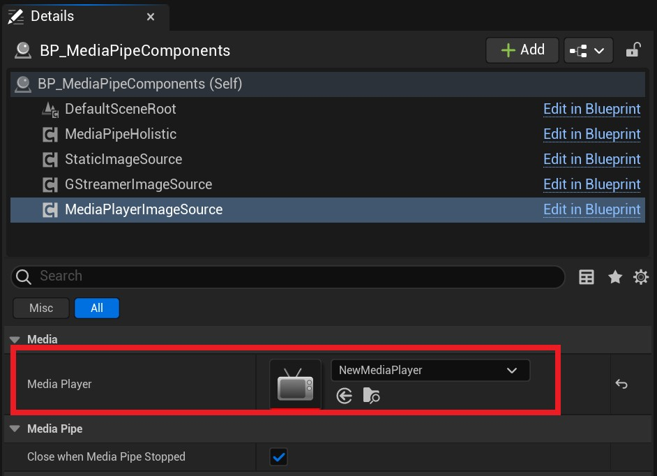

# Image Source 

Image Source 表示图像源。   
MediaPipe4U 将提供图像数据（静态图片、视频流、视频文件）的组件，统一抽象为一个 UE 接口 **IMediaPipeImageSource**， 表示 mediapipe 用于捕捉动作和表情的图像来源。   

## 内置 Image Source 
MediaPipe4U 中内置了 4 种图像源：

- **StaticImageSourceComponent** : 静态图片图像源，支持从 jpg, png 等图片文件捕获图像。   
- **WebcamImageSourceComponent** ：摄像头图像源，支持从本机摄像头捕获图像。   
- **GStreamerImageSourceComponent** ：基于 GStreamer 实现的媒体管线，支持从视频文件、在线流媒体（RTMP/RSTP/HTTP 等协议）中捕获图像。   
- **MediaPlayerImageSourceComponent** ：从 Unreal Engine 的 Media Player 组件中捕获图像 (beta)。   

{: .important}
> WebcamImageSourceComponent 内置在 MediaPipeHolisticComponent 中，不需要手动添加。   
>
> WebcamImageSourceComponent 通过调用 MediaPipeHolisticComponent 的 **StartCamera** 函数来使用，不使用 StartImageSource 函数。   

## 如何使用 Image Source

1. 添加图像源组件（蓝图编辑器中）。
2. 调用 MediaPipeHolisticComponent 上的 **StartImageSource** 活 **StartImageSourceAsync** 函数从 Image Source 组件中进行动作捕捉。
3. 调用 Image Source 的"打开"函数，打开摄像头、图片、视频文件等。

> 不同的 Image Source 组件有不同的“打开”函数，图中并未展示。
> 
> 各种图像源如何使用，请继续阅读本文档下面的内容。

## Image Source 通用属性
   
**bCloseWhenMediaPipeStopped**   
是否在 MediaPipe 动补停止时（例如：调用了 MediaPipeHolisticComponent 的 Stop 函数）自动停止 Image Source (自动关闭文件、MediaPlayer 等)。   
默认值: **true**

> 当 bCloseWhenMediaPipeStopped 未 true 时，调用 MediaPipeHolisticComponent 的 Stop 函数将自动结束动补，并关闭正在使用的 Image Source。

---    

## Image Source 高级控制
你可以通过 MediaPipeHolisticComponent 的属性来控制 Image Source 的高级操作，但是，不是所有的图片源都支持这些操作：

|控制属性| 说明 |
|:------|:--------|
| SourceHorizontalFlip | 水平反转图像 |
| SourceResolutionLimits | 限制图像分辨率 |

{: .highlight}
> 使用 **SourceResolutionLimits** 限制图像源的分辨率，可以有效的提升 mediapipe 算解器的性能。

## StaticImageSourceComponent

### 打开图片   
通过调用 StaticImageSourceComponent 的 **OpenFile** 函数来打开一个 jpg 或 png 文件。

---   

## WebcamImageSourceComponent

### 打开摄像头
MediaPipe4U 内置的 WebcamImageSourceComponent 提供了摄像头采集画面的支持。      

{: .highlight}
> Windows 平台摄像头使用 OpenCV 实现，并且只支持 Direct Show 摄像头，如果你的摄像头不支持 Direct Show ，可能无法使用。   
> Android 平台摄像头使用 Android CameraX 实现。   

摄像头采集只需要调用 MediaPipeHolisticComponent 的 **StartCamera** 函数或 **StartImageSourceAsync** 函数：  

   

StartCamera 参数：   

| 参数 | 说明 | 示例 |
|:------|:------:|:------|
| DeviceId | 从 0 开始的摄像头编号 | 0 |
| ResolutionX | 摄像头水平分辨率 | 1280 |
| ResolutionY | 摄像头垂直分辨率 | 720 |
| FPS | 帧率 | 30 |
   
{: .important}
> MediaPipe4U 只查找 Direct Show 摄像头，因此摄像头编号可能和其他软件有所不同。   
> 
> 当设置的分辨率摄像头不支持时，会自动寻找合适的分辨率。   
> 当设置的帧率摄像头不支持时，会自动寻找合适的帧率   

### 列出摄像头   
StartCamera 通过传递摄像头编号来开启摄像头，你可以通过 MediaPipe4U 的蓝图函数库中的 **ListWebcams** 函数来列出本地机器中所有的摄像头，数组下标（索引）可用于 DeviceId 参数。  

{: .highlight}
> 其中 Provider 参数表示摄像头提供程序，默认是 OpenCV ，当前仅支持 OpenCV 摄像头实现，因此，你不需要关心这个参数。   
> 
> ListWebcams 返回一个 bool 值，指示调用是否成功。
>
> 对于 Android，ListWebcams 总是返回 **0** 和 **1** 两个设备 id，**0** 表示前置摄像头， **1** 表示后置摄像头。

### 关闭摄像头   
通过调用 MediaPipeHolisticComponent 的 Stop 函数关闭摄像头动补

---   

## GStreamerImageSourceComponent
{: .d-inline-block }

Windows Only
{: .label .label-yellow } 

可以使用 GStreamerImageSourceComponent 从一个视频文件或在线流媒体中采集画面来进行动作捕捉。   

### 打开文件或流媒体

通过调用 GStreamerImageSourceComponent 的 **Start** 函数来打开一个视频文件或流媒体。   

Start 函数参数：      
**InFileOrUri**   
要开打的视频文件或流媒体。     
例如：   
- C:\MyVide.mp4   
- C:\MyVide.avi   
- rtsp://wowzaec2demo.streamlock.net/vod/mp4:BigBuckBunny_115k.mov   
- http://clips.vorwaerts-gmbh.de/big_buck_bunny.mp4   
   

返回值：指示操作是否成功。

### 关闭文件或流媒体

通过调用 GStreamerImageSourceComponent 的 Stop 函数来关闭视频文件或流媒体。   

   

---   

## MediaPlayerImageSourceComponent

MediaPipe4U 可以和 Unreal Engine 的 MediaPlayer 集成，从 MediaPlayer 中捕获画面。      

{: .warning}
> MediaPlayerImageSourceComponent 是一个 Beta 功能，可能存在不稳定性。   
>   
> MediaPlayerImageSourceComponent 仅支持对如下的像素格式解码：
> - BGRA
> - YUY2（YUNV, YUYV）
> - NV12
> - NV21
>
> 当前的 MediaPlayerImageSourceComponent 实现中，不支持高级控制（水平反转、分辨率限制）。
   

推荐使用 GStreamer 图像源来代替 MediaPlayer， 因为 GStreamerImageSourceComponent 有着更好的解码性能，也支持分辨率限制等高级功能。

### 配置 MediaPlayerImageSourceComponent   

 MediaPlayerImageSourceComponent 必须和 MediaPlayer 绑定，因此，你应该首先设置 MediaPlayer 属性。

 

### 开始捕捉

 MediaPlayerImageSourceComponent 会在 MediaPlayer 打开后自动捕捉画面。因此捕捉是通过 MediaPlayer 控制的。

 你可以使用 MediaPlayer 的 Open Source 或 Open Url 函数来开始捕捉画面。   
 下面的蓝图是一个启动 MediaPlayer 捕捉的完整流程：   

 

 图中的 Media 是一个 FileMediaSource 实例。