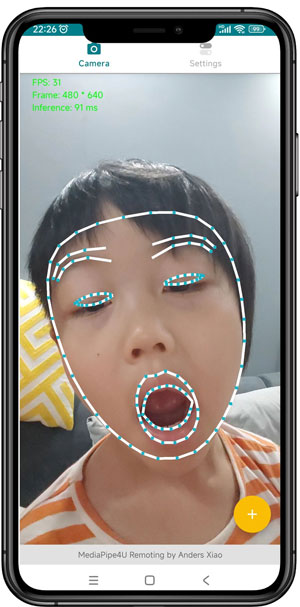
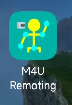
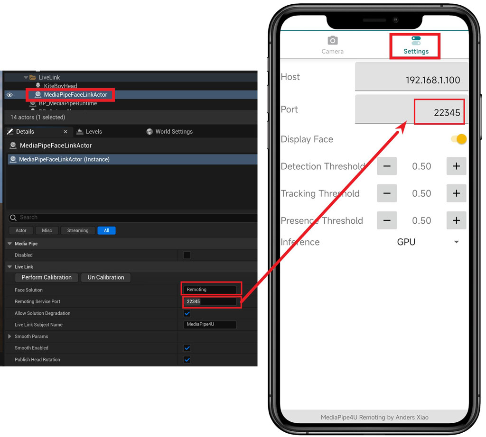

# M4U Rmoting 
{: .d-inline-block }

Since v20230423
{: .label .label-green }

Commerical License
{: .label .label-yellow }

M4U Remoting 是一个 Android App, 旨在将 MediaPipe4U 的捕捉能力延申到移动端（当前仅支持 Android），M4U Remoting 还在成长阶段，目前只具备表情捕捉。   


{: .warning}
> M4U Remoting **不包含**在免费授权许可中。   
> 如果你正在使用 MediaPipe4U 的免费授权许可，你可以在 UE Editor 中体验该功能，但是打包后功能将失效。  

[](./images/remoting_main_ui.jpg)

你可以在 MediaPipe4U 的发布页找到 M4U Remoting 的 apk 安装包， 下载安装包将其安装到你的安卓手机即可：

[https://github.com/endink/Mediapipe4u-plugin/releases](https://github.com/endink/Mediapipe4u-plugin/releases)

[](./images/remoting_icon.jpg)

## 表情捕捉

MediaPipe4U 插件中内置了名为 **Remoting** 的 Face Solution，用来接收来自 M4U Remoting App 捕捉到的表情数据，并通过 Live Link 协议发送到 Live Link 接收端（通常是 LiveLinkPose 动画蓝图节点）。   

> 移动端表情捕捉不但可以摆脱有线的束缚，因为移动端 mediapipe 支持 GPU 推理，加之它只运行单一的表情算解器，所以通常能够获得比 windows 摄像头更高的算解帧率。   
> 实测安卓表情捕捉帧率可以达到 30 PFS。
 
{: .important}    
> 此文档假设你已经知道如何使用 MediaPipe4U 进行表情捕捉，并且已经清楚 MediaPipe4U 中的以下概念：
> - Face Solution
> - Face Link Actor 
>   
> 如果你不清楚这些内容，请先阅读[表情捕捉](./face_link_actor.md)。


### 使用方法：

1. 启动手机端 M4U Remoting App, 在 Settings 中填写正确的主机 IP 地址。
2. 设置好 MediaPipe4U 的表情捕捉功能。
3. 设置 Face Link Actor 的 Face Solution 为 "**Remoting**"。
4. 运行使用 MediaPipe4U 插件的 Unreal Engine 项目。

> 默认 MediaPipe4U 会在 **22345** 端口侦听来自 M4U Remoting 的数据包，你也可以修改这个端口号，但是修改端口号以后手机端也必须使用一致的端口号设置。

[](./images/remoting_setup.jpg)


### 手机端校准命令

M4U Remoting 具有远程控制 MediaPipe4U 的能力，你可以从安卓设备发送校准指令， MediaPipe4U 将进行校准操作，只需在主界面点击 + 按钮。

### 关于防火墙

你的防火墙可能不允许手机访问主机的端口（默认端口 22345），你可以通过保存以下内容为 bat 文件并执行，让防火墙允许端口通过。

```powershell
netsh advfirewall firewall add rule name="Port22345" dir=in action=allow protocol=UDP localport=22345
```
{: .important}
> 上述命令保存为 bat 文件后需要用管理员身份执行，对 bat 文件点击鼠标右键，“以管理员身份运行” 即可。


### 设置说明

一般情况下，M4U Remoting 是一个开箱即用的 App， “零配置”即可工作良好，也提供了少量的设置：

|设置项| 说明 |
|:------|:-----|
|Host | 运行 MediaPipe4U 的主机 IP 地址。|
|Port | 运行 MediaPipe4U 的主机开放的通讯端口地址。|
|Display Face |出于隐私考虑，可以通过这个开关，控制关闭/开启摄像头画面。|
|Detection Threshold |检测人脸的阈值，数值越大，对人脸清晰度、遮挡等条件越苛刻。|
|Tacking Threshold |连续侦测人脸的阈值，对于视频流来说，如果能够复用上一帧的人脸数据，例如人脸位置，可以提供计算效率，数值越大，对上一帧的可信度要求越高。|
|Present Threshold |人脸地标可信度阈值，当检测到人脸地标后对每个区域的的可信度评价，如果低于这个阈值，这个区域表情将算解失败。|
|Inference | AI 推理方式，优先使用 GPU 加速推理，如果你使用 GPU 出现问题，可以切换到 CPU 推理。|


