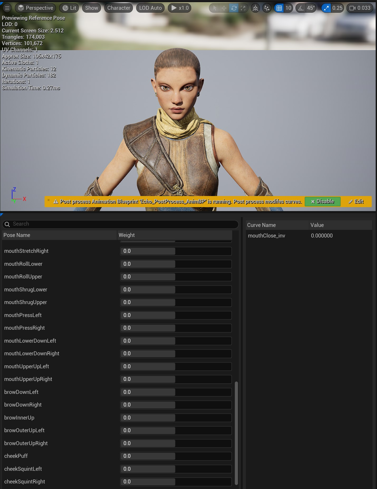
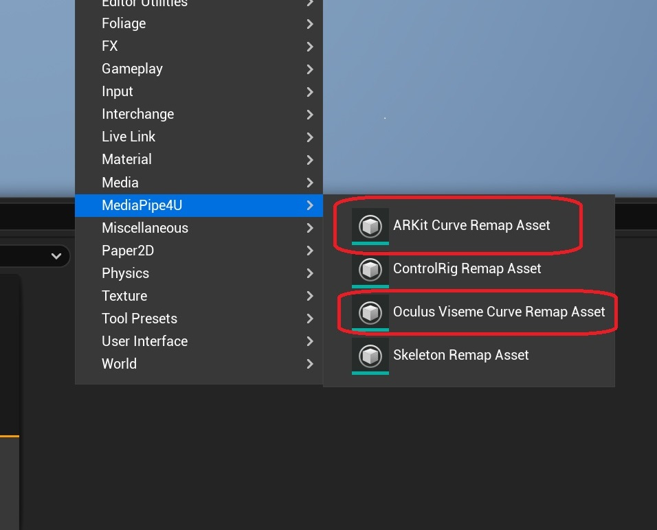
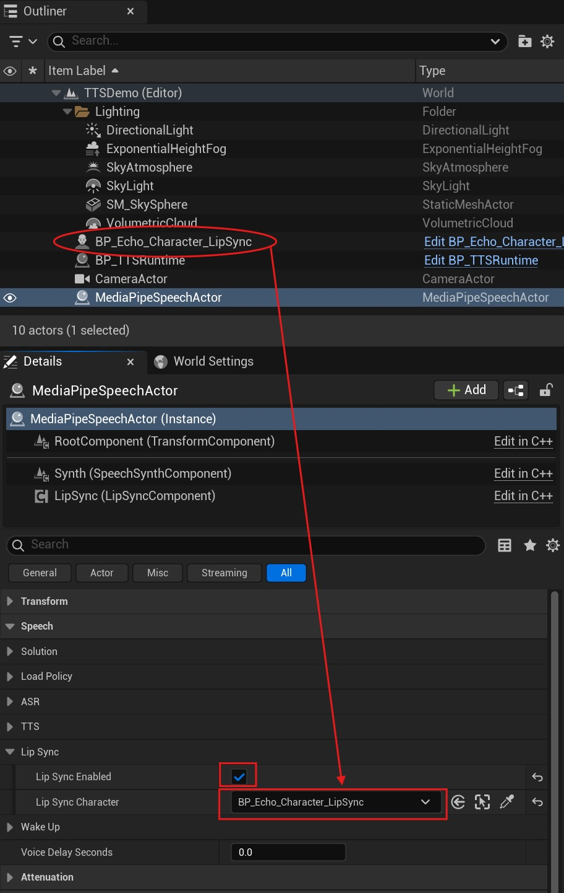

# 口型同步(Lip Sync)

`MediaPipe4U` 中的 `MediaPipe4USpeech` 插件支持了实时的, 离线的语音和口型动画同步功能，帮助你生成逼真的 3D 角色朗读效果。

此文档详细介绍如何在 TTS 基础上集成口型同步。

## 制作口型动画资产 (PoseAsset)   

`MediaPipe4U` 支持多种口型动画方案 (Curve Schema), 默认使用 **ARKit** 表情。   
你可以使用任何一种方案制作一个 PoseAsset 来包含这些曲线。

- `音素表情`：兼容音素口型的 **15** 种表情动画。
- `ARKit 表情`：兼容 ARKit 的 **52** 种表情动画。

!!! tip "如何选择口型动画方案 (Curve Schema)"

    大多数的`数字人`或 `VTuber` 模型都兼容了 ARKit 表情，可能已经内置了符合 ARKit 标准的 PoseAsset。   
    
    如果你想要更好的口型效果，使用 `ZBrush` 等工具制作音素（Viseme）曲线可能是更好的选择。

=== "ARKit Curve Schema"

    制作 **52** 个和 Apple ARKit 匹配的表情动画，每一个表情是一个 BlendShape 或者是 PoseAsset 中的一条曲线。     

    具体表情参考请查看 [Apple 官方文档](https://developer.apple.com/documentation/arkit/arfaceanchor/blendshapelocation){: target='_blank'}    
    也可以这个网站： [https://arkit-face-blendshapes.com/](https://arkit-face-blendshapes.com/){: target='_blank'}。  

    
       
    > Pose Asset 中的曲线名称或者 BlendShape 名称，遵循 Apple ARKit 的 **52** 个曲线名称标准（不区分大小写）。 

=== "Oculus Viseme Curve Schema"

    制作 **15** 个和 OVRLipSync 匹配的口型动画，每一个口型是一个 BlendShape 或者是 PoseAsset 中的一条曲线。   

    

    具体唇形参考请查看 [OVRLipSync 文档](https://developer.oculus.com/documentation/unity/audio-ovrlipsync-viseme-reference){: target='_blank'}     
    也可以参考此文档最后的附录（来自 Facebook 网站截图）。   
       
    > Pose Asset 中的曲线名称或者 BlendShape 名称约定为： SIL、PP、FF、TH、DD、KK、CH、SS、NN、RR、AA、E、I、O、U (不区分大小写)  

### MediaPipe LipSync 动画蓝图节点

创建动画蓝图，并在动画蓝图中添加 `MediaPipe LipSync` 节点，如果你使用 PoseAsset ，还需要添加 Evalute Pose 节点。

> 说明，上图中的 ARKit_PoseAsset 是一个 Evalute Pose 节点。

### LipSync 节点属性

**Alpha**   
控制唇形的平滑程度，数值越小，唇形动画越平滑。

**WeightScale**   
控制口型动画的缩放，数值越大，角色开口会越明显，某些语音的音色识别效果不明显时，我们需要用这个属性让它更明显。

**MaxDelaySeconds**   
语音延迟时间，以秒为单位，当使用分段语音块时，如果收到的语音数据帧延迟高于这个时间，该帧将不再执行口型动画。

:rainbow: **CurveSchema**     
表情动画的曲线方案。

- `OculusViseme`: 表示使用音素曲线，要求你在 PoseAsset 种包含 **15** 条音素 (Visemes) 曲线。
- `ARKit`: 表示使用 ARKit 表情动画曲线，要求你在 PoseAsset 种包含 **52** 条 ARKit 表情曲线。

> 你使用的 PoseAsset 类型必须和 `CurveSolution` 设置一致。

默认值: `ARKit`

**ApplyMode**   
口型动画的渲染方式。

- `WeightedMovingAverage`：口型动画不考虑当前姿势中的曲线值，仅平滑的向前移动。
- `Blend`：口型动画混合到当前姿势中的曲线值，这通常用于混合已有的曲线值。   

默认值： `WeightedMovingAverage`   

**VisemeCurveRetargetAsset**

音素曲线重定向资产，当你已经有 15 种音素的曲线，但是这些曲线名称和音素曲线要求的名称**不一致**时，你可以添加一个重定向资产来映射你自己的曲线名称到标准曲线名称。   
仅当 `CurveSolution` 值为 **OculusViseme** 有效。

**ARKitCurveRetargetAsset**

动画曲线重定向资产，当你已经有 52 种 **ARKit** 曲线，但是这些曲线名称和标准 ARKit 曲线要求的名称**不一致**时，你可以添加一个重定向资产来映射你自己的曲线名称到标准曲线名称。   
仅当 `CurveSolution` 值为 **ARKit** 有效。

默认值： `WeightedMovingAverage`   

**UseGlobalParameters**   
是否使用全局口型动画参数。开启它能够支持运行时动态调整口型动画。   
默认值：**true**

### 创建重定向资产 (可选)

当你的曲线名称不符合标准时，可以创建重定向资产，并通过 `VisemeCurveRetargetAsset` 或 `ARKitCurveRetargetAsset` 使用它。   
在内容浏览器空白处点击鼠标右键，可以看到创建资产的菜单:

### 创建 Character

1. 创建一个 `Character`，将 `Mesh` 上的动画蓝图指定为上面添加了 `MediaPipe LipSync` 节点的动画蓝图。   
2. 将这个 `Character` 放入场景 (Level) 中。
3. 将 `MediaPipeSpeechActor` 的 `LipSyncCharacter` 设置为这个 `Character`。 
4. 检查 `MediaPipeSpeechActor` 中的 `LipSync` 已经打开。

 

## 开始口型同步

完成以上操作后，当 TTS 开始朗读 (调用 `MediaPipeSpeechActor` 的 `SpeakTextAsync` 函数)，3D 角色就会根据朗读内容生成和文本一致的口型动画。

## 运行时设置口型动画

当 `MediaPipe LipSync` 动画蓝图节点**启用**了*全局参数*时（`UseGlobalParameters` 为 **true**），你还可以在其他蓝图中动态调整口型动画的参数。   

在蓝图中调用 `SetGlobLipSyncParameters` 函数：

!!! warning

    *全局参数*设置会影响所有的 LipSync 动画蓝图节点。   
    当场景中有多个 LipSync 节点或多个动画蓝图都包含 LipSync 节时应该将 UseGlobalParameters 设为 false，

## OvrLipSync License

`MediaPipe4USpeech` 通过集成 `OVRLipSync` C++ 库来生成音素的 Blend Shape 值。   

!!! warning "OvrLipSync"

    OVRLipSync 库中包单独 Facebook(Meta) License 文件，请严格遵守这些条款。   
            
    MediaPipe4U 依据 [Meta Platforms Technologies SDK License](https://developer.oculus.com/licenses/oculussdk/) 协议 1.1.1 内容分发 OVRLipSync 中的库，并且已在插件中包含单独的 License 文件。   
    
    > 1.1.1 If the SDK includes any libraries,
    > sample source code, or other materials that we make available specifically for incorporation in your Application (as indicated by applicable documentation), 
    > you may incorporate those materials and reproduce and distribute them as part of your Application, including by distributing those materials to third parties contributing to your     Application.   
    >   
    
    如果我对协议的理解有不妥之处，请与我联系，我将迅速下架 LipSync 功能。

## 附录

=== "OVRLipSync 口型参考"

    > 你也可以转到[Facebook 网站](https://developer.oculus.com/documentation/unity/audio-ovrlipsync-viseme-reference){: taget='_blank'}阅读详细信息。

    

=== "ARKit 曲线（BS）名称"

    -  1: *eyeBlinkLeft*,
    -  2: *eyeLookDownLeft*,
    -  3: *eyeLookInLeft*,
    -  4: *eyeLookOutLeft*,
    -  5: *eyeLookUpLeft*,
    -  6: *eyeSquintLeft*,
    -  7: *eyeWideLeft*,
    -  8: *eyeBlinkRight*,
    -  9: *eyeLookDownRight*,
    -  10: *eyeLookInRight*,
    -  11: *eyeLookOutRight*,
    -  12: *eyeLookUpRight*,
    -  13: *eyeSquintRight*,
    -  14: *eyeWideRight*,
    -  15: *jawForward*,
    -  16: *jawLeft*,
    -  17: *jawRight*,
    -  18: *jawOpen*,
    -  19: *mouthClose*,
    -  20: *mouthFunnel*,
    -  21: *mouthPucker*,
    -  22: *mouthRight*,
    -  23: *mouthLeft*,
    -  24: *mouthSmileLeft*,
    -  25: *mouthSmileRight*,
    -  26: *mouthFrownRight*,
    -  27: *mouthFrownLeft*,
    -  28: *mouthDimpleLeft*,
    -  29: *mouthDimpleRight*,
    -  30: *mouthStretchLeft*,
    -  31: *mouthStretchRight*,
    -  32: *mouthRollLower*,
    -  33: *mouthRollUpper*,
    -  34: *mouthShrugLower*,
    -  35: *mouthShrugUpper*,
    -  36: *mouthPressLeft*,
    -  37: *mouthPressRight*,
    -  38: *mouthLowerDownLeft*,
    -  39: *mouthLowerDownRight*,
    -  40: *mouthUpperUpLeft*,
    -  41: *mouthUpperUpRight*,
    -  42: *browDownLeft*,
    -  43: *browDownRight*,
    -  44: *browInnerUp*,
    -  45: *browOuterUpLeft*,
    -  46: *browOuterUpRight*,
    -  47: *cheekPuff*,
    -  48: *cheekSquintLeft*,
    -  49: *cheekSquintRight*,
    -  50: *noseSneerLeft*,
    -  51: *noseSneerRight*,
    -  52: *tongueOut*