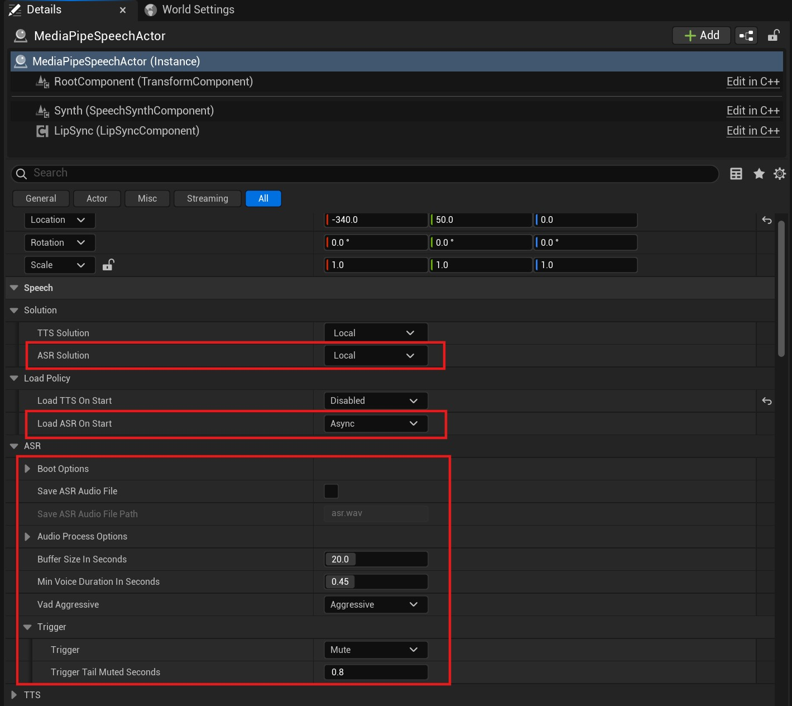

# 离线语音识别 (ASR)

`MediaPipe4USpeech` 提供离线的，实时的，端到端语音识别 (ASR) 能力, 支持将音频输出转为文本输出。

---   
## 如何使用

1. 向场景中添加 `AMediaPipeSpeechActor` 组件 。
2. 通过细节面板配置 ASR 。
3. 调用 `AMediaPipeSpeechActor` 的 `StartCaptureMicrophone`/`StartCaptureAudio` 等函数进行语音识别。

!!! tip "集成语音唤醒"

    关于 ASR 如何与语音唤醒集成使用，请阅读[语音唤醒](./wakeup.md)文档。

---   
## 属性

`MediaPipeSpeechActor` 有很多关于 ASR 的属性，下面详细说明：

**LoadASROnStart**     
当程序启动后自动加载模型包的方式。   

- Disabled: 不在启动程序后加载 ASR 模型。
- Async: 异步加载模型（在线程池线程中）。
- Sync: 同步加载模型（在游戏线程中）。

!!! tip

    当设置加载方式为异步加载（Async）时，你可以通过 `OnASRLoaded` 事件来获得模型加载完成的通知。

**ASRSolutionName**   
表示 ASR 使用的方案，一般来说离线 ASR 使用 **Local** 即可。

**SaveASRAudioFile**    
是否将音频保存为语音文件（.wav），这通常用于调试。

**AudioProcessOptions**    
在语音识别前进行的前置处理,如降噪, 回声消除等。

**SaveASRAudioFilePath**    
当 SaveAudioFile 为 **true** 时，这个属性控制音频文件的保存路径。   
这个路径可以是绝对路径，也可以是相对路径，相对路径根目录为 `Saved/M4UAudio`。
   
**BufferSizeInSeconds**    
语音识别时，允许的音频最大长度（单位：秒），如果超过这个长度，语音会立即开始识别，这可能造成音频被阶段。   
> 例如设置为 **20** ，可以理解为一句话的长度最多不超过 **20** 秒。

**ASRMinVoiceDurationInSeconds**   
语音识别时，允许音频最短长度（单位秒）。

**VadAggressive**   
Vad 激进程度， 越激进（VAD 是在语音中发现人声的模块， 可以区分语音中的人声和非人声）。

**Trigger**    
语音识别触发模式，默认为静音触发模式。

- `Mute`: 静音时触发，当发现语音中的人声，发生停顿（停顿的时长由 `TriggerMuteSeconds` 决定）时自动开始语音识别。
- `ManualStop`: 手动触发，当调用 `MediaPipeSpeechActor` 的 `StopCapture` 或 `StopCaptureAsync` 函数时候开始语音识别。

**TriggerMuteSeconds**    
当 `Trigger` 为 **Mute** 时，这个属性表示间隔多长时间认为一句话已经结束。

!!! tip

    无论 `Trigger` 模式设置成什么值，当语音的长度达到 `BufferSizeInSeconds` 设置的值时，都将触发语音识别。

---   
## 事件   

**OnASRLoaded**   
模型加载结束时回调的事件。    

**OnASRSlept**    
当 ASR 配合唤醒模型使用时，这个事件在 ASR 由"清醒"(已经被唤醒)状态转为"沉睡"（需要被唤醒）状态时发生。   

**OnASRWokeUp**    
当 ASR 配合唤醒模型使用时，这个事件在 ASR 由"沉睡"（需要被唤醒）状态转为"清醒"(已经被唤醒)状态时发生。

**OnTextRecognized**    
当语音识别完成时发生。事件参数：

- `Text`: 从音频中识别到的文本。
- `bIsFinished`: 这个参数表示是否已经全部识别完成（当模型是流式识别时， 一段音频可能多次触发 `OnTextRecognized`， 通过 `bIsFinished` 已经全部识别）。

---   

## 函数

|函数名| 说明 |
|----------|------------|
|IsASRLoading        | 指示 ASR 是否正在加载。  |
|IsASRReady          | 指示 ASR 是否加载完成，并且加载成功。  |
|HasASRVoice         | 指示 ASR 是否当前是否识别到人声。  |
|IsASRWakeUpRunning  | 指示 ASR 唤醒模型是否正在运行。  |
|IsASRWakeUpAvailable| 指示 ASR 唤醒功能是否可用。 |
|IsCapturing         | 指示 ASR 是否正在捕获音频。 |
|IsCaptureStopping   | 指示 ASR 是否正在停止捕获音频。 |
|IsASRAwake          | 指示 ASR 是否处于"清醒"（已经被唤醒）状态。 |
|KeepASRAwake        | 重置唤醒计时器，让 ASR 保持"清醒"状态。 |
|SleepASR            | 让 ASR 进入"沉睡"状态（需要被唤醒）。|
|GetASRState         | 获取 ASR 模型加载状态。 |
|CanStartCapture     | 指示 ASR 是否能够开始捕获音频。 |
|StartCaptureMicrophone | 开始从麦克风捕获音频进行语音识别。|
|StartCaptureAudio   | 开始从`音频组件`中捕获音频进行语音识别。|
|StopCapture         | 停止捕获音频。  参数:  `bSetToSleep`: 参数表示是否让 ASR 进入"沉睡"状态, 如果为 **false**, ASR 只是暂停捕获，如果当前 ASR 已经被唤醒，下次开始时无需唤醒； 如果为 **true**， 下次开始捕获时 ASR 需要被唤醒。|

## 异步函数

|函数名| 说明 |
|----------|------------|
|LoadASRAsync     | 当 `LoadASROnStart` 属性未 **Disabled** 时，不会自动加载 ASR，需要使用这个函数手动加载 。|
|StartCaptureMicrophoneAsync   | 开始从麦克风捕获音频。|
|StopCaptureAsync    |  停止捕获音频。  参数:  `bSetToSleep`: 参数表示是否让 ASR 进入"沉睡"状态, 如果为 **false**, ASR 只是暂停捕获，如果当前 ASR 已经被唤醒，下次开始时无需唤醒； 如果为 **true**， 下次开始捕获时 ASR 需要被唤醒。|

## 蓝图函数库

- `ListMicrophones`: 列出当前主机上的麦克风设备。
- `ListASRSolutions`: 列出当前可以使用的 ASR 方案。

