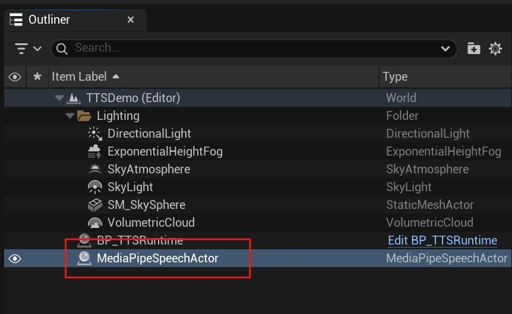
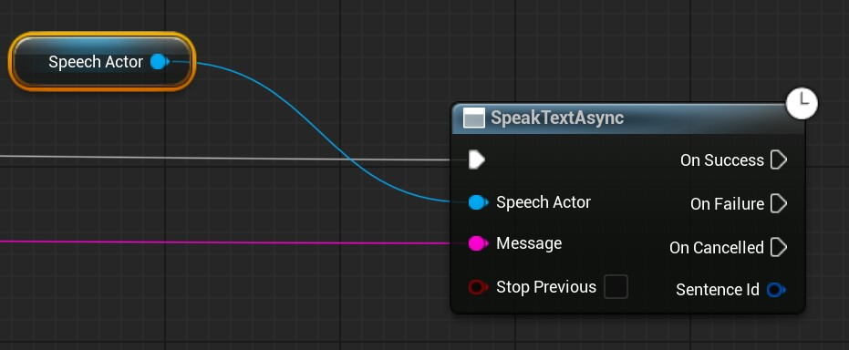
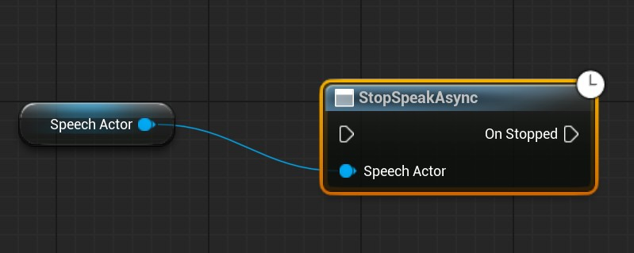
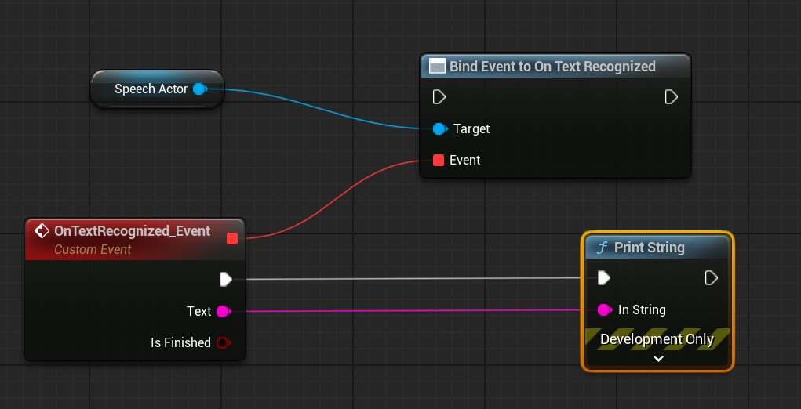
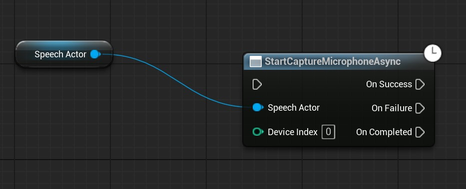
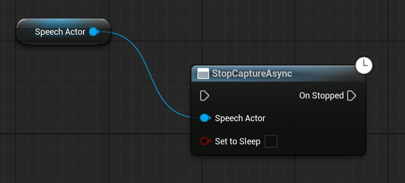
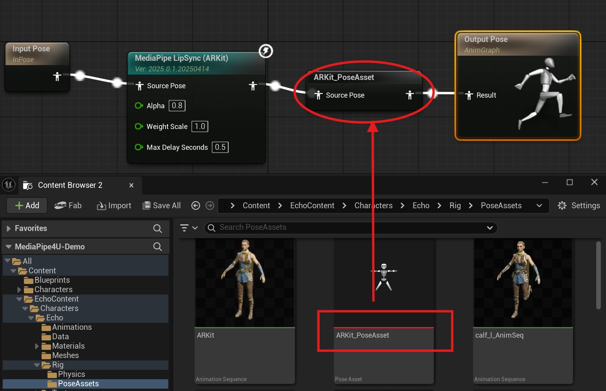

# 快速入门

`MediaPipe4U` 提供离线的，实时的语音合成和语音识别功能，让你的 3D 角色具备 "**听**" 和 "**说**" 的能力。

## 安装模型包

在开始使用语音套件之前，你必须先下载和安装语音模型包。   
从 [https://huggingface.co/endink/M4U-Speech-Models](https://huggingface.co/endink/M4U-Speech-Models/tree/main) 页面中找到语音模型， 下载对应语言的模型包。

关于语音模型下载和安装的详细说明，请阅读[安装语音模型](./setup_models.md)文档。   

## 使用 MediaPipeSpeechActor

向场景中添加一个 `MediaPipeSpeechActor`。

---

## 使用语音合成（TTS）

### 开始朗读文本

在蓝图中使用 `MediaPipeSpeechActor` 的 `SpeakTextAsync` 函数，可以进行文本朗读。

其中 `Message` 参数为要朗读的文字

### 停止朗读文本

在蓝图中使用 `MediaPipeSpeechActor` 的 `StopSpeakAsync` 函数，可以停止朗读。

---

## 使用语音识别（ASR）

使用 MediaPipe4U 的语音识别功能，可以将输入的语音识别为文本，只需要几个简单步骤：

1. 绑定识别事件获取识别到的文本。
2. 在蓝图中开始语音识别
   
!!! tip
    
    当你不再需要语音识别时，你应该停止语音识别。

### 绑定语音识别事件

在蓝图中绑定 `MediaPipeSpeechActor` 的 `OnTextRecognized` 事件，可以在事件回调中获取到 ASR 识别到的文本。

事件参数中的 `Text` 是识别到的文本。

### 开始识别语音

在蓝图中调用 `MediaPipeSpeechActor` 的 `StartCaptureMicrophoneAsync` 函数，可以从默认的音频输入设备（麦克风）中捕获语音数据并识别为文本。   

!!! tip

    如果你发现无法识别到语音，并且日志中无错误，请检查你的操作系统中的默认声音输入设备是否是你的麦克风，MediaPipe4U Speech 将自动使用操作系统中默认的输入设备。

### 停止识别语音

在蓝图中调用 `MediaPipeSpeechActor` 的 `StopCaptureAsync` 函数，可以停止捕获音频数据。   

---

## 口型同步（LipSync）

让 3D 角色的口型和朗读的文本同步，只需要几个简单步骤：

1. 准备动画资产
2. 添加动画蓝图节点
3. 打开口型同步
4. 创建 `Character` ，并设置为 `MediaPipeSpeechActor` 的 `LipSyncCharacter` 属性
5. 开始朗读

下面，详细介绍这些步骤的操作方法。

### 准备动画资产

制作一个姿势资产（PoseAsset） 兼容 *ARkit Blend Shape* 标准（包含 **52** 条曲线，命名不区分大小写）

### 添加动画蓝图节点

在动画蓝图中添加 `MediaPipe LipSync` 节点和 Evalute Pose 节点。

### 创建 Character

1. 创建一个 `Character`，将 `Mesh` 上的动画蓝图指定为上面添加了 `MediaPipe LipSync` 节点的动画蓝图。   
2. 将这个 `Character` 放入场景 (Level) 中。
3. 将 `MediaPipeSpeechActor` 的 `LipSyncCharacter` 设置为这个 `Character`。
4. 检查 `MediaPipeSpeechActor` 中的 `LipSync` 已经打开。

### 开始朗读

此时，当 `MediaPipeSpeechActor` 的 `SpeakTextAsync` 函数被调用， 就会朗读文本, 并在 `Character`  生成和发音一致的口型动画。