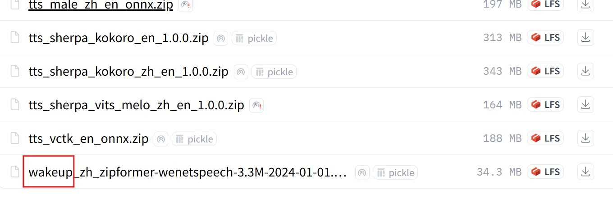
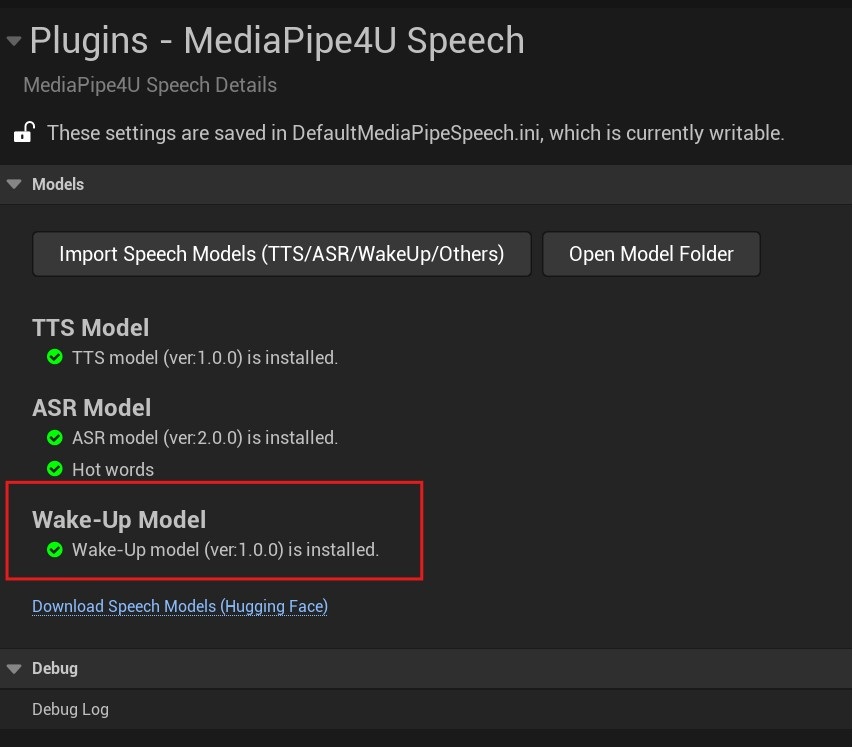
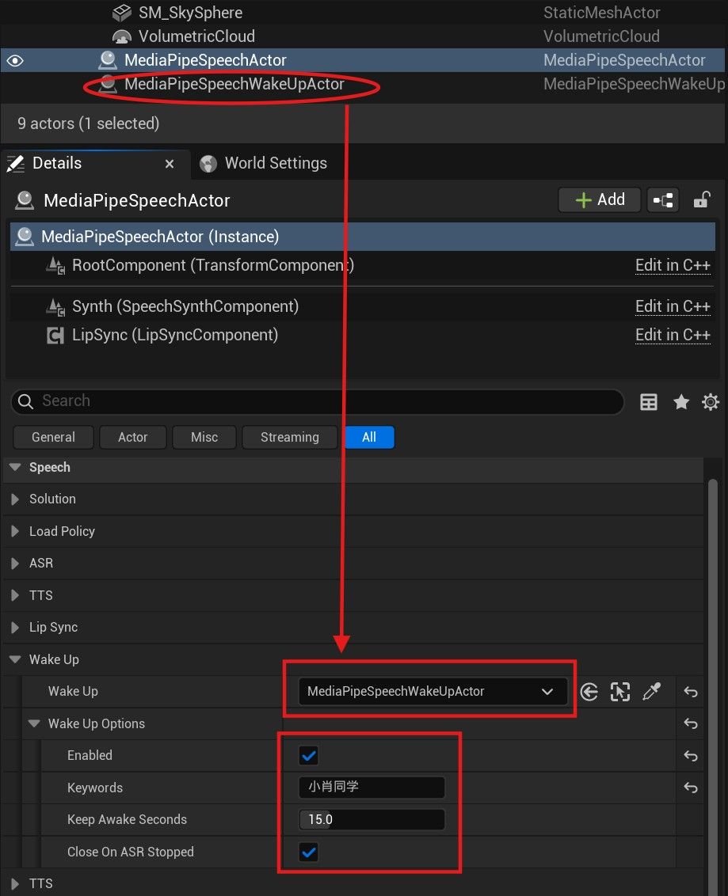
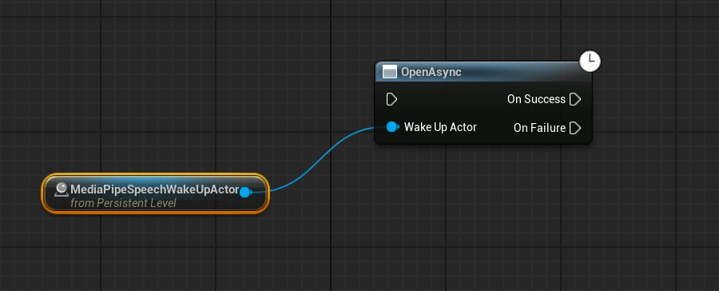
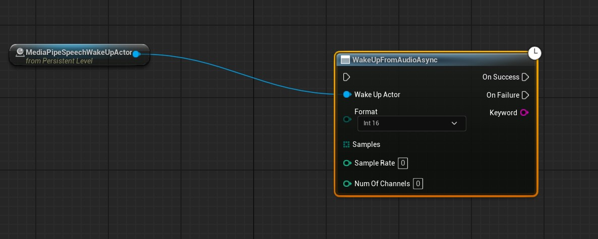
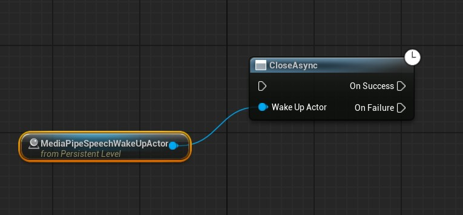

# 语音唤醒

`MediaPipe4USpeech` 中提供了语音唤醒能力，能够让你在侦听到语音指令（从麦克风）时做出反应，
唤醒功能还可以与 **ASR** 集成, 可以实现 "Hey Siri"、"小爱同学" 类似的语音激活效果。

!!! tip

    目前，语音唤醒功能脱离 ASR 使用会很困难，因为暴露的函数较少，建议和 ASR 搭配使用。

## 安装唤醒模型

语音唤醒首先需要安装唤醒模型，可以从 [语音模型包下载](https://huggingface.co/endink/M4U-Speech-Models/tree/main) 页面中找到语音唤醒模型。

!!! tip

    需要注意，中文唤醒模型只支持中文唤醒词，英文模型只支持英文唤醒词，中英文不可混用。   

当安装好唤醒模型后，`MediaPipe4U Speech` 插件设置页应该显示唤醒模型已安装

## 与 ASR 集成使用

### 添加 MediaPipeSpeechWakeUpActor

现在向场景 (Level) 中放入一个 `MediaPipeSpeechWakeUpActor` ，**无需**对 `MediaPipeSpeechWakeUpActor` 进行任何配置。

### 配置 `MediaPipeSpeechActor`

当你向场景中添加了 `MediaPipeSpeechActor` 和 `MediaPipeSpeechWakeUpActor` 以后，你可以通过设置 `MediaPipeSpeechActor` 来开启 ASR 的语音唤醒功能。

ASR 要满足下列条件才会进入唤醒流程：

- `MediaPipeSpeechActor` 中的 `WakeUpOptions` 属性 `Enable` 设为 **true**
- `MediaPipeSpeechActor` 中的 `WakeUp` 属性被设置为场一个 `MediaPipeSpeechWakeUpActor` 实例。

当 `MediaPipeSpeechActor` 与唤醒集成后，  `MediaPipeSpeechActor` 将会接管 `MediaPipeSpeechWakeUpActor`。无需关心 `MediaPipeSpeechWakeUpActor` 组件的打开和关闭， 也无需在 `MediaPipeSpeechWakeUpActor` 上配置唤醒词， 你只需要在 `MediaPipeSpeechActor` 中完成设置。

下面是 `MediaPipeSpeechActor` 上唤醒功能相关属性:   

- `WakeUp`: 用于与 ASR 功能集成的 `MediaPipeSpeechWakeUpActor` 实例。
- `WakeUpOptions`: 语音唤醒相关选项。

  - `Enabled`: 是否启用语音唤醒。
  - `Keywords`: 唤醒 ASR 使用的唤醒词
  - `KeepAwakeSeconds`: 当 ASR 被唤醒后，保持"清醒"的时间，当ASR 识别到语音后，计时器会重置。这个属性理解为：当 XXX 秒无人说话，ASR 进入"沉睡"状态，需要重新被唤醒。
  - `CloseOnASRStopped`: 设为 **true** 时，当 ASR 停止后，将自动关闭 `MediaPipeSpeechWakeUpActor`, 否则，你需要手动调用 `MediaPipeSpeechWakeUpActor` 的 `Close` 函数来关闭它。

### 语音唤醒并语音识别

调用 `MediaPipeSpeechActor` 的 `StartCaptureMicrophoneAsync` 开始从麦克风中捕捉音频，此时要求先用唤醒词唤醒，之后才能进行语音识别。

下面是一个大致的 ASR 唤醒处理流程：

``` mermaid
graph TD
  A[Audio] --> B{ASR Awake?};
  B --> |Yes| D{Recognize ?};
  B --> |No| C{Do Wake Up}
  C --> |Success| D
  C --> |Failure| H{Wait Next Audio}

  D -->|Yes| E{Output Text};
  E --> H
 
  D -->|No| F{Exceed KeepAwakeSeconds?};

  F --> |Yes| G{Sleep ASR}
  G --> H
  F --> |No| H
  
```

## 独立使用

当前版本的 `MediaPipeSpeechWakeUpActor` 独立使用并不能很好的和 Unreal Engine 配合， 这主要是由于 Unreal Engine 本身声音系统设计的缺陷造成，
（例如： 我们无法从 `AudioCaptureComponent` 组件中得到 PCM 数据， 其他一些组件我们也很难得到采样率等信息），
因此当前版本 `MediaPipeSpeechWakeUpActor` 独立使用价值不大，推荐你将 `MediaPipeSpeechWakeUpActor` 和 ASR 功能集成使用。

!!! tip "独立使用限制"

    由于 Unreal Engine 除了 SoundSubmix + Audio Device 方案，几乎没有办法得到声音中的 PCM 数据。   
    SoundSubmix， Audio Device 这类方案都是 C++ 专属，并不是蓝图友好的方案。   

    综上所述,目前 `MediaPipeSpeechWakeUpActor` 独立使用时仅提供从原始 PCM 数据中检测唤醒词。

## 添加 MediaPipeSpeechWakeUpActor

现在向场景 (Level) 中放入一个 `MediaPipeSpeechWakeUpActor` ，并配置唤醒词。

!!! warning "注意"

    你可以设置多个唤醒词， 并在唤醒事件中做出不同的响应。

    当和 ASR 集成时，ASR 唤醒词**不应该**在 `MediaPipeSpeechWakeUpActor` 上设置，而应该在 `MediaPipeSpeechActor` 上设置。

### 打开 WakeUp

在开始从音频中进行唤醒检测之前，必须调用 `Open` 函数打开 `MediaPipeSpeechWakeUpActor`， 这个操作会加载模型，开辟声音缓冲。

### 唤醒检测

调用 `WakeUpFromAudio` 函数 从 PCM 语音数据中进行唤醒检测。

当检测成功时，表示发现了唤醒词，此时可以在 `Keyword` 返回值中获取到检测到的唤醒词。    
如果检测失败，表示语音中没有发现唤醒词。

### 关闭 WakeUp

当你不再需要唤醒功能时，调用 `Close` 函数关闭 `MediaPipeSpeechWakeUpActor`， 这将释放大量内存。

## 与 ASR 集成