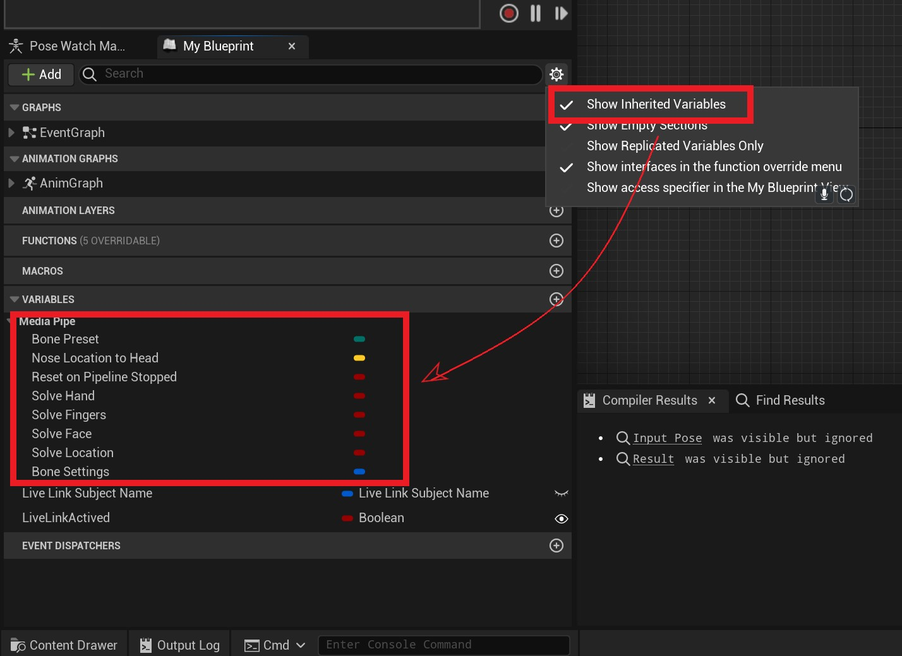
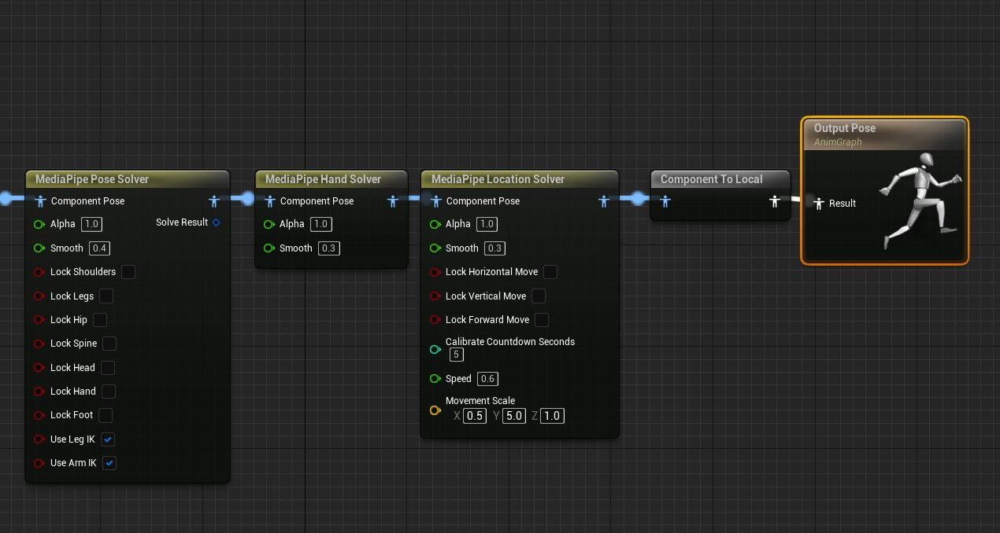

# 准备动补角色（Character)

## 创建动画蓝图

1. 创建一个动画蓝图，基类选择 MediaPipeAnimInstance。

基类选择 MediaPipeAnimInstance ！   
基类选择 MediaPipeAnimInstance ！   
基类选择 MediaPipeAnimInstance ！   

重要的事情说三遍

> 必须使用这个基类，否则无法正常使用使用动补功能   

1. 在动画蓝图左侧选择打开显示继承的变量，确保你可以看到 mediapipe 变量   

3. 依次放入三个节点: MediaPipePoseSolver, MediaPipeHandSolver, MediaPipeLocationSolver   

   

--- 

## 动画蓝图核心节点   

### MediaPipePoseSolver

身体动补算解节点，负责计算身体骨骼旋转，参数如下：   

|参数|类型|说明|
|---|----|-----|
Alpha     | float (0-1.0)      | 和普通动画蓝图节点的 Alpha 参数相同，请参考 UE 文档
Smooth     | float (0-1.0)     | 动作平滑度，该参数影响阻尼滤波算法，平滑度越大抖动越少，但是动作"灵敏度"越低，简单来说，如果图像源是快速动作（例如街舞）请使用较小的平滑值，如果图像源速度较慢，可以增加平滑值以消除抖动噪声
|LockShoudlers| bool | 是否锁定整个肩膀(Shoudler, 目前 Shoudler 其实并未参与计算，未来可能会引入肩膀 IK 功能)到手腕 (hand) 的骨骼，值为 **true** 时该链上的骨骼不参与动补，否则参与动补，“锁定”含义下面均相同，不再重复说明 |
|LockLegs| bool | 是否锁定整个大腿( Leg )到脚踝 (Foot) 的骨骼 |
|LockHips| bool | 是否锁定盆骨，模型通常通常以盆骨作为根骨，锁定盆骨后人物将不会整体旋转 |
|LockSpine| bool | 是否锁定脊柱，锁定后角色上半身将不能旋转 |
|LockHead| bool | 是否锁定头部，锁定后角色头部不能旋转 |
|LockHand| bool | 是否锁定手部，锁定后角色手腕、手指将不能旋转，**注意**： LockShoudlers 被设为锁定时，手部也会强制锁定 |
|LockKnee| bool | 是否锁定膝盖，锁定后角色膝盖不能旋转，**注意**： LockLegs 被设为锁定时，膝盖也会强制锁定 |
|LockFoot| bool | 是否锁定脚踝，锁定后角脚踝部不能旋转，**注意**： LockLegs 被设为锁定时，脚踝也会强制锁定 |
|UseLegIK| bool | 使用使用腿部 IK，使用脚部 IK 可以纠正膝关节扭曲，一般情况下开启，副作用是动作可能不如关闭 IK 到位 |
|UseArmIK| bool | 使用使用手臂 IK，使用手部 IK 可以纠正肘关节扭曲，一般情况下开启，副作用是动作可能不如关闭 IK 到位 |
|KalmanQ| float | 卡尔曼滤波 Q 参数，除非你对 Kalman 滤波非常熟悉，否则不建议更改 |
|KalmanR| float | 卡尔曼滤波 R 参数，除非你对 Kalman 滤波非常熟悉，否则不建议更改 |
|Optimize| bool | 是否进行额外的优化，开启后会调整姿态中的不合理关节旋转，如果优化使姿态出现问题，请关闭此开关 |

> 说明：KalmanQ\KalmanR 参数默认因为不常用，默认显示不是 pin，所以节点上可能不能看到， 但是你可以在右侧细节面板中看见

### MediaPipeHandSolver   

手指动补算解节点，负责计算手指骨骼旋转，参数同 **MediaPipePoseSolver**

### MediaPipeLocationSolver

动补位移算解节点，负责计算角色位移（相同参数不再介绍）：   

|参数|类型|说明|
|---|----|-----|
|LockHozantalMove| bool | 是否锁定横向位移（角色左右运动） |
|LockVerticalMove| bool | 是否锁定垂直位移（角色下蹲、跳跃） |
|LockForwardMove| bool | 是否锁定前后位移（角色靠近、走远） |
|CalibrateCountDownSeconds| float | 自动标定角色位置的延迟时间（秒），将在开始动补 XX 秒之后标定，标定前角色不会产生位移 |
|Speed | float | 角色移动速度, 位移计算类似于“惯性动补原理”，并非定位空间位置，而是预估角色移动速度，图像源动作的快慢可能会有不同的位移效果，通过该参数调节预估算法以匹配正确的位移速度 |
|MovementScale | FVector | 角色三个朝向（X,Y,Z）运动的效果缩放，同 speed 参数类似，但是可以精确控制各个轴向的移动效果 |
   

--- 

## 动画蓝图参数

### 骨骼绑定

MediaPipe4U 理论上支持所有的人形骨骼，并不要求你的骨骼名称和必须遵循某一规范，同时，提供了两种预设以减少配置骨骼的枯燥工作。

你可以在动画蓝图上左侧 tab 页找到 MediaPipeAnimInstance 的参数（MediaPipe 类别下）

   

**BonePreset**    
使用骨骼预设：
- VRM: Vroid 骨骼, 支持通过 Vroid Studio 创建的角色
- UE5：UE5曼尼（mannequin 小金人）的骨骼，该骨骼其实也兼容 UE4 的曼尼（小白人）、Metahuman
- Custom: 自定义骨骼（关于自定义骨骼，下一小节详细说明）

**BoneRemap**    

自定义骨骼映射资源 （关于自定义骨骼，会在[**自定义骨骼**](./custom_skeleton.md)中详细说明），仅当 **BonePreset** 为 Custom 时该属性有效。   

### 算解控制

**ResetOnPiplineStop**     

是否在 MediaPipe 停止时（停止动补时）将角色骨骼旋转回复到最初状态。

**SolveHand**

是否算解手掌（包括手指）动作

**SolveFingers**

是否算解手指动作， 注意，当 SolveHand 为 false 时，即使 SolveFingers 为 true 也不会算解手指，当 SolveFinger 开启时手腕旋转使用 MediaPipe 手部地标计算（更加精确），当 SolveFinger 关闭后使用 MediaPipe POSE 地标计算手腕

**SolveFace**

是否算解面部表情（仅在使用了 MediaPipe LiveLink 时有效）

**SolveLocation**   

是否算接位移   

**LiveLinkSubject**

该属性仅提供 C++ 时方便设置 livelink 的主体，**MediaPipe4U** 并没有在任何代码中使用该变量。   
如果你没有使用该变量，请忽略它。

**LiveLinkEnabled**
该属性仅提供 C++ 时方便设置 livelink 可用性，**MediaPipe4U** 并没有在任何代码中使用该变量。   
如果你没有使用该变量，请忽略它。

---

至此，**MediaPipe4U** 角色已经准备好了，请继续阅读后续章节。