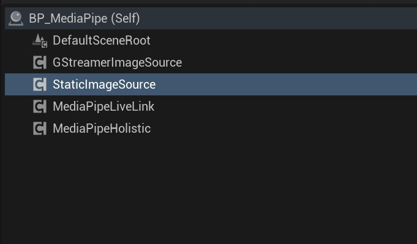

# 准备 MediaPipe 运行时组件（Component）

**MediaPipe4U** 运行时需要一些组件，下面分别介绍： 

## UMediaPipeImageSource 接口

当使用视频动补或图片动补时，**MediaPipe4U** 需要一个图像源以提供给 MediaPipe 工作流，为此，**MediaPipe4U** 抽象了这个图像源，提供了
**UMediaPipeImageSource** 接口, 这是一个 UE 规范的接口，因此，你可以通过蓝图或者 C++ 实现它，它负责为 MediaPipe 提供 AI 计算所需的图像数据。   

*建议将此接口实现为 Component， 方便你在编辑器中灵活使用。*   

 
> 注意：接口实现需要自行保证多线程性能，例如图像缓冲队列，否则可能造成整个算解器性能低下，因此建议你使用 C++ 高效的实现该接口，例如可以从 UE4 内置的媒体播放器获得图像放入 mediapipe 中进行计算，或者从在线的视频流获得图像等。

**MediaPipe4U** 提供了两个常用的内置实现，可以方便你进行图片动补、视频动补。

---

## StaticImageSouceComponent

静态图片图像源，该组件通过输入单张的图片到 MediaPipe 完成算解过程。
> 注意，单张图片会自动启用 mediapipe static 模式，算解过程将得到优化，所以请勿自己实现单张图片的动补，使用该组件即可

## GStreamerImageSourceComponent    
   

>该组件需要 需要 GStreamer Plugin  

GStramer 图像源，该组件实现了从 GStramer 获取视频流作为图像源。   
可以把 GStreamerImageSourceComponent 视为一个视频播放器，他提供了播放、暂停、跳转到时间点等能力。

> GStreamer 是知名的第三方媒体库，可以实现采集，编码，解码，渲染，如果你对 Gstreamer 感兴趣，可以看这里 https://gstreamer.freedesktop.org/。使用 Gstreamer 是为了完美兼容 mp4，当然，如果你对 Gstreamer 熟悉，你甚至可以用他解码在线流媒体然后输出给 mediapipe 进行动补

<small>GStreamer 的源代码遵循 LGPL 开源协议，MediaPipe4U 插件并未对 GStreamer 进行任何更改，所以你可以放心的商用和分发而不必担心版权问题，如果你自行修改了 GStreamer 实现了高级功能，请务必遵循 LGPL 协议，尊重知识产权也避免你的商业软件产生知识产权纠纷。</small>

## MediaPipeHolisticComponent

对 MediaPipe Holistic 计算器（Calculator）封装的组件，关于 MediaPipe Holistic 参考下面链接：

https://google.github.io/mediapipe/solutions/holistic.html

## MediaPipeLiveLinkComponent

该组件提供将 MediaPipe 作为 LiveLink 源的能力，这样你可以像使用 Arkit 一样通过在动画蓝图中添加 LiveLinkPose 节点使用 MediaPipe4U 的面补功能，更多 LiveLink 详细信息请参阅 Unreal 官方文档。

## 创建 Actor

创建一个 Actor，并添加上述组件，添加后你的 Actor 看起来应该如下图：

   

至此，你已经完成了所有运行 **MediaPipe4U** 动补的准备工作！！！   