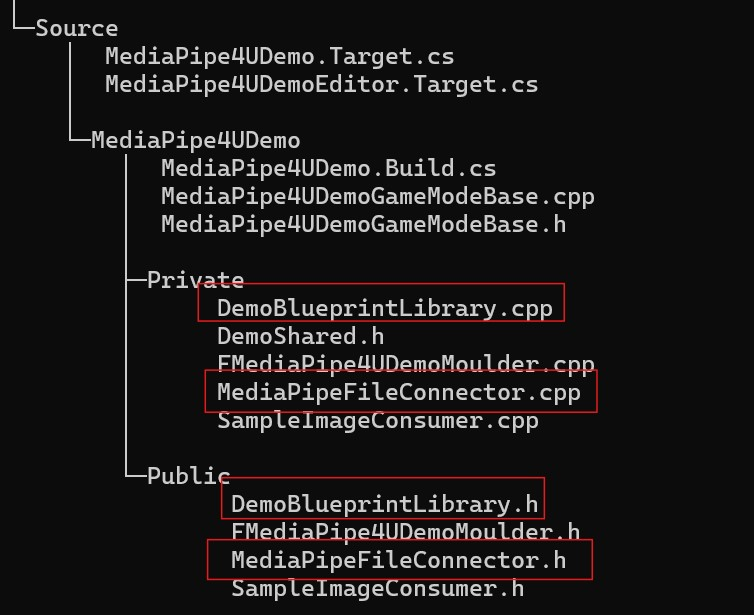

# 整体替换 Google MediaPipe (C++)

`MediaPipe4U` 提供了可插拔的算法连接器，你可以使用自己的算法，或者自己的 MediaPipe 程序（例如： python 服务器端运行的 mediapipe 程序）来代替内置的 google mediapipe 算解程序。

## 前提条件

虽然 `MediaPipe4U` 提供了替换 mediapipe 算法的能力， 但是 `MediaPipe4U` 使用的是 mediapipe 的 [**Blazor Pose**](https://research.google/blog/on-device-real-time-body-pose-tracking-with-mediapipe-blazepose/) 骨骼结构，其他方案例如 **SMPL**、**SMPLX** 在 `MediaPipe4U` 中将无法正确运行。

因此，如果你决定替换 google mediapipe 算法，必须符合如下要求:

- 算法输出的骨骼结构符合 [Blazor Pose](https://research.google/blog/on-device-real-time-body-pose-tracking-with-mediapipe-blazepose/) 结构。
- 算法输出的地标（Landmarks）坐标系和 google mediapipe 算法保持一致。
- 如果算法包含表情 (BlendShape) 输出，必须符合 Apple ARKit 标准。

!!! tip

    除了骨骼结构，坐标系，表情规范，地标使用的规格也应该和 google mediapipe 保持一致：

    Google MediaPipe 中地标有两种地标，具体含义如下：

    **NormalizedLandmark**      
     `x`，`y` 和 `z`: 以米为单位的真实世界3D坐标，原点位于臀部之间的中心。   

    **Landmark**   
    `x` 和 `x`: 分别由图像宽度和高度归一化为 [0.0，1.0] 的地标坐标, 原点 [0.0, 0.0] 是图片的左上角;    
    `z`: 表示以 hips 中点处的深度为原点的地标深度，该值越小，地标越靠近相机。`z` 的大小使用与 `x` 大致相同的比例。
  
    > `MediaPipe4U` 中 `PoseWorldLandmark` 使用的是 **NormalizedLandmark**，其余均为 **Landmark**。


## 实现步骤

要完整的替换 `MediaPipe4U`  中的 google mediapipe 算法，可以采取如下步骤：

1. 实现一个继承自 `IMediaPipeHolisticConnector` 自定义连接器 (Connector).
2. 提供一个蓝图函数库 （`UBlueprintFunctionLibrary`）来调用 `UMediaPipeHolisticComponent` 的 `StartCustomConnector` 或 `StartCustomConnectorAsync` 函数。
3. 在 Unreal Engine 蓝图编辑器中使用步骤 **2** 提供的蓝图函数来代码 `StartCamer`/`StartImageSource` 等函数。

下面详细介绍这些技术细节。


## IMediaPipeHolisticConnector

`MediaPipe4U` 提供了一个 `IMediaPipeHolisticConnector` 用于定义 Unreal Engine 和 google mediapipe api 之间的连接。
通过在 C++ 中实现一个继承自 `IMediaPipeHolisticConnector` 的类可以替换 `MediaPipe4U` 内置的连接器 (Connector)。

下面是 `IMediaPipeHolisticConnector` 的 C++ 定义。

```cpp

class IMediaPipeHolisticConnector
{
public:
	static IMediaPipeHolisticConnector& Get();
	static IMediaPipeHolisticFeatureRegistry& GetFeatureRegistry();
	 
	virtual bool ConfigureGraph(const MediaPipeGraphCnf& InConfig) const = 0;
	virtual void EnableFrameCallback(bool Enabled) = 0;

	virtual bool IsConnected(UObject* Owner) const = 0;
	virtual bool Connect(UObject* Owner) = 0;
	virtual bool Disconnect(const UObject* Owner) = 0;
	
	virtual bool StartPipeline(long long SessionId, IImageSource* ImageSource, const FMediaPipeHolisticOptions& Options) = 0;
	virtual void StopPipeline() = 0;
	virtual bool PushFrameToPipeline(TSharedRef<IMediaPipeTexture> InTexture,  int RotationDegrees) = 0;
	
	virtual FLandmarksOutputEvent& OnPoseLandmarksTrigger() = 0;
	virtual FLandmarksOutputEvent& OnPoseWorldLandmarksTrigger() = 0;
	virtual FLandmarksOutputEvent& OnLeftHandLandmarksTrigger() = 0;
	virtual FLandmarksOutputEvent& OnRightHandLandmarksTrigger() = 0;
	virtual FFaceBlendShapesOutputEvent& OnFaceBlendShapesTrigger() = 0;
	virtual FFaceGeometryOutputEvent& OnFaceGeometryTrigger() = 0;
	virtual FLandmarksOutputEvent& OnFaceLandmarksTrigger() = 0;
	virtual FImageSizeDetectedEvent& OnImageSizeDetectedTrigger() = 0;
	virtual FMediaPipeFailedEvent& OnMediaPipeFailedTrigger() = 0;
	virtual FMediaPipeFrameEvent& OnMediaPipeFrameTrigger() = 0;
	
	virtual bool AddListener(const TSharedPtr<FMediaPipeHolisticListener>& InListener) = 0;
	virtual bool RemoveListener(const TSharedPtr<FMediaPipeHolisticListener>& InListener) = 0;
protected:
	virtual ~IMediaPipeHolisticConnector() = default;
};

```


### 声明周期函数

!!! tip

    在 `MediaPipe4U` 中 `IMediaPipeHolisticConnector` 调用顺序（声明周期）如下：
    
    **Connect** --->> **StartPipeline** --->> **StopPipeline** --->> **Disconnect**
    
    - `Connect`: 内置的 Connector 在 MediaPipeHolisticComponent 初始化时调用, 自定义 Connector 在 UMediaPipeHolisticComponent 的 StartXXX 函数调用时调用。
    - `StartPipeline`: UMediaPipeHolisticComponent 的 StartXX 函数调用时调用。
    - `StopPipeline`: UMediaPipeHolisticComponent 的 `Stop`/`StopAsync` 函数调用时调用。
    - `Disconnect`: 内置的 Connector 在 MediaPipeHolisticComponent 卸载 ( Uninitialize ) 时调用, 自定义 Connector 在 UMediaPipeHolisticComponent 的 `Stop`/`StopAsync` 函数调用时调用该函数。


实现自定义 Connector 时，下面的函数实现是可以选的：

- `ConfigureGraph`： 配置 mediapipe 图形，自定义 Connector 时直接返回 **true** 即可。
- `EnableFrameCallback`: 允许 frame 回调， 自定义 Connector 可以什么都不做。
- `Connect`: 如果你在 `StartPipeline` 中处理逻辑，直接返回 **true** 即可。
- `Disconnect`: 如果你在 `StopPipeline` 中处理逻辑，直接返回 **true** 即可。


实现自定义 Connector 时，下面的函数无需实现：

- `PushFrameToPipeline`： 当 ImageSource 的模式是 **Push** 时，这个函数接受主动推送帧， 由于自定义 Connector 目前不使用 ImageSource ， 因此你无需实现它。


### 事件函数

以 **On** 开头，并且以 **Trigger** 结束的函数表示当自定义算法求解出数据时需要触发的事件，你实现的事件越多，功能就越完整。

### 监听支持函数

`AddListener` 和 `RemoveListener` 为外部提供数据监听器支持，`MediaPipe4U` 中通过这些函数完成其他功能。


## 使用 FMediaPipeConnectorBase 基类

为了简化实现过程， `MediaPipe4U` 提供了简化版的基类 `FMediaPipeConnectorBase`, 它实现起来比 `IMediaPipeHolisticConnector` 要容易得多。
建议你使用 `FMediaPipeConnectorBase` 作为基类。


使用 `FMediaPipeConnectorBase` ， 你只需要实现如下函数, 其他函数已经由 `FMediaPipeConnectorBase` 实现：

- `OnConnect`
- `OnStartPipeline`
- `OnStopPipeline`
- `OnDisconnect`


## 例子

你可以在 [MediaPipe4U Demo 工程](https://gitlab.com/endink/MediaPipe4U-Demo){: target='_blank'} 源码中找到一个**替换** Google MediaPipe 的具体例子，该例子中我们通过读取一个数据文件，来输出 mediapipe 数据，而不是从图像源捕获图像进行计算。


在这个例子中，重点关注如下文件：



- `MediaPipeFileConnector.h`: Connector 头文件 , [查看源码](https://gitlab.com/endink/MediaPipe4U-Demo/-/blob/main/Source/MediaPipe4UDemo/Public/MediaPipeFileConnector.h){: target='_blank' }
- `MediaPipeFileConnector`: Connector 的具体实现，[查看源码](https://gitlab.com/endink/MediaPipe4U-Demo/-/blob/main/Source/MediaPipe4UDemo/Private/MediaPipeFileConnector.cpp){: target='_blank' }
- `DemoBlueprintLibrary.cpp`: 蓝图函数库头文件, [查看源码](https://gitlab.com/endink/MediaPipe4U-Demo/-/blob/main/Source/MediaPipe4UDemo/Public/DemoBlueprintLibrary.h){: target='_blank' }
- `DemoBlueprintLibrary.cpp`: 提供蓝图函数库实现, [查看源码](https://gitlab.com/endink/MediaPipe4U-Demo/-/blob/main/Source/MediaPipe4UDemo/Private/DemoBlueprintLibrary.cpp){: target='_blank' }


最终我们在蓝图编辑器中调用 `StartMediaPipeDataFile` 函数来读取本地磁盘上的一个 MediaPipe 数据文件。

> 这个数据文件也可以在  MediaPipe4U Demo 工程的根目录下找到 （[查看数据文件](https://gitlab.com/endink/MediaPipe4U-Demo/-/blob/main/mediapipe_pose_data.txt){: target='_blank' }）。


## MediaPipe 参考

### MediaPipe 3D 坐标系


### 33 个身体地标

{ width="400" }

### 21 个手部地标

