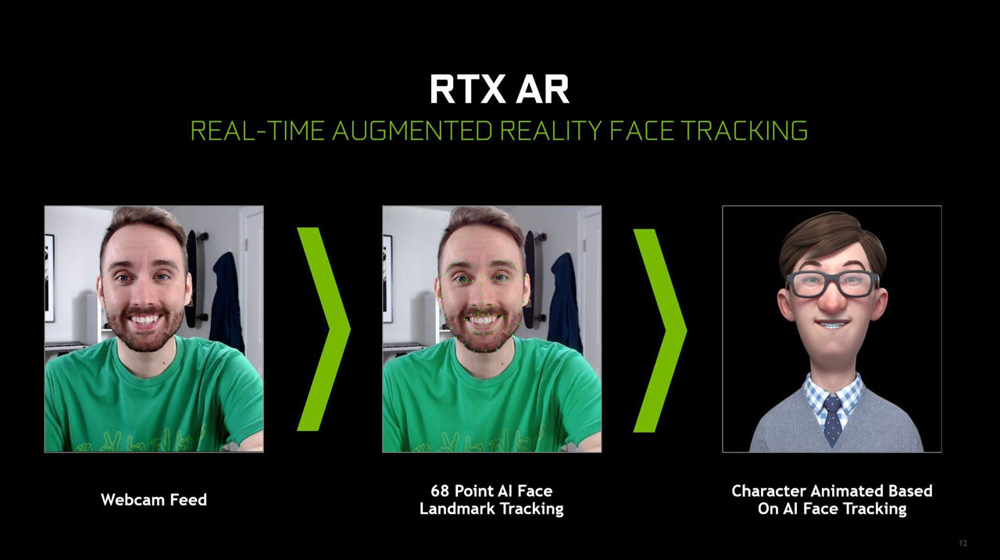
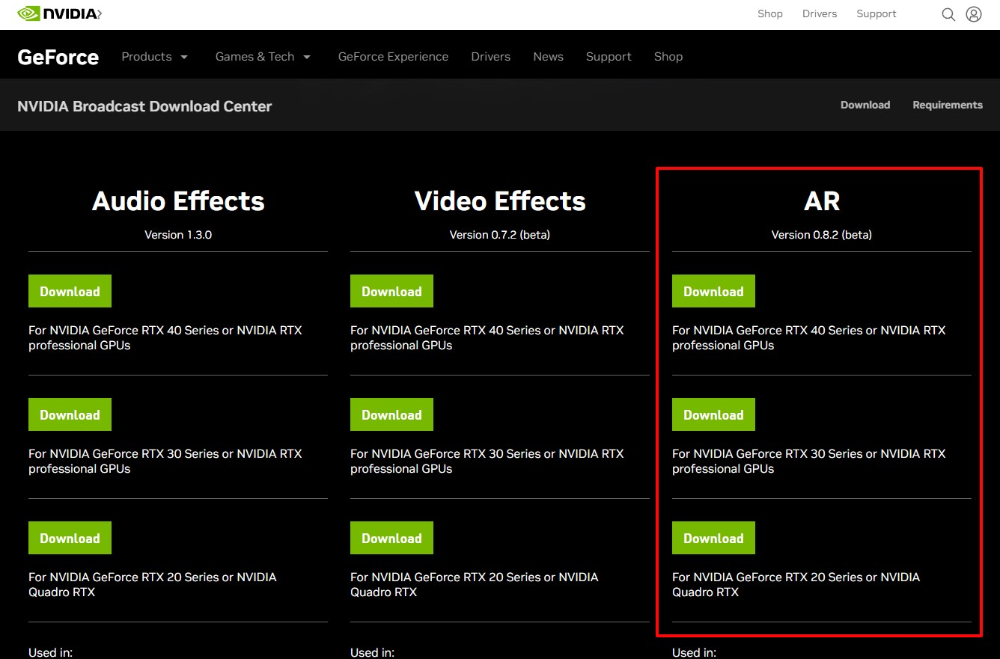

# NvAR 表情捕捉

如果你拥有 Nvidia RTX 20XX 或更高级的 GPU，**MediaPipe4UNvAR** 能够帮助你获得一个可以和苹果 Arkit 媲美的表情捕捉方案。

!!! tip
    阅读本章内容之前，你必须阅读过[使用表情捕捉](./get_started.md)相关文档，否则你可能无法理解后面的内容。

---

`MediaPipe4U` 封装了一个名为 `MediaPipe4UNvAR` 的插件，将 Nvidia 的算法注册成 MediaPipe LiveLink 插件中的一个 BlendShapes 求解方案（Face Solution）。    

你可以通过设置 `MediaPipeFaceLinkActor` （MediaPipe LiveLink 插件中的 Actor）的 `FaceSolution` 属性为 **NvAR** 来使用它。

演示效果：

国内用户如果 Youtube 打不开，请观看 bilibili 站视频：

[B站演示效果](https://www.bilibili.com/video/BV1sD4y1N7HX/?share_source=copy_web&vd_source=f77a8ce9c4c322dcc88515970bea1630)

关于 **NvAR** 详细信息，请看这里：     
[https://developer.nvidia.com/maxine](https://developer.nvidia.com/maxine)

## 环境要求

### 软件要求

|软件|版本要求|
|----|--------|
Windows OS | 64-bit Windows 10 or later
NVIDIA Graphics Driver for Windows | 511.65 or later
Nvidia Maxine AR SDK | 0.8.2

> MediaPipe4U 的 NvAR 插件无论是开发环境和打包部署后都要求 PC 已经安装 **Nvidia Maxine AR SDK**。   
> NvAR 插件体积太大（1G以上），让用户自行安装会更方便，否则你的软件包也将非常大。

### 硬件要求

**NvAR** 必须使用 Nvidia GPU, 且只支持以下三种架构

- **NVIDIA Turing™**: Geforce RTX 20XX
- **NVIDIA Ampere™**: Geforce RTX 30XX
- **NVIDIA Ada™**: Geforce RTX 40XX
- **Other have Tensor Cores**: H100,etg (but no sdk for downloading, ask nvidia ? )   

Nvidia 官方的系统和软件要求请阅读这里：

[https://docs.nvidia.com/deeplearning/maxine/ar-sdk-system-guide/index.html](https://docs.nvidia.com/deeplearning/maxine/ar-sdk-system-guide/index.html)

!!! warning

    不同的显卡有不同的可再发行组件包。例如：你的 GPU 是 Nvidia 2060， 你不能安装 30XX 的可再发行组件包，这可能导致 NvAR 无法正常工作。

### 插件依赖

请启用以下 UnrealEngine 插件：   

- MediaPipe4U
- MediaPipeLiveLink

## 开始使用

### 安装 Nvidia 的可再发行组件包（Redistributable SDK package)

从以下网址下载适合你的显卡的组件包：   

[https://www.nvidia.com/broadcast-sdk-resources](https://www.nvidia.com/broadcast-sdk-resources)

### 安装 MediaPipe4UNvAr 插件   

从下载的 MediaPipe4U 插件目录找到 `MediaPipe4UNvAR` 目录，将它复制到你的 Unreal Engine 项目 **Plugins** 目录并启用它.   

此时，`MediaPipe4UNvAR` 会自动注册一个名为 **NvAR** 的 Face Solution 到 `MediaPipeFaceLinkActor` (MediaPipe LiveLink 插件中的 Actor), 你可以在 `MediaPipeFaceLinkActor` 中使用它。

!!! tip

    MediaPipe4UNvAr 只一个包含算法的插件，本身不包含任何 Unreal Engine 功能，使用这套算法进行表情捕捉你需要 MediaPipe Live Link 插件。    
    关于如何使用 MediaPipeFaceLinkActor 进行面部捕捉，请阅读：[使用表情捕捉](./get_started.md)

**NvAR Arkit 表情支持情况**   

|名称|说明|NvAR 支持|
|----|----|--------|
|eyeBlinkLeft| 左眼眨眼|Yes|
|eyeLookDownLeft |左眼目视下方|Yes|
|eyeLookInLeft |左眼注视鼻尖|Yes|
|eyeLookOutLeft| 左眼向左看|Yes|
|eyeLookUpLeft| 左眼目视上方|Yes|
|eyeSquintLeft| 左眼眯眼|Yes|
|eyeWideLeft |左眼睁大|Yes|
|eyeBlinkRight |右眼眨眼|Yes|
|eyeLookDownRight |右眼目视下方|Yes|
|eyeLookInRight |右眼注视鼻尖|Yes|
|eyeLookOutRight |右眼向左看|Yes|
|eyeLookUpRight |右眼目视上方|Yes|
|eyeSquintRight| 右眼眯眼|Yes|
|eyeWideRight |右眼睁大|Yes|
|jawForward |努嘴时下巴向前|Yes|
|jawLeft |撇嘴时下巴向左|Yes|
|jawRight |撇嘴时下巴向右|Yes|
|jawOpen |张嘴时下巴向下|Yes|
|mouthClose |闭嘴|Yes|
|mouthFunnel |稍张嘴并双唇张开|Yes|
|mouthPucker |抿嘴|Yes|
|mouthLeft |向左撇嘴|Yes|
|mouthRight |向右撇嘴|Yes|
|mouthSmileLeft |左撇嘴笑|Yes|
|mouthSmileRight| 右撇嘴笑|Yes|
|mouthFrownLeft |左嘴唇下压|Yes|
|mouthFrownRight |右嘴唇下压|Yes|
|mouthDimpleLeft |左嘴唇向后|Yes|
|mouthDimpleRight |右嘴唇向后|Yes|
|mouthStretchLeft |左嘴角向左|Yes|
|mouthStretchRight |右嘴角向右|Yes|
|mouthRollLower |下嘴唇卷向里|Yes|
|mouthRollUpper |下嘴唇卷向上|Yes|
|mouthShrugLower |下嘴唇向下|Yes|
|mouthShrugUpper |上嘴唇向上|Yes|
|mouthPressLeft |下嘴唇压向左|Yes|
|mouthPressRight |下嘴唇压向右|Yes|
|mouthLowerDownLeft |下嘴唇压向左下|Yes|
|mouthLowerDownRight |下嘴唇压向右下|Yes|
|mouthUpperUpLeft |上嘴唇压向左上|Yes|
|mouthUpperUpRight |上嘴唇压向右上|Yes|
|browDownLeft |左眉向外|Yes|
|browDownRight| 右眉向外|Yes|
|browInnerUp |蹙眉|Yes|
|browOuterUpLeft |左眉向左上|Yes|
|browOuterUpRight |右眉向右上|Yes|
|cheekPuff| 脸颊向外|Yes|
|cheekSquintLeft |左脸颊向上并回旋|Yes|
|cheekSquintRight |右脸颊向上并回旋|Yes|
|noseSneerLeft |左蹙鼻子|Yes|
|noseSneerRight| 右蹙鼻子|Yes|
|tongueOut |吐舌头|<mark>No</mark>|
|HeadYaw        |  左右转头   |  Yes  |
|HeadPitch      |  上下抬头   |  Yes  |
|HeadRoll       |  向肩膀偏头 |  Yes  |

