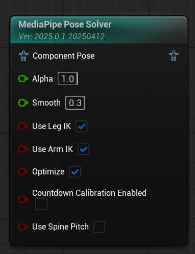
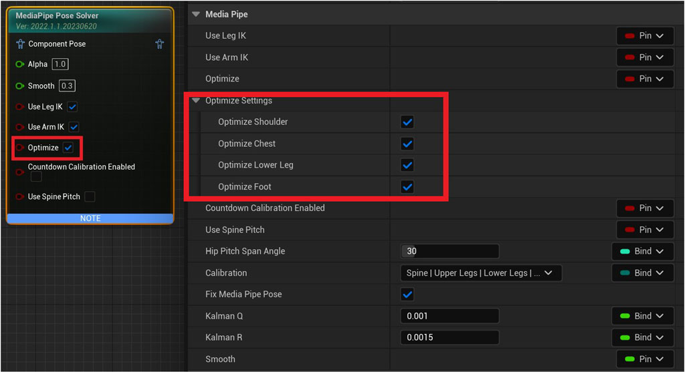
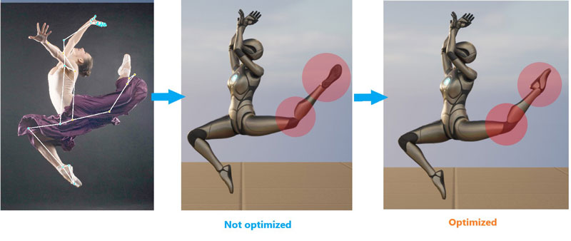
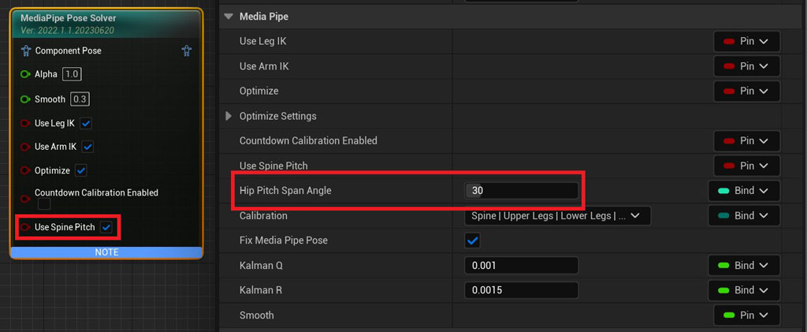
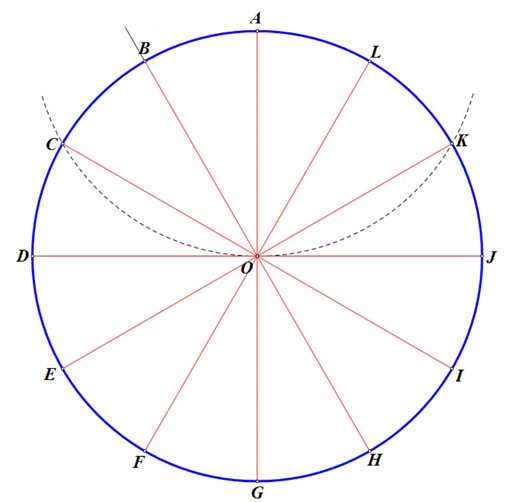
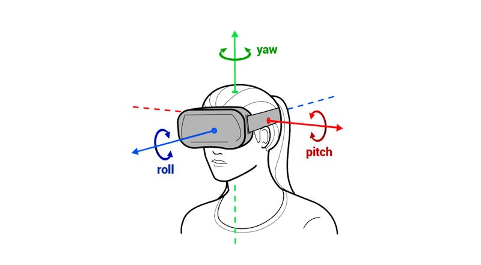

# 姿势算解节点

MediaPipe4U 使用一个专门的动画蓝图节点 `MediaPipePoseSolver`，从动补数据中计算角色的关节旋转，从而同步图像中的人物姿势到 3D 角色。

## 安装节点

1. 在动画蓝图中放入 `MediaPipePoseSolver` 节点。
2. 在节点上设置主要的行为。

MediaPipe4U 将从动补数据中算解出关节的旋转，并且驱动 3D 角色做出近似图像中人物的姿势。

## 参数列表

|参数|类型|说明|
|---|----|-----|
|Alpha     | float (0-1.0)      | 和普通动画蓝图节点的 Alpha 参数相同，请参考 UE 文档 |
|Smooth     | float (0-1.0)     | 动作平滑度，该参数影响阻尼滤波算法，平滑度越大抖动越少，但是动作"灵敏度"越低，简单来说，如果图像源是快速动作（例如街舞）请使用较小的平滑值，如果图像源速度较慢，可以增加平滑值以消除抖动噪声 |
|LockArms| bool | 是否锁定整个上臂到手腕 (hand) 的骨骼，值为 **true** 时，该链上的骨骼（Shoudler, UpperArm, LowerArm, Hand）不参与动补，否则参与动补，“锁定”含义下面均相同，不再重复说明 |
|LockLegs| bool | 是否锁定整个大腿( Leg )到脚踝 (Foot) 的骨骼 |
|LockHips| bool | 是否锁定盆骨，模型通常通常以盆骨作为根骨，锁定盆骨后人物将不会整体旋转 |
|LockSpine| bool | 是否锁定脊柱，锁定后角色上半身将不能旋转 |
|LockChest| bool | 是否锁定前胸。**注意**：如果 LockSpine 设为 **true**, 前胸也也将被锁定 |
|LockHead| bool | 是否锁定头部，锁定后角色头部不能旋转 |
|LockHand| bool | 是否锁定手部，锁定后角色手腕、手指将不能旋转，**注意**： LockArms 被设为锁定时，手部也会强制锁定 |
|LockElbow| bool | 是否锁定肘关节，锁定后角色肘部不能旋转，**注意**： LockArms 被设为锁定时，肘关节也会强制锁定 |
|LockKnee| bool | 是否锁定膝盖，锁定后角色膝盖不能旋转，**注意**： LockLegs 被设为锁定时，膝盖也会强制锁定 |
|LockFoot| bool | 是否锁定脚踝，锁定后角脚踝部不能旋转，**注意**： LockLegs 被设为锁定时，脚踝也会强制锁定 |
|UseLegIK| bool | 使用使用腿部 IK，使用脚部 IK 可以纠正膝关节扭曲，一般情况下开启，副作用是动作可能不如关闭 IK 到位 |
|UseArmIK| bool | 使用使用手臂 IK，使用手部 IK 可以纠正肘关节扭曲，一般情况下开启，副作用是动作可能不如关闭 IK 到位 |
|KalmanQ| float | 卡尔曼滤波 Q 参数，除非你对 Kalman 滤波非常熟悉，否则不建议更改 |
|KalmanR| float | 卡尔曼滤波 R 参数，除非你对 Kalman 滤波非常熟悉，否则不建议更改 |
|Optimize| bool | 是否进行额外的优化 |
|CountdownCalibrationEnabled | bool | 默认为: **false**，指示是否在倒计时结束时校准位置。 |
|Calibration | PoseCalibrationFlags | 设置校准时要校准的关节点。 |
|UseSpinePitch | bool | 是否使用脊柱俯仰（旋转）。 |
|HipPitchSpanAngle | int | 0 - 180 的角度数，控制盆骨旋转的跨度。 |
|bFixMediaPipePose|bool|是否修正原始 mediapipe 动补数据中的细节错误。|
|UpperBodyLocks| struct | 锁定上半身 pitch, yaw, roll 的旋转。 |
|TwistCorrectionSettings| strcut | 关节扭曲矫正的权重设置。 |

## 手臂 IK

当 UseArmIK 启用时，姿势求解器使用 TwoBone IK 算法代替直接旋转骨骼来完成手臂（上臂到手腕）动作，这主要是防止肘关节扭曲，如果你在不启用 Arm IK 的情况下
角色姿势良好，建议你关闭此功能，可以让角色姿势更加贴近图像源中的人物姿势。

## 腿部 IK

当 UseLegIK 启用时，姿势求解器使用 TwoBone IK 算法代替直接旋转骨骼来完成腿部（大腿到脚踝）动作，这主要是防止膝关节扭曲，如果你在不启用 Arm IK 的情况下
角色姿势良好，建议你关闭此功能，可以让角色姿势更加贴近图像源中的人物姿势。

## 姿势校准 (Calibration)

由于视觉算法局限性，基于图像的人体姿态跟踪算法可能造成膝盖、脊柱弯曲，为此 MediaPipe4U 加入了初始姿态校准功能。    
默认情况下，MediaPipe4U 动补启动后会开始倒计时，倒计时结束时将进行身体关节的姿势校准。
> 根据 `MediaPipeAnimationInstance` 上的 `CalibrateCountdownSeconds` 属性来设置这个倒计时是多少秒。   

!!! tip

    MediaPipe4U 的姿势校准有两种方式：   
    1. **Countdown**：开始动补同时开始校准倒计时，倒计时结束时自动校准（通过 MediaPipeAnimationInstance 上的 **CalibrateCountdownSeconds** 属性设置）
    2. **Manual**：手动校准, 通过调用 MediaPipeAnimationInstance 的 **CalibratePose** 函数进行姿势校准。  
      
    你可以设置 Pose Solver 节点上的 **CountdownCalibrationEnabled** 属性来决定是否在倒计时结束时进行姿势校准。 
     
:page_with_curl:要了解更多校准的用法，请阅读[校准](../advance/calibration.md)部分文档。

## 调整关节锁定

!!! tip

    注意，动态的调整关节锁定会导致姿势校准失效！

    运行过程中变更关节锁定后，你可以手动重新校准姿势，关于手动校准姿势，参考[校准](./calibration.md)部分文档。

## 姿态优化

由于动补存在精度、遮挡、IK 算法上的问题，直接使用算解后的姿势可能在某些细节方面不尽人意。可以通过将 Optimize 设置为 **true** 来优化这些细节。
同时可以通过 **Optimize Settings** 调整需要优化的项目设置:

目前已经计划和完成的优化有：

- [x] 脚踝旋转矫正
- [x] 膝盖极向矫正
- [x] 肩膀运动补偿
- [x] 脚步旋转修正 

> 随着 MediaPipe4U 的更新，新的优化措施会不断的加入，建议启用优化。

这是一个极端姿势求解后优化对比

!!! tip

    如果启用 Optimize 后会调整姿势中的不合理关节旋转，如果优化使姿势出现问题，请关闭此开关。

## 脊柱旋转模式 (Beta)

默认情况下，MediaPipe4U 会使用盆骨 (Pelvis/Hip) 旋转角色身体，由于盆骨会带动全身旋转，加之动补数据的抖动，这可能造成脚踝抖动，从而造成脚部不稳定。   
MediaPipe4U 中包含盆骨旋转模式，可以极大的改善这一问题，开启脊柱旋转模式需要以下步骤：   

1. 勾选 Pose Solver 动画蓝图节点上的 UseSpinePitch 属性。
2. 根据模型调整合适的盆骨跨度（HipPitchSpanAngle）的角度数。

**盆骨俯仰跨度(HipPitchSpanAngle)的含义**：   

我们知道,盆骨 Pitch 最大旋转为正负 180 度，通过设置 HipPitchSpanAngle 将盆骨旋转分成若干的“刻度”，以 HipPitchSpanAngle 设置为 30 为例：

脊柱的旋转值只会在特定的刻度（图红线的部分），即：0, 30, 90, 120, 150, 180, -30, -90, -120, -150，其余的角度由脊柱来补齐。   
通过这样设定，盆骨的旋转变化会减少，从而稳定了脚踝，以 0 - 180 度的身体旋转为例说明 HipPitchSpanAngle 为 30 时的过程：

|身体 Pitch 角度| 盆骨角度 | 脊柱角度 |
|------ | -- |----- |
|0 - 29 | 0 | 0- 29 |
|30 - 59 | 30 | 0- 29 |
|60 - 89 | 60 | 0- 29 |
|90 - 119 | 90 | 0- 29 |
|120 - 179 | 120 | 0- 29 |
|180 | 180 | 0 |

!!! warning

    脊柱旋转模式是一个 **beta** 功能，如果开启后你的模型出现问题，请关闭它。
    
    不同模型的骨骼设计可能不同，你需要根据你的模型调整合适的值以找到最佳跨度。   
    
    错误的跨度设置可能造成脊柱部位扭曲，跨度越小，越不容易扭曲，但是盆骨的旋转切换会越多，因此脚步越不稳定。反之，跨度越大，脚部越稳定。

## 上半身锁定

支持对上半身三个轴向进行锁定，通过 Pose Solver 节点上的 UpperBodyLocks 来控制。   

轴向的定义如下：   

