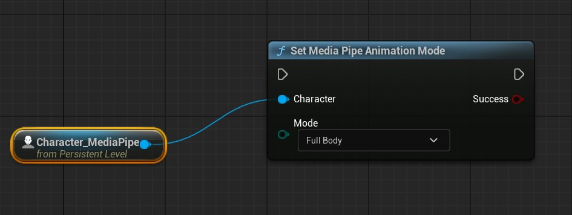
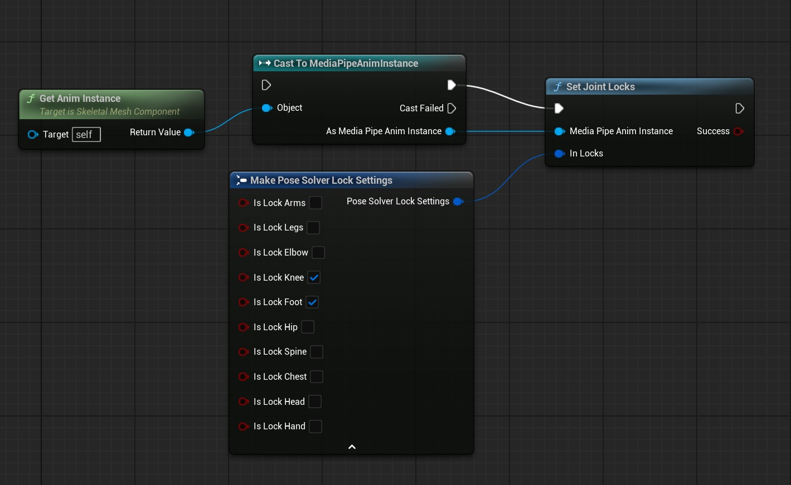

# 算解器

MediaPipe4U 允许你在运行时动态调整一些参数，例如平滑、滤波器参数、关节锁定等。   
由于 MediaPipe4U 使用 **C++** 开发，因此如果你是 C++ 项目，你将获得最大的自由度，对于蓝图项目，我们提供了蓝图函数库 `UMediaPipeMotionUtils`，
目前这个类库可能不如 C++ 编程那么强大，但是会陆续为它添加实用的功能。

## 获取 MediaPipeAnimInstance

=== "蓝图"

    如果我们有个名为 **ABP_BaseCharacter_MediaPipe** 的动画蓝图（基类是 `MediaPipeAnimInstance`），并且已将它应用到带有名为 mesh 的骨骼网格的 Character上，
    那么，我可以在该 Character 的蓝图中获取到 ABP_BaseCharacter_MediaPipe.

    

    > 上面的蓝图将 `MediaPipeAnimInstance` 实例保存到一个名为 **MediaPipeAnimationInstance** 的蓝图变量中。

=== "C++"

    ```c++
    if (Mesh)
	{
		UAnimInstance* anim = Mesh->GetAnimInstance()
		if(UMediaPipeAnimInstance* animInstance = Cast<UMediaPipeAnimInstance>(anim))
		{
			// use animInstance here...
		}
	}
    ```


## 修改身体运动平滑

借助 `UMediaPipeMotionUtils` 蓝图函数库可以修改身体运动的平滑值：

=== "蓝图"
    
    

=== "C++"

    ```c++

    UMediaPipeAnimInstance* animInstance = nullptr;
    if(UMediaPipeMotionUtils::FindMediaPipeAnimationInstance(MediaPipeCharacter, animInstance))
    {
        UMediaPipeMotionUtils::SetPoseSmooth(animInstance, Value);
    }

    ```

## 修改手指运动平滑

借助 `UMediaPipeMotionUtils` 蓝图函数库可以修改手指运动的平滑值：

=== "蓝图"
    
    

=== "C++"

    ```c++

    UMediaPipeAnimInstance* animInstance = nullptr;
    if(UMediaPipeMotionUtils::FindMediaPipeAnimationInstance(MediaPipeCharacter, animInstance))
    {
        UMediaPipeMotionUtils::SetFingerSmooth(animInstance, Value);
    }

    ```

## 修改手指运动平滑

 `UMediaPipeMotionUtils` 还允许你运行时开关算解器：

=== "蓝图"
    
    

=== "C++"

    ```c++

    UMediaPipeAnimInstance* animInstance = nullptr;
    if(UMediaPipeMotionUtils::FindMediaPipeAnimationInstance(MediaPipeCharacter, animInstance))
    {
        UMediaPipeMotionUtils::SetFingerSmooth(animInstance, Value);
    }

    ```


## 切换全身/上半身模式


`UMediaPipeMotionUtils` 提供了一个在上半身/全身动补之间方便的切换的函数，该函数的本质是改变关节的锁定状态，具体来说，上半身模式将锁定腿部和盆骨的旋转。

=== "蓝图"

    

=== "C++"

    ```c++

    UMediaPipeAnimInstance* animInstance = nullptr;
    if(UMediaPipeMotionUtils::FindMediaPipeAnimationInstance(MediaPipeCharacter, animInstance))
    {
        UMediaPipeMotionUtils::SetMediaPipeAnimationMode(animInstance, Value);
    }

    ```

## 锁定部分关节


`UMediaPipeMotionUtils` 除了笼统的全身半身切换，还允许你精确控制关节的锁定。

=== "蓝图"

    

=== "C++"

    ```c++

    UMediaPipeAnimInstance* animInstance = nullptr;
    if(UMediaPipeMotionUtils::FindMediaPipeAnimationInstance(MediaPipeCharacter, animInstance))
    {
        FPoseSolverLockSettings settings;
        settings.bIsLockKnee = true;
        settings.bIsLockFoot = true;
        UMediaPipeMotionUtils::SetJointLocks(animInstance, settings);
    }

    ```

## 开关算解器

`MediaPipeAnimInstance` 上提供了开关算解器的函数，运行你动态的打开/关闭算解器。


=== "蓝图"

    

=== "C++"

    ```c++

    UMediaPipeAnimInstance* animInstance = nullptr;
    if(UMediaPipeMotionUtils::FindMediaPipeAnimationInstance(MediaPipeCharacter, animInstance))
    {
        animInstance->bSolveLocation = false;
        animInstance->bSolveFingers = false;
        animInstance->bSolveHeadFromFaceMesh = false;
    }

    ```


## 其他实用函数

你可以在一个 Actor 上直接找到 **MediapPipeAnimInstance** 实例   


