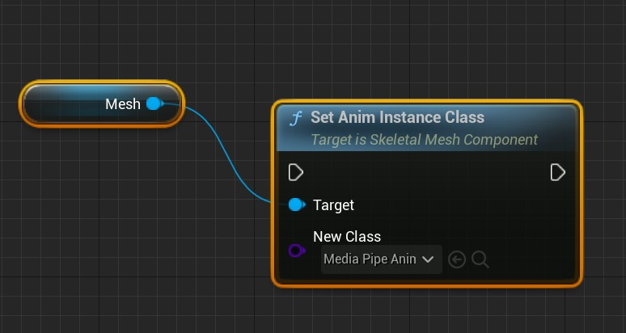

# 运行时切换动画蓝图

你可能因为各种原因，需要在程序运行以后改变骨骼网格体上的动画蓝图。    

!!! tip 

    如果你是因为动画蓝图基类无法使用 `MediaPipeAnimInstance`, 不建议你使用本文档描述的方案，而应该考虑使用 UnrealEngine 提供的`链接动画蓝图`(`Animation Blueprint Linking`)方案。 
    关于`Animation Blueprint Linking`，请参考下面的文档:

    [https://dev.epicgames.com/documentation/unreal-engine/animation-blueprint-linking-in-unreal-engine](https://dev.epicgames.com/documentation/unreal-engine/animation-blueprint-linking-in-unreal-engine)   


## 关键函数

不论是蓝图还是 C++，你都可以通过设置 `USkeletalMeshComponent` 的 `SetAnimInstanceClass` 函数来改变一个骨骼体的动画蓝图。




## 切换到 MediaPipe 动画蓝图

当你切换到一个 `MediaPipeAnimInstace` 蓝图时，你还需要将动画蓝图连接到 MediaPipe 。  

你可以使用 `MediaPipeAnimInstace` 的 `ConnectToMediaPipeInLevel` 函数完成这个过程：  

>注意: `ConnectToMediaPipeInLevel` 具有 bool 类型的返回值，用来指示连接 MediaPipe 是否成功

=== "蓝图"

    

=== "C++"

    ```cpp
    USkeletalMeshComponent* Mesh = XXXX;
    UClass* AnimInstanceClass = UMediaPipeAnimInstance::StaticClass(); //This should be your Blueprint class
    Mesh->SetAnimInstanceClass(AnimInstanceClass);
    UAnimInstance* AnimInstance = Mesh->GetAnimInstance();
    if(UMediaPipeAnimInstance* MediaPipeAnimInstance = Cast<UMediaPipeAnimInstance>(AnimInstance))
    {
        if(MediaPipeAnimInstance->ConnectToMediaPipeInLevel())
        {
            // switch ok
        }
        else
        {
            // switch fault
        }
    }
    ```
