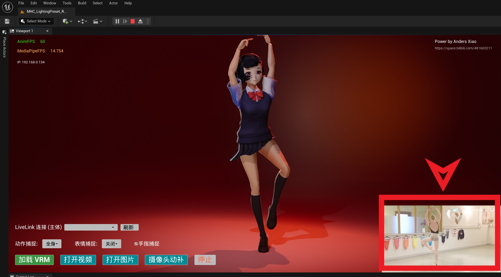
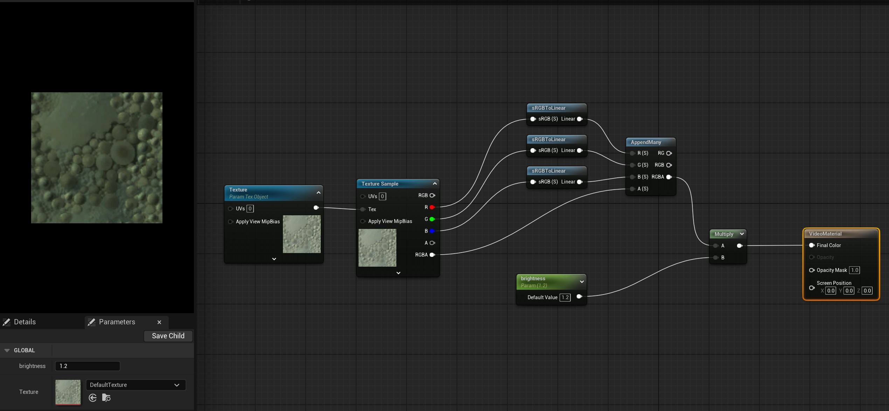
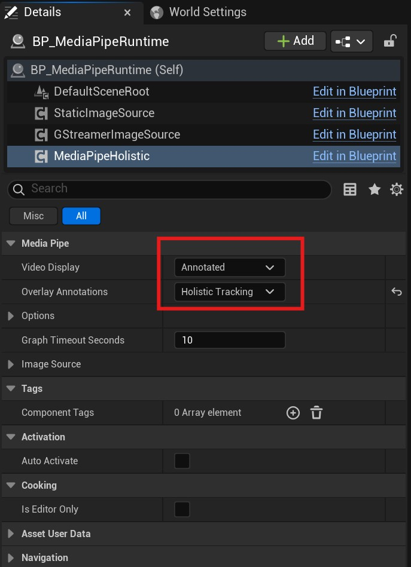
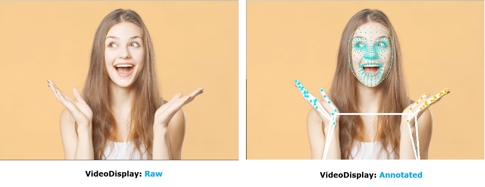

# 回显图像

你可能希望在屏幕上显示图像源中的图像，MediaPipe4U 提供了回调函数，方便你在材质或 UMG 渲染图像源中的图片。



学习如何显示追踪图像，最简单的方法是观看入门教程：

- [Youtube](https://youtu.be/_6OLqClX-Fw)   
- [bilibili](https://www.bilibili.com/video/BV1zs4y1978J)   

## 回调事件

`UMediaPipeHolisticComponent` 组件上提供了 `OnVideoTextureCreated` 事件，通过绑定该事件，你可以得到一个 `Texture2D` 对象，使用它来渲染。

该事件是一个多播委托 (蓝图事件)， C++ 定义如下：

```c++
DECLARE_DYNAMIC_MULTICAST_DELEGATE_ThreeParams(FOnVideoTextureCreated, UTexture2D*, NewTexture, int, TextureWidth, int, TextureHeight);

UPROPERTY(Category="MediaPipe | VideoTexture", BlueprintAssignable)
FOnVideoTextureCreated OnVideoTextureCreated;
```

> 视频动补、图片动补和摄像头动补均可以使用该事件。

蓝图实例如下：


上面的蓝图在 `OnVideoTextureCreated` 事件中动态创建一个材质，同时将材质中的 `Texture` 参数（该参数接受一个 Texture2D 对象）设置为回调事件中的纹理对象，并将材质设置到界面（UI）上的 `UImage` 组件上。


作为参考，上面蓝图中的 `VideoMaterial` 材质定义如下：



## SetMaterialToImage 函数

值得一提的是，为了方便你将图像绘制到 UMG 中，我们提供了一个 `SetMaterialToImage` 蓝图函数帮助你对齐图像到 Canvas 的角落。   

如果你恰好是用 `UImage` 对象渲染图像，并且你的 `UImage` 控件放置于一个 Canvas 中，那么你可以使用该蓝图简化你的图像对齐和自动缩放操作。

`SetMaterialToImage` 参数说明：

该函数只有当你的 Image 放置在 Canvas 中才有效

| 参数 | 类型 | 说明 |
|------|-----|------|
|Image| UImage* | UMG 中的 Image 组件 |
|Material| UMaterialInstance* | 要绘制到 Image 的材质  |
|TextureWidth| int | 图片的宽度  |
|TextureHeight| int | 图片的高度  |
|MaxImageWidthPercent| float | 0~1 表示图片允许在 canvas 中的宽度最大占比（1 表示 100%）  |
|MaxImageHeightPercent| float | 0~1 表示图片允许在 canvas 中的高度最大占比（1 表示 100%）  |
|AnchorPosition| EAnchorPosition | 图片在 canvas 中的位置， 值说明参考下面的说明 |
   


>**AnchorPosition** 值
>
>TopLeft: 左上角    
>TopRight: 右上角   
>BottomLeft: 左下角   
>BottomRight: 右下角   
>TopCenter: 上方中央   
>BottomCenter: 下方中央   
>MiddleCenter: 正中

# 回显模式

通过设置 **UMediaPipeHolisticComponent** 的 **VideoDisplay** 属性, 你可以控制图像显示风格，可以显示/隐藏用于分析动补数据的装饰线条。   


[](images/texture_display/video_display_mode_component.jpg)

下面是不同的 VideoDisplay 值产生的显示效果：


[](images/texture_display/video_display_mode.jpg)