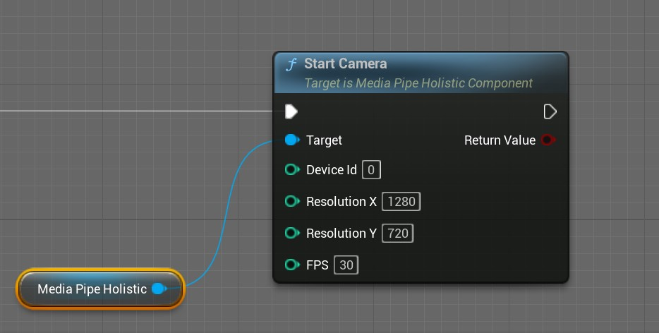

# 开始动作捕捉

## 摄像头动补

你可以通过调用 **MediaPipeHolisticComponent** 的 **StartCamera** 函数来开始一个摄像头动补，如果你使用蓝图调用，看起来差不多是这样：

   

StartCamera 参数说明

|参数|说明|
|-------------|----------------|
|DeviceId|摄像头编号，一般 0 表示 PC 中的第一个摄像头|
|ResolutionX |摄像头水平分辨率|
|ResolutionY |摄像头垂直分辨率|

> 注意：一般摄像头都支持很多分辨率，图像不是越大越好，过大的图像反而影响计算效率，推荐 1280*720 即可

## 图片动补

通过调用 **MediaPipeHolisticComponent** 的 **在StartImageSource** 函数， 在StartImageSource 中传入 StaticImageSouceComponent 即可，由于方法很简单，不再文字描述，参考下面蓝图节点：

   

## 视频动补

通过调用 **MediaPipeHolisticComponent** 的 **在StartImageSource** 函数，StartImageSource 中传入 GStreamerImageSourceComponent 即可：   

> 开始 mediapipe 后也应该调用 **GStreamerImageSource** 的 **Start** 函数让 GStreamerImageSource 开始播放视频。

   

## 停止动补

通过调用 **MediaPipeHolisticComponent** 的 **Stop** 函数，StartImageSource 中传入 GStreamerImageSourceComponent 即可:   
> 停止 Mediapipe 后也应该停止 GStreamerImageSource 的播放（调用 **GStreamerImageSource** 的 **Stop** 函数）。

   